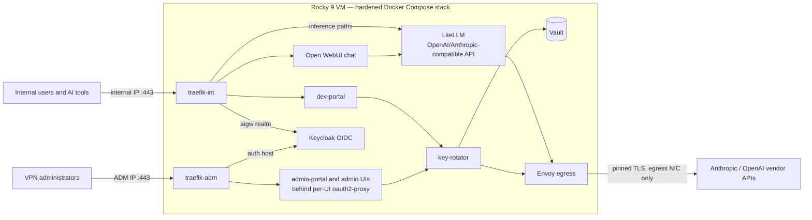

# AI Gateway

AI Gateway is a security-focused, self-hosted AI access platform for an existing
Rocky Linux 9 VM. It puts OpenAI- and Anthropic-compatible API front doors,
browser chat, per-user gateway keys, Keycloak OIDC, pinned vendor egress,
Vault-backed provider credentials, and local plus Cribl telemetry behind a
single hardened Docker Compose stack.

Ansible configures the host and containers. It does **not** create the VM or a
NetworkManager profile, readdress an interface, or change customer-owned routes,
gateways, DNS, or static IP addressing. It owns exactly one bounded property on
each supplied active physical profile — `connection.zone`, keyed by its live
UUID — so a firewalld reload cannot move that interface back to the default
zone. It neither cycles nor reactivates the connection. The committed lab inventory is an explicit lab profile, not a production default.

## Architecture at a glance



The full component, network, and trust-boundary detail lives in the
[solution map](docs/solution-map.md); the complete diagram set (network,
authentication, key-lifecycle, rotation, telemetry, and converge flows) is in
[technical diagrams](docs/architecture-diagrams.md).

## Host interfaces

The supported host has three customer-owned, already-addressed interfaces:

- **egress** — the only default route; no gateway listener is published here.
- **ADM** (`ETH1_IP`) — SSH and administrative HTTPS, restricted to the VPN
  source CIDR.
- **internal** (`ETH2_IP`) — user HTTPS and an optional exact Cribl export,
  restricted to the internal source CIDR.

## Status

AI Gateway is a **customer prototype under active hardening** — one Compose
project on one Rocky VM, not highly available and not a turnkey production
appliance; Vault bootstrap is currently lab/test-grade. Implementation state,
verification evidence, and the open items gating production live in
[project status](docs/project-status.md); the historical destructive
rebuild-and-restore evidence is archived in
[docs/archive/lab-dr-rehearsal.md](docs/archive/lab-dr-rehearsal.md).

## Documentation

Read these in order for a deployment:

1. [Architecture and trust boundaries](docs/solution-map.md)
2. [Technical diagrams](docs/architecture-diagrams.md)
3. [Network architecture and enforcement](docs/network-security.md)
4. [Operating system security baseline](docs/os-security.md)
5. [Container platform security](docs/docker-security.md)
6. [Ansible deployment runbook](docs/deploy-runbook.md)
7. [Generic Rocky 9 and lab deployment reference](docs/deploy-guide.md)
8. [Offline external-image seed](docs/offline-image-seed.md)
9. [Identity, Samba AD lab, and group administration](docs/identity-operations.md)
10. [Anthropic WIF and `private_key_jwt`](docs/anthropic-wif-bootstrap.md)
11. [Operations, recovery, upgrades, and troubleshooting](docs/operations.md)
12. [Sensitive telemetry and retention](docs/observability-operations.md)
13. [LiteLLM capacity and scaling design](docs/litellm-scaling.md)
14. [Scaling and high-availability posture](docs/high-availability.md)
15. [Acceptance test runbook](docs/test-runbook.md)
16. [Project status and open items](docs/project-status.md)

The original
[architecture skeleton](docs/archive/architecture-skeleton.md) is archived as
historical input only. It is not an operational reference.

## Deployment entry points

For a real customer host, supply the actual interface names, addresses,
gateways, source CIDRs, and resolver through an environment-specific inventory,
`--extra-vars`, or the documented `AIGW_*` controller environment variables:

```bash
ansible-galaxy collection install -r ansible/requirements.yml
ansible-playbook -i ansible/inventory/hosts.yml ansible/site.yml \
  -e @/secure/customer-topology.yml --ask-vault-pass
```

For the explicit lab only:

```bash
ansible-playbook -i ansible/inventory/lab.yml ansible/site.yml \
  --ask-vault-pass
```

Both commands intentionally fail before mutating the host if the supplied
topology disagrees with live interface/default-route facts. See the
[deployment guide](docs/deploy-guide.md) before running either command.

Safe local validation that starts no containers and needs no secret overlay:

```bash
scripts/validate-compose.sh
```

## Repository layout

```text
ansible/
  site.yml                 full host + network + stack converge (heavy preflight gates)
  deploy-stack-only.yml    app-only rollout; refuses a stale firewall/network ABI
  inventory/               generic entry point (hosts.yml) + lab (lab.yml)
  group_vars/all.yml       20 segmented bridge definitions and host variables
  roles/                   host_preflight, selinux_baseline, network_routing,
                           firewalld_zones, os_baseline, docker_networks,
                           docker_stack, verify
compose/
  docker-compose.yml       base stack, 24 services; images tag-and-digest pinned
  docker-compose.lab.yml   lab overlay (Samba AD + authoritative DNS)
  .env.example             fail-closed variable contract templated by Ansible
  traefik/                 separate internal and ADM routing
  keycloak/ litellm/ postgres/ vault/
  alloy/ prometheus/ loki/ tempo/ grafana/ cribl-mock/
services/
  egress-proxy/            Envoy TLS-originating, pinned per-vendor CA egress
  key-rotator/             rotation engine and Keycloak identity controller
  dev-portal/              portal app image (serves dev-portal and admin-portal)
  traefik/                 patched DHI Traefik build (3.7.7 binary on DHI runtime)
  samba-ad-lab/            disposable AD/LDAPS lab image for the lab profile
  lab-dns/                 authoritative non-recursive CoreDNS lab image
  dhi-health-probe/        static health-probe binary embedded in DHI images
scripts/
  aigw-compose.sh          profile-aware deployed Compose wrapper
  aigw-runtime-up.sh       start/wait the graph without re-running volume-init
  validate-compose.sh      render-only Compose validation
  vault-bootstrap.sh       lab/test Vault bootstrap; run on the target VM
  vault-unseal.sh          submit one unseal share without exposing it
  state-backup.sh          quiesced, age-encrypted state backup
  state-restore.sh         authenticated offline restore; leaves graph stopped
  pre-upgrade-check.sh     recent-backup gate for stateful image changes
  plan-compose-builds.py / preserve-compose-rollbacks.py / *.py
                           build planning, rollback retention, and portal tests
docs/                      current operator and architecture documentation
```

## Primary security boundaries

- Only Traefik publishes container ports, bound to the exact ADM/internal host
  addresses; no container port is bound to the egress address or `0.0.0.0`.
- Envoy at fixed `172.28.0.2` is the only workload allowed external DNS and
  TCP/443. Vendor TLS uses exact SANs and narrowed per-vendor CA bundles.
- Atomic `DOCKER-USER` rules and an independent native nftables guard deny
  cross-plane, container-to-host, and unapproved bridge egress.
- User/API, administrative, database, cache, Vault, telemetry, metrics,
  observability, and trace planes use separate Docker bridges — 18 used by the
  base stack, 20 pre-created by Ansible. Services join only the planes they need.
- SSH is public-key-only: root, password, and interactive login and all
  TCP/socket/agent/X11/tunnel forwarding are denied. Ansible proves a fresh
  key-only login and non-interactive sudo after reloading the validated policy.
- Keycloak realm roles gate chat, developer-key, and admin capabilities. The
  LiteLLM Admin, Grafana, Prometheus, and Vault UIs are each fronted by their own
  oauth2-proxy instance in reverse-proxy mode behind ADM-leg Traefik; open-source
  Traefik provides TLS and routing but does not replace the Keycloak OIDC session
  layer.
- SELinux is a fail-closed deployment contract: the playbook requires Rocky's
  `targeted` policy already enforcing, requires per-container MCS labels, and
  asserts zero AVCs in the converge window. It does not convert a permissive or
  disabled host.
- Full prompts/completions are sensitive Tempo trace attributes and may also be
  exported to Cribl; they are not ordinary Loki log records. Open WebUI uses one
  inference-only service key, so its audit attribution is `svc-open-webui`, not
  the individual browser user.
- Authenticated restore exits with zero running project containers under an exact
  root-only marker; `vault-bootstrap.sh` is forbidden on the recovery path.

This remains a customer prototype, not a turnkey production appliance. Review the
documented residual risks, rehearse stateful upgrades and restore, and run the
complete acceptance suite before production use.
