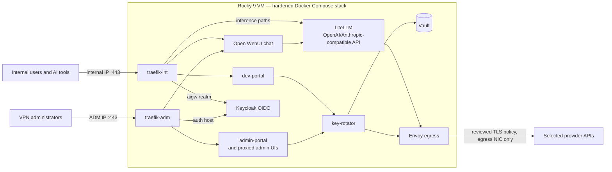

# AI Gateway

[](../../actions/workflows/infrastructure-ci.yml)
[](../../actions/workflows/python-ci.yml)
[](../../actions/workflows/go-security.yml)
[](../../actions/workflows/trivy.yml)
[](../../actions/workflows/secret-scanning.yml)
[](../../actions/workflows/codeql.yml)
[](../../actions/workflows/actions-security.yml)
[](../../actions/workflows/repo-hygiene.yml)
[](../../actions/workflows/dependency-review.yml)
[](../../actions/workflows/runtime-skew.yml)
[](../../actions/workflows/scorecard.yml)

AI Gateway is a self-hosted, security-focused AI access platform. Production
runs on an existing Rocky Linux 9 VM. Local release tests run in Docker
preprod. The stack provides compatible API endpoints, browser chat, user keys,
Keycloak login, Vault-backed provider access, local monitoring, and an optional
Cribl SOC telemetry feed.

Anthropic is the only approved egress provider today. API compatibility does
not mean another provider is enabled.

The VM and its three network connections must exist before Ansible runs.
Ansible does not change their IP addresses, routes, gateways, or DNS. It also
does not restart those connections. It changes only `connection.zone`, the
firewall zone, on each selected connection. It matches the live connection
UUID so it cannot change a different interface. This keeps the firewall zones
in place after a reload.

## Architecture at a glance



The full component, network, and trust-boundary detail lives in the
[solution map](docs/solution-map.md). The [technical diagrams](docs/architecture-diagrams.md)
show network, authentication, key lifecycle, rotation, provider, model,
usage, telemetry, and deployment flows.

## Host interfaces

Production needs three customer-owned network interfaces. They must already
have their IP settings:

- **egress:** the only default route; it has no gateway listener.
- **ADM:** SSH and admin HTTPS for the approved VPN range.
- **internal:** user HTTPS and the optional Cribl telemetry feed.

## Status

AI Gateway is a **customer prototype under active hardening**. Production is
one Compose project on one Rocky Linux VM. It is not highly available. Vault
setup and key custody still need an approved operator ceremony. Preprod uses
test-only key custody. See [project status](docs/project-status.md) for current
limits and open work.

## Start here

Pick the task that matches your goal:

| Goal | Guide |
| --- | --- |
| Test a release in local Docker | [Local preprod](docs/preprod.md) |
| Run the full release checks | [Acceptance test runbook](docs/test-runbook.md) |
| Install on a production VM | [Production deployment](docs/deploy-runbook.md) |
| Update images and build an offline seed | [Image update workflow](docs/image-update-workflow.md) |
| Unlock Vault after a reboot | [Vault unseal SOP](docs/sop/vault-unseal-after-reboot.md) |
| Run daily production tasks | [Production operations](docs/operations.md) |

You do not need a test VM. The release gate runs in local Docker preprod with
the fixed domain `aigw.internal`.

Start preprod from source:

```bash
ansible-playbook -i ansible/inventory/preprod.yml ansible/preprod.yml \
  --ask-become-pass
```

Ansible uses sudo only for the bounded `/etc/hosts` block and, on macOS, two
loopback aliases. Docker still runs as your normal user. You may use a private
become password file instead of the prompt. The
[preprod guide](docs/preprod.md) shows both forms.

Create a production inventory:

```bash
python3 -I scripts/bootstrap-rocky9-production.py \
  --inventory-alias <alias> \
  --vault-id <vault-id> \
  --vault-password-file </absolute/private/password-file>
```

These three options are required for a non-interactive run. Run the script
with no options in a terminal for guided prompts. Follow the production
runbook after it creates the inventory.

To check Compose without starting containers:

```bash
bash scripts/validate-compose.sh
```

## Documentation map

- Design: [solution map](docs/solution-map.md) and
  [architecture diagrams](docs/architecture-diagrams.md)
- Network and names: [network rules](docs/network-security.md) and
  [FQDN inventory](docs/fqdn-inventory.md)
- Identity: [identity operations](docs/identity-operations.md),
  [Keycloak design](docs/keycloak-realm-architecture.md), and
  [Anthropic WIF](docs/anthropic-wif-bootstrap.md)
- Images and trust: [offline seed details](docs/offline-image-seed.md),
  [provider onboarding](docs/provider-onboarding.md), and
  [provider CA maintenance](docs/sop/provider-ca-maintenance.md)
- Security: [security model](docs/security-model.md),
  [OS security](docs/os-security.md), and
  [container security](docs/docker-security.md)
- Monitoring and logs: [observability](docs/observability-operations.md) and
  [Cribl telemetry handoff](docs/cribl-soc-handoff.md)
- Current work: [project status](docs/project-status.md) and
  [TASKS.md](TASKS.md)
- Model governance and accounting: [model lifecycle SOP](docs/sop/model-lifecycle.md),
  [implementation plan](docs/model-governance-plan.md),
  [usage and cost accounting](docs/usage-and-cost-accounting.md), and
  [automatic routing ADR](docs/automatic-model-routing-adr.md)

## Repository layout

```text
ansible/
  site.yml                 full production run
  os-prep.yml              production host setup; starts no containers
  deploy-stack-only.yml    app deploy on a prepared production host
  inventory/               generated production inventories + local preprod
  group_vars/all.yml       shared production defaults
  roles/                   host, network, Docker, stack, and check roles
compose/
  docker-compose.yml       base stack with tag-and-digest image pins
  docker-compose.preprod.yml portable local overlay (Samba AD + WIF mock)
  .env.example             fail-closed variable contract templated by Ansible
  traefik/                 separate internal and ADM routing
  keycloak/ litellm/ postgres/ vault/
  alloy/ prometheus/ alertmanager/ loki/ grafana/ cribl-mock/
services/
  egress-proxy/            immutable catalog-selected Envoy egress policy
  key-rotator/             rotation engine and Keycloak identity controller
  dev-portal/              portal app image (serves dev-portal and admin-portal)
  traefik/                 patched DHI Traefik build (3.7.8 binary on DHI runtime)
  samba-ad-preprod/        disposable AD/LDAPS image for local preproduction
  wif-provider-mock/       local provider-control-plane mock for preprod WIF
  platform-dns/            optional authoritative split-DNS image
  dhi-health-probe/        static health-probe binary embedded in DHI images
scripts/
  aigw-compose.sh          profile-aware deployed Compose wrapper
  aigw-runtime-up.sh       start/wait the graph without re-running volume-init
  validate-compose.sh      render-only Compose validation
  vault-unseal.sh          submit one unseal share without exposing it
  state-backup.sh          quiesced, age-encrypted state backup
  state-restore.sh         authenticated offline restore; leaves graph stopped
  pre-upgrade-check.sh     recent-backup gate for stateful image changes
  update-images.py         seed build/test and remote upgrade/validate/rollback
  other tools              build plans, rollback retention, and portal tests
docs/                      current operator and architecture documentation
```

## Primary security boundaries

- Only edge services publish ports. Nothing binds to the egress IP or
  `0.0.0.0`.
- Envoy is the only app path to provider DNS and HTTPS. Its provider routes and
  CA files are fixed in the release image.
- Separate networks limit which services can talk to each other.
- Keycloak roles protect chat, developer, and admin access.
- Vault holds provider and signing secrets.
- SELinux, firewall rules, and Ansible checks fail closed.
- Alloy keeps local telemetry and mirrors every admitted metric, log, and trace
  to Cribl over verified OTLP/gRPC TLS. Rejected secrets are never collected.
- Restore keeps the stack stopped until Ansible checks it.

Read the [security model](docs/security-model.md) for the full controls and
trust boundaries.

This remains a customer prototype, not a turnkey production appliance. Review the
documented residual risks, rehearse stateful upgrades and restore, and run the
complete acceptance suite before production use.
