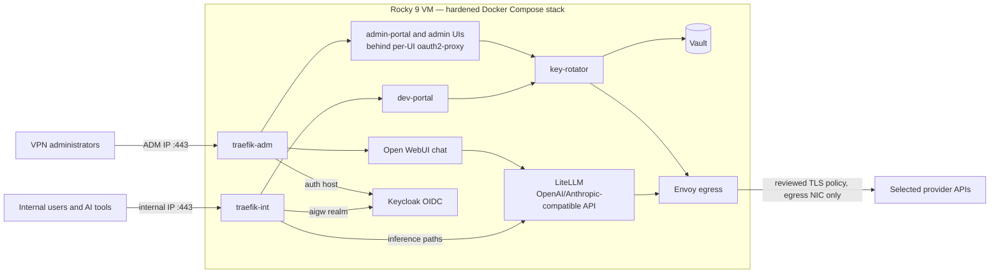

# AI Gateway

Checks: [infrastructure](.github/workflows/infrastructure-ci.yml),
[Python](.github/workflows/python-ci.yml),
[secret scanning](.github/workflows/secret-scanning.yml),
[filesystem and IaC](.github/workflows/trivy.yml), and
[GitHub Actions policy](.github/workflows/actions-security.yml).

AI Gateway is a security-focused, self-hosted AI access platform for an existing
Rocky Linux 9 VM. It puts OpenAI- and Anthropic-compatible API front doors,
browser chat, per-user gateway keys, Keycloak OIDC, immutable provider-selected
egress,
Vault-backed provider credentials, local observability, and a narrow optional
Cribl SOC log feed behind one hardened Docker Compose stack.

Ansible configures the host and containers. It does **not** create the VM or a
NetworkManager profile, readdress an interface, or change customer-owned routes,
gateways, DNS, or static IP addressing. It owns exactly one bounded property on
each supplied active physical profile — `connection.zone`, keyed by its live
UUID — so a firewalld reload cannot move that interface back to the default
zone. It neither cycles nor reactivates the connection.

## Architecture at a glance



The full component, network, and trust-boundary detail lives in the
[solution map](docs/solution-map.md); the complete diagram set (network,
authentication, key-lifecycle, rotation, telemetry, and converge flows) is in
[technical diagrams](docs/architecture-diagrams.md).

## Host interfaces

The supported host has three customer-owned, already-addressed interfaces:

- **egress** — the only default route; no gateway listener is published here.
- **ADM** (`ETH1_IP`) — SSH and administrative HTTPS, restricted to the VPN
  source CIDR.
- **internal** (`ETH2_IP`) — user HTTPS and an optional exact Cribl SOC log export,
  restricted to the internal source CIDR.

## Status

AI Gateway is a **customer prototype under active hardening** — one Compose
project on one Rocky VM, not highly available and not a turnkey production
appliance. Production Vault initialization and custody remain reviewed operator
ceremonies; local preprod uses only disposable test custody. Implementation state,
verification evidence, and the open items gating production live in
[project status](docs/project-status.md); the historical destructive
rebuild-and-restore evidence is archived in
[docs/archive/lab-dr-rehearsal.md](docs/archive/lab-dr-rehearsal.md).

## Documentation

Choose one operator path:

- **Local release test:** [Local Docker preprod](docs/preprod.md) →
  [acceptance test runbook](docs/test-runbook.md).
- **Production deployment:** [Production deployment runbook](docs/deploy-runbook.md)
  → [operations and recovery](docs/operations.md) →
  [Vault unseal after reboot](docs/sop/vault-unseal-after-reboot.md).
- **Image release:** [Image update, local seeded test, production upgrade, and
  rollback](docs/image-update-workflow.md).

Use these pages when you need design detail:

- [Architecture and trust boundaries](docs/solution-map.md) and
  [technical diagrams](docs/architecture-diagrams.md)
- [Network rules](docs/network-security.md),
  [FQDN and DNS inventory](docs/fqdn-inventory.md),
  [OS security](docs/os-security.md), and
  [container security](docs/docker-security.md)
- [Identity operations](docs/identity-operations.md),
  [Keycloak realm design](docs/keycloak-realm-architecture.md), and
  [Anthropic WIF](docs/anthropic-wif-bootstrap.md)
- [Provider onboarding](docs/provider-onboarding.md),
  [provider CA maintenance](docs/sop/provider-ca-maintenance.md), and
  [offline seed internals](docs/offline-image-seed.md)
- [Telemetry](docs/observability-operations.md),
  [Cribl SOC logging handoff](docs/cribl-soc-handoff.md),
  [LiteLLM scaling](docs/litellm-scaling.md), and
  [high availability](docs/high-availability.md)

Current state is in [project status](docs/project-status.md). Durable work is
tracked in [TASKS.md](TASKS.md).

The original
[architecture skeleton](docs/archive/architecture-skeleton.md) is archived as
historical input only. It is not an operational reference.

## Deployment entry points

Choose the environment before running anything:

- For a disposable local Docker environment, follow the
  [local preprod runbook](docs/preprod.md).
- For a customer-owned Rocky Linux host, follow the
  [production deployment runbook](docs/deploy-runbook.md).

For a real customer host, generate a dedicated inventory with an encrypted
secret overlay, fill in the topology, pass the controller-only preflight, and
then converge:

```bash
ansible-galaxy collection install -r ansible/requirements.yml
scripts/bootstrap-rocky9-production.py --inventory-alias <alias> \
  --vault-id <vault-id> --vault-password-file <password-file>
# edit ansible/inventory/generated/<alias>/host_vars/<alias>.yml
ansible-playbook -i ansible/inventory/generated/<alias>/hosts.yml \
  ansible/preflight-rocky9-production.yml --limit <alias> \
  --vault-id <vault-id>@<password-file>
ansible-playbook -i ansible/inventory/generated/<alias>/hosts.yml \
  ansible/site.yml --limit <alias> --vault-id <vault-id>@<password-file>
```

The canonical profile is `rocky9-production` (Ansible group `production_rocky9`).
The older `bootstrap-generic-rocky9.py` / `preflight-generic-rocky9.yml` /
`generic-rocky9` names still work as DEPRECATED compatibility aliases and print a
one-line deprecation notice pointing here.

For disposable local preprod:

```bash
ansible-playbook -i ansible/inventory/preprod.yml ansible/preprod.yml
```

On macOS, append `--ask-become-pass` so the play can create the two missing
Docker Desktop loopback aliases. Linux skips that privileged step.

Production intentionally fails before mutating the host if the supplied
topology disagrees with live interface/default-route facts. Preprod refuses a
remote Docker context and does not run any Rocky Linux host role.

Safe local validation that starts no containers and needs no secret overlay:

```bash
scripts/validate-compose.sh
```

## Repository layout

```text
ansible/
  site.yml                 full converge = os-prep.yml then deploy-stack-only.yml
  os-prep.yml              host preparation only (heavy preflight gates + roles
                           through docker_networks); starts no containers
  deploy-stack-only.yml    stack deploy + verify + marker promotion; refuses an
                           unprepared host or a stale firewall/network ABI
  inventory/               generated production inventories + local preprod
  group_vars/all.yml       20 segmented bridge definitions and host variables
  roles/                   host_preflight, firewall_preflight, time_sync,
                           selinux_baseline, network_routing, firewalld_zones,
                           os_baseline, docker_networks, docker_stack, verify,
                           host_finalize
compose/
  docker-compose.yml       base stack, 24 services (22 selected by default,
                           including volume-init; Vault UI pair profile-gated);
                           images tag-and-digest pinned
  docker-compose.preprod.yml portable local overlay (Samba AD + WIF mock)
  .env.example             fail-closed variable contract templated by Ansible
  traefik/                 separate internal and ADM routing
  keycloak/ litellm/ postgres/ vault/
  alloy/ prometheus/ loki/ grafana/ cribl-mock/
services/
  egress-proxy/            immutable catalog-selected Envoy egress policy
  key-rotator/             rotation engine and Keycloak identity controller
  dev-portal/              portal app image (serves dev-portal and admin-portal)
  traefik/                 patched DHI Traefik build (3.7.8 binary on DHI runtime)
  samba-ad-preprod/        disposable AD/LDAPS image for local preproduction
  platform-dns/            optional authoritative split-DNS image
  dhi-health-probe/        static health-probe binary embedded in DHI images
scripts/
  aigw-compose.sh          profile-aware deployed Compose wrapper
  aigw-runtime-up.sh       start/wait the graph without re-running volume-init
  validate-compose.sh      render-only Compose validation
  vault-unseal.sh          submit one unseal share without exposing it
  state-backup.sh          quiesced, age-encrypted state backup
  state-restore.sh         authenticated offline restore; leaves graph stopped
  pre-upgrade-check.sh     recent-backup gate for stateful image changes
  update-images.py         seed build/test and remote upgrade/validate/rollback
  plan-compose-builds.py / preserve-compose-rollbacks.py / *.py
                           build planning, rollback retention, and portal tests
docs/                      current operator and architecture documentation
```

## Primary security boundaries

- Only Traefik publishes container ports, bound to the exact ADM/internal host
  addresses; no container port is bound to the egress address or `0.0.0.0`.
- Envoy at fixed `172.28.0.2` is the only workload allowed external DNS and
  TCP/443. The offline release bakes only selected provider routes, exact
  SNI/SAN rules, and reviewed CA bundles into one immutable image and policy.
  Ansible never downloads CA trust during deployment.
- Atomic `DOCKER-USER` rules and an independent native nftables guard deny
  cross-plane, container-to-host, and unapproved bridge egress.
- User/API, administrative, database, cache, Vault, telemetry, metrics,
  observability, and trace planes use separate Docker bridges — 18 used by the
  base stack, 20 pre-created by Ansible. Services join only the planes they need.
- SSH is public-key-only: root, password, and interactive login and all
  TCP/socket/agent/X11/tunnel forwarding are denied. Ansible proves a fresh
  key-only login and non-interactive sudo after reloading the validated policy.
- Keycloak realm roles gate chat, developer-key, and admin capabilities. The
  LiteLLM Admin, Grafana, Prometheus, and Vault UIs are each fronted by their own
  oauth2-proxy instance in reverse-proxy mode behind ADM-leg Traefik; open-source
  Traefik provides TLS and routing but does not replace the Keycloak OIDC session
  layer.
- SELinux is a fail-closed deployment contract: the playbook requires Rocky's
  `targeted` policy already enforcing, requires per-container MCS labels, and
  asserts zero AVCs in the converge window. It does not convert a permissive or
  disabled host.
- Full prompts/completions are sensitive. Alloy converts the reviewed request
  span into a sanitized audit log for local Loki and the optional Cribl SOC
  feed. Raw traces, metrics, alerts, and ordinary service logs never enter
  Cribl. Open WebUI uses one inference-only service key, so its enforced audit
  identity is `svc-open-webui`.
- Authenticated restore exits with zero running project containers under an exact
  root-only marker; replacement initialization is forbidden on the recovery path.

This remains a customer prototype, not a turnkey production appliance. Review the
documented residual risks, rehearse stateful upgrades and restore, and run the
complete acceptance suite before production use.
