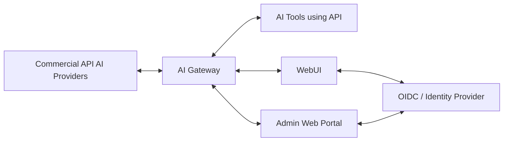
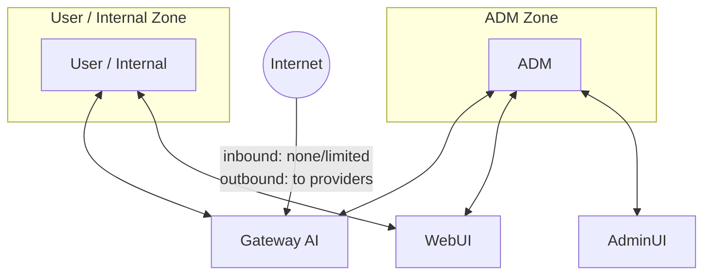
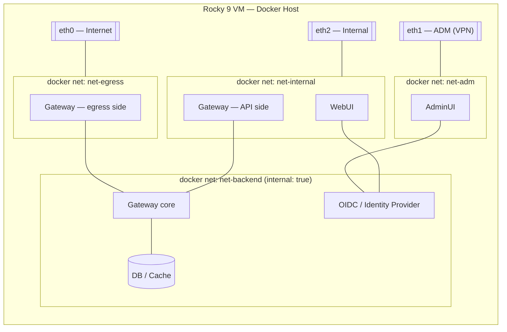

# AI Gateway — Project Skeleton

> **⚠ SUPERSEDED:** this was the v0 starting skeleton. The current, maintained design is
> [`docs/solution-map.md`](docs/solution-map.md) (components, networks, firewalld, IaC,
> vendor auth) + [`docs/anthropic-wif-bootstrap.md`](docs/anthropic-wif-bootstrap.md).
> Kept for history; diagrams and `[TBD]`s below are stale.

Status: draft skeleton, no requirements loaded yet. Sections marked `[TBD]` are placeholders — fill in as requirements arrive.

## 1. Goal

Multi-vendor AI Gateway (Venice.ai-equivalent): a single control point between commercial AI API providers and internal tools/users, with WebUI, OIDC auth, and an admin portal.

## 2. Network Zones

| Zone | Members | Direction | Notes |
|---|---|---|---|
| Internet-facing | Gateway AI | Gateway → out to providers | `[TBD]` inbound exposure? |
| ADM | Gateway AI, WebUI, AdminUI | bidirectional | management/ops access |
| User/Internal | Gateway, WebUI | bidirectional | end-user access |

## 3. Components

- **AI Gateway (core)** — routes/proxies requests to commercial providers, vendor abstraction, key management `[TBD]`
- **WebUI** — end-user chat/tool interface `[TBD]`
- **Admin Web Portal** — config, user/vendor management, monitoring `[TBD]`
- **OIDC / Identity** — auth for WebUI + AdminUI `[TBD: IdP choice]`
- **AI Tools (API consumers)** — internal apps/agents calling the gateway `[TBD]`
- **Upstream Providers** — commercial AI APIs to support `[TBD: which vendors]`

## 4. Requirements (to be filled in)

### 4.1 Functional
- Supported providers/vendors: `[TBD]`
- Routing / failover / load balancing logic: `[TBD]`
- Model catalog / aliasing: `[TBD]`
- Streaming support: `[TBD]`
- Rate limiting / quota / usage metering: `[TBD]`
- Billing / cost tracking: `[TBD]`
- API compatibility target (e.g., OpenAI-compatible): `[TBD]`

### 4.2 Auth & Identity
- OIDC provider: `[TBD]`
- SSO scope (WebUI, AdminUI, API keys, or all): `[TBD]`
- RBAC / roles: `[TBD]`

### 4.3 Networking & Security
- Inbound exposure of Gateway to Internet: eth0 is egress-only — no inbound services bound to it (see §6, `ext` zone)
- ADM zone access control: eth1, reached via VPN, source-restricted to VPN client subnet `[TBD: CIDR]` (see §6)
- TLS / mTLS requirements: `[TBD]`
- Secrets management (provider API keys): `[TBD]`

### 4.4 Non-Functional
- Availability / SLA: `[TBD]`
- Scale (RPS, concurrent users): `[TBD]`
- Logging / observability / audit: `[TBD]`
- Data residency / compliance: `[TBD]`

### 4.5 Deployment
- Target infra: Rocky Linux 9 VM, Docker Engine, 3 NICs — see §5
- Containerization/orchestration: Docker (Compose vs Swarm/other `[TBD]`)
- CI/CD: `[TBD]`

## 5. Infrastructure — Host & Docker Networking

Host: single Rocky 9 VM running Docker, three interfaces mapped to the three zones from §2.

| Interface | Zone | Purpose |
|---|---|---|
| eth0 | Internet | Gateway egress only, to commercial AI provider APIs |
| eth1 | ADM (via VPN) | Admin/management access — AdminUI, host SSH |
| eth2 | Internal | User/internal AI tools access — WebUI, Gateway API |

| Docker network | Type | Bound interface | Purpose | Internet-routable |
|---|---|---|---|---|
| `net-egress` | bridge (macvlan/ipvlan `[TBD]` — see §7) | eth0 | Gateway → commercial provider calls | Egress only |
| `net-adm` | bridge | eth1 | AdminUI, admin-facing traffic | No — VPN-restricted |
| `net-internal` | bridge | eth2 | WebUI, Gateway API for internal tools | No — internal CIDR only |
| `net-backend` | bridge, `internal: true` | none | Gateway core ↔ OIDC ↔ DB/cache | No — no host route out |

Gateway is drawn as spanning `net-egress`/`net-internal` (its two edges) plus `net-backend` (core logic) — exact service decomposition is a backend-design decision, not yet made.

## 6. firewalld Zones & Rules (proposed baseline — confirm before implementing)

Rocky 9 uses firewalld (nftables backend). Docker manipulates iptables/nftables directly and can bypass firewalld zone policy — container-traffic enforcement must go through the `DOCKER-USER` chain or firewalld's Docker/nftables integration, not the zone rules alone.

| Zone | Interface | Source restriction | Allowed services/ports | Masquerade | Default target | Notes |
|---|---|---|---|---|---|---|
| `ext` | eth0 | any (0.0.0.0/0) | Outbound 443/tcp to provider APIs only; **no inbound services** | No | `DROP` | Nothing listens on eth0; deny+log all inbound, don't leak REJECT signal to internet |
| `adm` | eth1 | VPN client subnet `[TBD: CIDR]` | 22/tcp (host SSH mgmt), 443/tcp (AdminUI) `[TBD: monitoring/Docker API ports]` | No | `REJECT` | Confirm whether VPN terminates on-host (eth1 = tunnel endpoint) or upstream (eth1 = post-VPN internal leg) — changes source restriction |
| `internal` | eth2 | Internal CIDR `[TBD]` | 443/tcp (WebUI), Gateway API port `[TBD]` | No | `REJECT` | User + internal AI tools access |
| docker-managed | `net-*` bridges | n/a | Enforced via `DOCKER-USER` chain, not zone rules | Yes, per bridge network | n/a | firewalld zone rules alone will **not** filter container-published ports — must add explicit `DOCKER-USER`/nftables rules or bind bridges into a firewalld zone via `firewall-cmd --zone=<zone> --change-interface=<bridge>` |

## 7. Docker Network Routing (open — revisit during backend design)

Question raised: do we need host-level routing tables to correctly route traffic across `net-egress`/`net-adm`/`net-internal` when they map to three separate physical NICs/subnets? Flagging as open per your note — deferring a final call until Gateway/WebUI/AdminUI/OIDC service topology is defined, but two candidate approaches:

- **Option A — NAT bridges + policy-based routing.** Keep all docker networks as standard NAT bridges; add host-level `ip rule` / `ip route add table <name>` per source subnet so return traffic exits the same interface it arrived on (avoids the classic multi-homed asymmetric-routing black hole). Simpler Docker Compose, more host-level plumbing to maintain.
- **Option B — macvlan/ipvlan for the egress-facing container.** Give the Gateway's egress-side container a real L3 presence directly on eth0 (macvlan/ipvlan network) instead of NAT, so it egresses without touching host routing tables at all. Avoids policy-routing complexity but complicates host↔container reachability and firewalld zone binding (container gets its own interface, not a shared bridge).

Decision deferred to backend design phase — will revisit once Gateway/WebUI/AdminUI/OIDC container boundaries are set.

## 8. Open Questions

- ADM VPN client subnet CIDR — needed to lock down `adm` zone source restriction
- Internal CIDR for `internal` zone
- VPN termination point (on-host at eth1, or upstream of eth1)
- Gateway API port(s) and AdminUI/monitoring ports for firewalld rules
- Docker network routing approach — NAT+policy routing vs macvlan/ipvlan (§7)
- `net-egress` docker network type: bridge vs macvlan/ipvlan (depends on §7 outcome)

## 9. Decision Log

| Date | Decision | Rationale |
|---|---|---|
| 2026-07-11 | Host platform: single Rocky Linux 9 VM running Docker, three NICs — eth0 internet, eth1 ADM (VPN), eth2 internal | Customer hard requirement |
| 2026-07-11 | firewalld used for host-level zone/rule enforcement, one zone per interface | Customer hard requirement (documented zone/rule table) |
| 2026-07-11 | Docker-network-level routing (NAT+policy-routing vs macvlan/ipvlan) deferred | Depends on backend service topology, not yet designed |
