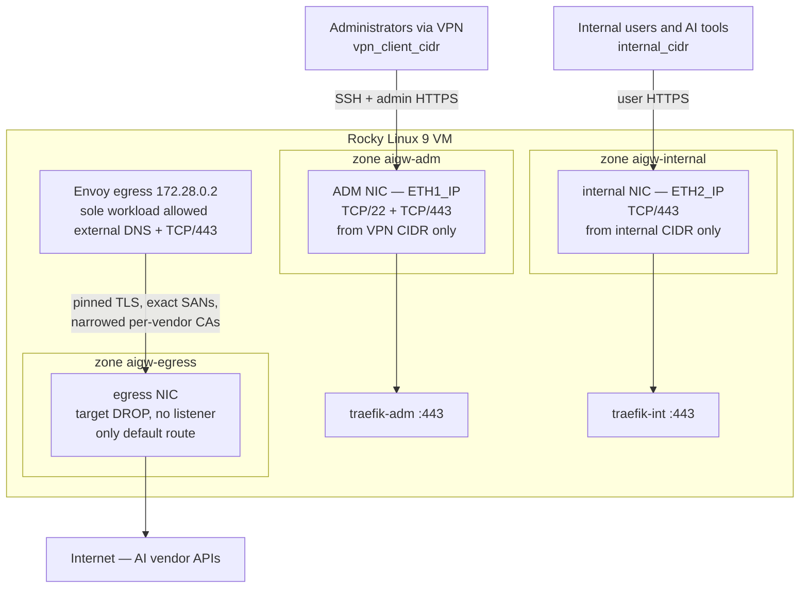
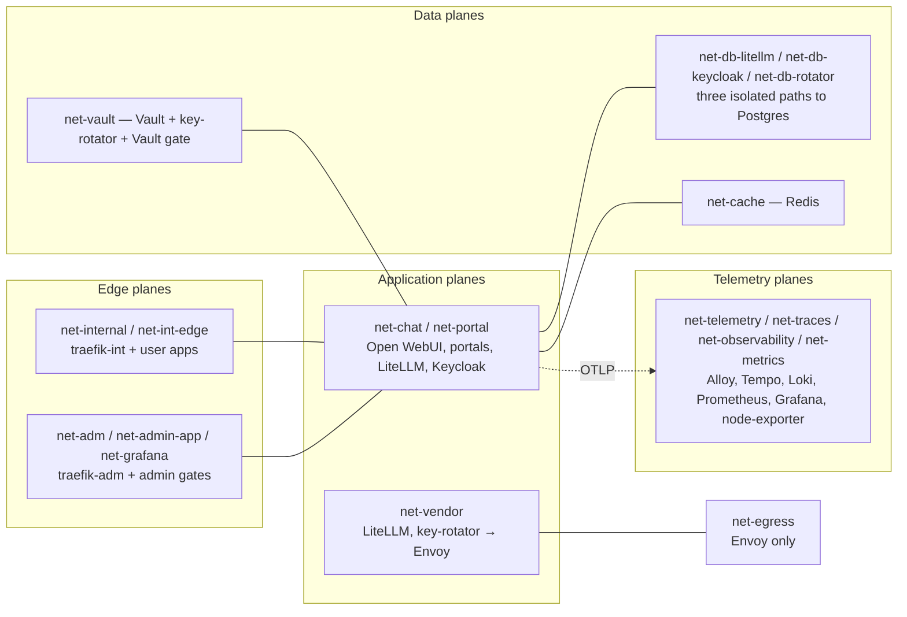
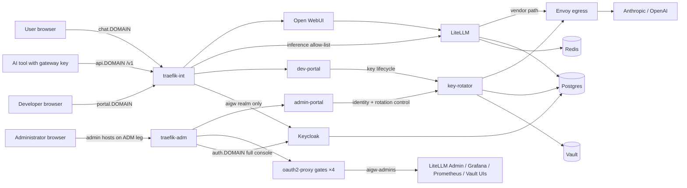
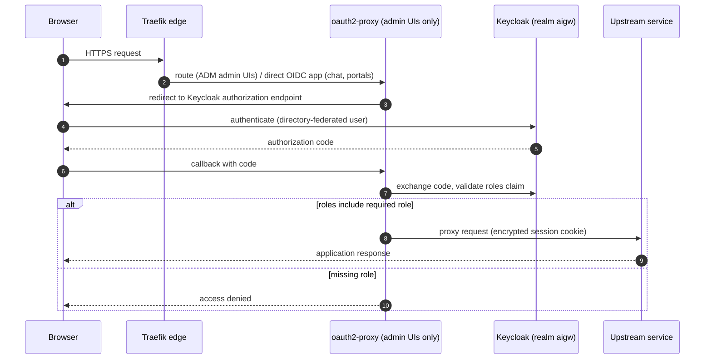
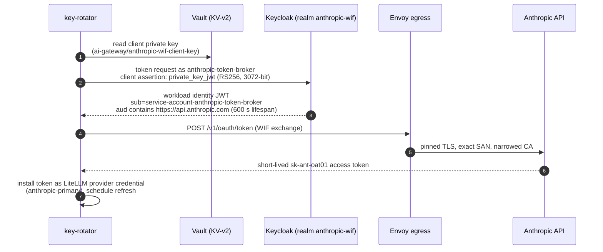
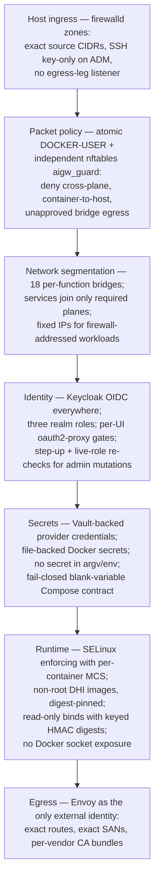
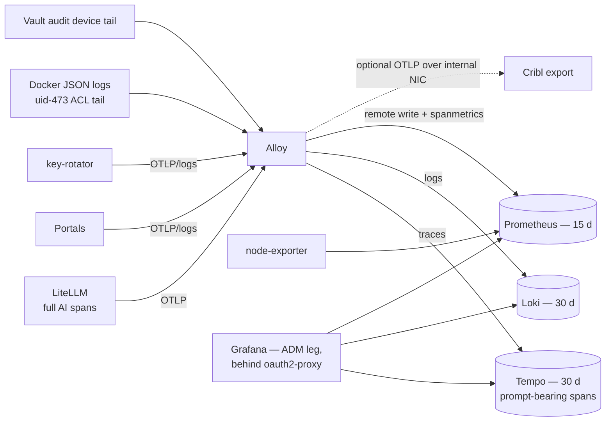
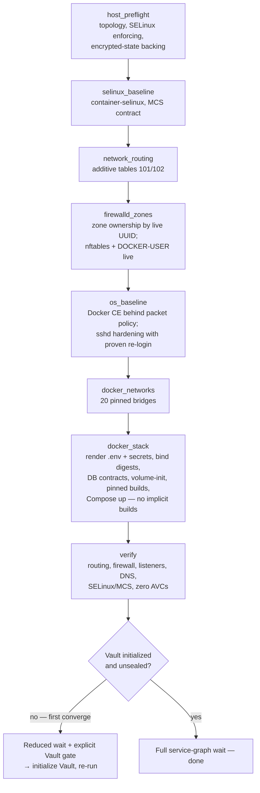

# AI Gateway — Technical Diagrams

This document is the visual companion to the
[solution map](solution-map.md). Each diagram reflects the implemented
configuration in `compose/`, `ansible/`, and `services/`; where a diagram
simplifies, the solution map's tables remain authoritative. Diagrams render
natively on GitHub/GitLab (Mermaid).

## 1. Network topology and trust zones

Three customer-owned interfaces map to three firewalld zones with distinct
inbound policy. Nothing publishes a listener on the egress leg; only the two
Traefik edges publish container ports, each bound to its exact host address.

Reply traffic for the ADM and internal legs uses source-policy routing
(tables 101/102) so responses leave through the interface they arrived on.

## 2. Segmented container planes

The stack pre-creates 20 Docker bridges and uses 18 in the base profile;
services join only the planes they need, and both an atomic `DOCKER-USER`
chain and an independent native nftables guard (`aigw_guard`) deny
cross-plane, container-to-host, and unapproved egress traffic. The full
per-bridge membership table is in the solution map.

## 3. Software flow — user, developer, and administrator paths

## 4. Authentication flow — browser OIDC and admin gates

All human access authenticates against Keycloak realm `aigw`, which emits
the three realm roles (`aigw-users`, `aigw-developers`, `aigw-admins`) in a
`roles` claim. Admin UIs sit behind dedicated oauth2-proxy instances.

Admin-portal mutations additionally require a CSRF token and a fresh
Keycloak step-up (`prompt=login`, `max_age=0`) within a five-minute window,
and every page read re-checks the caller's live composite roles — a revoked
administrator fails closed even with a valid session cookie.

## 5. Logic flow — developer key lifecycle

Group membership in Keycloak is the authorization source; LiteLLM virtual
keys are always derived from it and revoked with it.

## 6. Security flow — provider credential rotation (Anthropic WIF)

No long-lived vendor API key sits in application configuration. key-rotator
brokers a short-lived Anthropic token through Keycloak's isolated
`anthropic-wif` realm using `private_key_jwt`; the private key exists only
in Vault (or a mounted PEM) and every vendor call leaves through Envoy.

## 7. Security design — layered enforcement

Each layer fails closed independently; compromising one does not disable the
others.

## 8. Telemetry flow

Prompts and completions are sensitive: they travel as Tempo trace attributes
(and optionally to Cribl), never as ordinary Loki log records. Retention and
redaction rules are in
[observability operations](observability-operations.md).

## 9. Deployment logic — Ansible converge order

The converge is a gated pipeline: each stage validates its contract and the
run stops at the first failure, before later stages can mutate the host.

