# AI Gateway technical diagrams

These pictures match the current code in `compose/`, `ansible/`, and
`services/`. The [solution map](solution-map.md) has the exact service tables.
The [security model](security-model.md) explains the controls in plain words.

GitHub renders these Mermaid diagrams. Provider details are in
[provider onboarding](provider-onboarding.md) and the
[CA maintenance SOP](sop/provider-ca-maintenance.md).

## Diagram index

- Foundations: [production network](#1-network-topology-and-trust-zones),
  [local preprod](#2-local-preprod-topology), and
  [container planes](#3-segmented-container-planes).
- Application flows: [user and admin paths](#4-software-flow--user-developer-and-administrator-paths),
  [browser OIDC](#5-authentication-flow--browser-oidc-and-admin-gates),
  [developer keys](#6-logic-flow--developer-key-lifecycle), and
  [Anthropic WIF](#7-security-flow--provider-credential-rotation-anthropic-wif).
- Security and telemetry: [layered enforcement](#8-security-design--layered-enforcement)
  and [local versus SOC telemetry](#9-telemetry-and-soc-log-flow).
- Release path: [Ansible order](#10-deployment-logic--ansible-converge-order),
  [provider selection](#11-provider-selection-and-immutable-envoy-build),
  [provider runtime](#12-runtime-request-path-for-selected-providers),
  [CA review and rotation](#13-ca-capture-review-rotation-and-approval), and
  [seed validation and rollback](#14-offline-seed-validation-deployment-and-rollback).

## 1. Network topology and trust zones

Production has three customer-owned connections. Each has its own firewalld
zone. Egress has no listener. The two Traefik edges bind only to the exact ADM
and internal addresses.

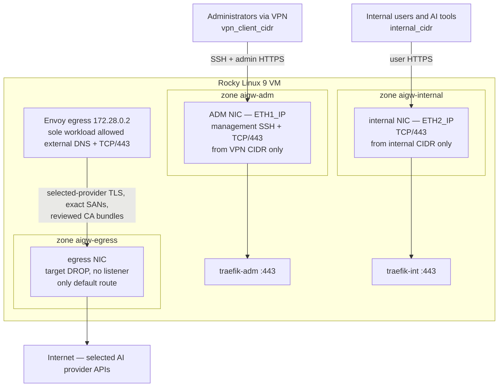

Route tables 101 and 102 send ADM and internal replies back through the same
connection.

## 2. Local preprod topology

Local preprod runs on one Docker engine. Three Docker planes stand in for the
host connections. Only `127.0.2.1:443` and `127.0.3.1:443` are published.

The exact production Envoy image comes from the seed and must pass its policy
gate. A separate test Envoy handles mock WIF. Test CA trust never enters the
production image.

Docker Desktop needs one test-only TCP forwarder to own both port 443 binds.
It passes TLS to the two Traefik edges. Production does not use this helper.

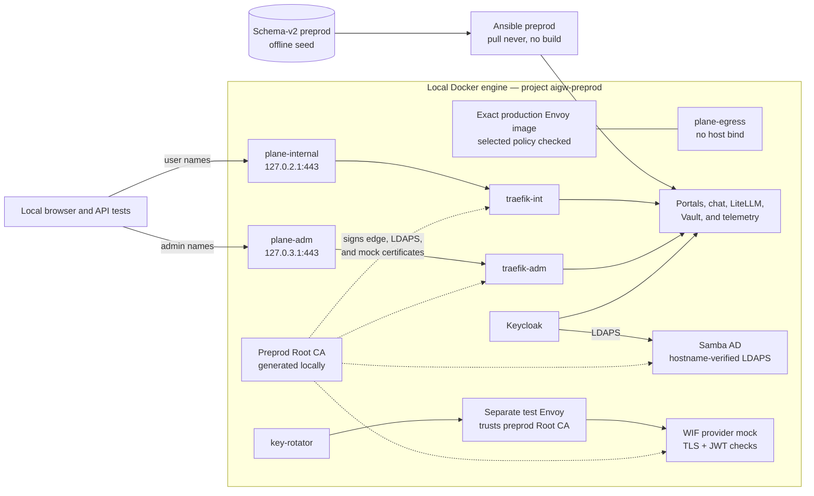

See [local preprod](preprod.md) for names, addresses, users, and destroy steps.

## 3. Segmented container planes

Ansible creates 20 Docker bridges. The base stack uses 18. Services join only
the planes they need. `DOCKER-USER` and `aigw_guard` deny cross-plane,
container-to-host, and unsafe outbound traffic.

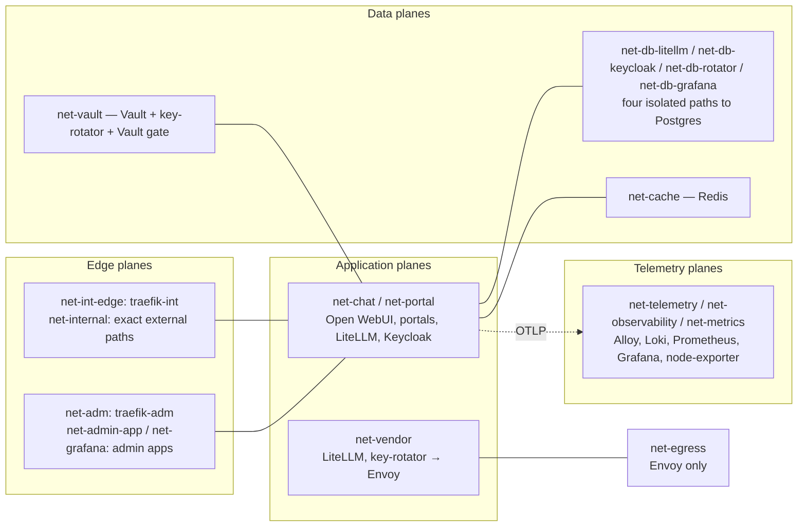

## 4. Software flow — user, developer, and administrator paths

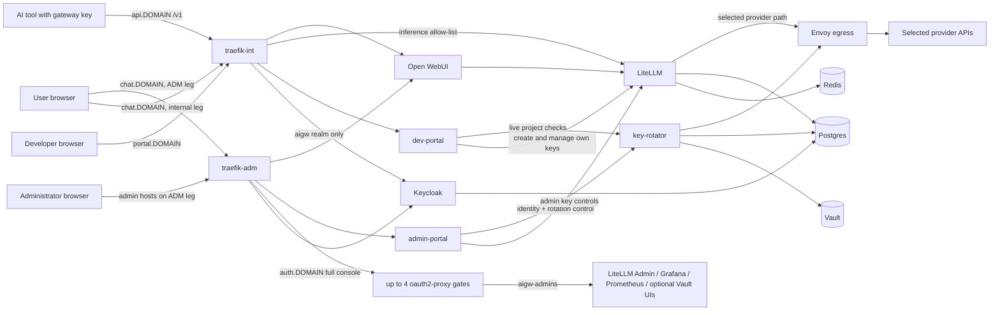

## 5. Authentication flow — browser OIDC and admin gates

All people sign in through Keycloak realm `aigw`. It sends four roles in the
`roles` claim: `aigw-chat`, old `aigw-users`, `aigw-developers`, and
`aigw-admins`. Each proxied admin UI has its own OAuth2 Proxy. Chat and both
portals use OIDC in the app.

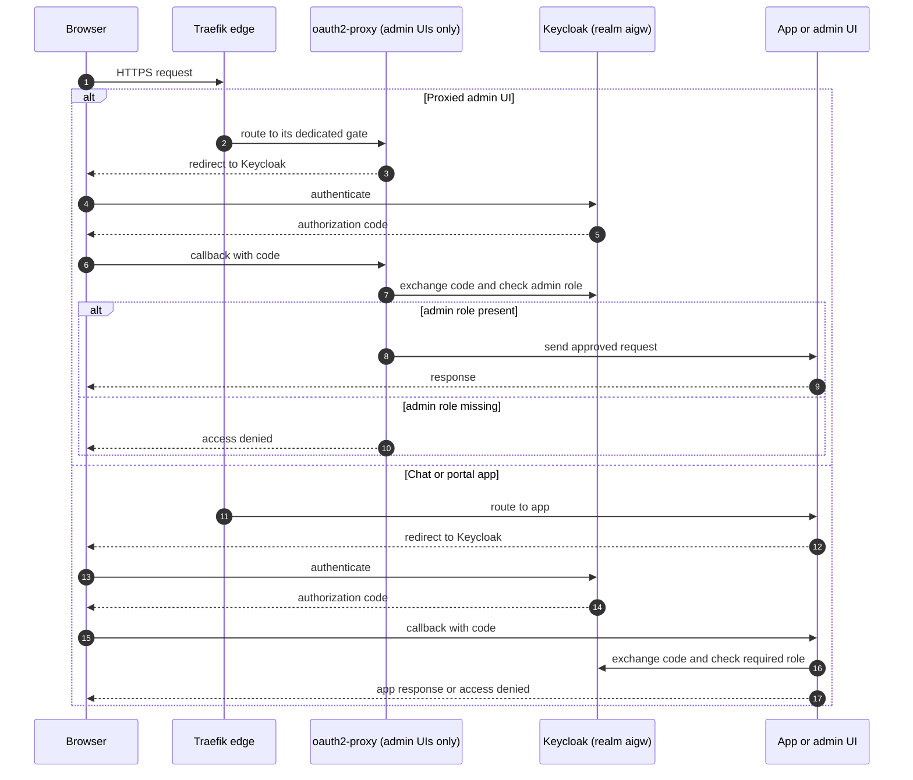

Admin portal writes also need a CSRF token and a fresh Keycloak login. The
step-up uses `prompt=login` and `max_age=0` and lasts five minutes. Each page
checks the live admin role again.

## 6. Logic flow — developer key lifecycle

Keycloak group membership grants project access. Portal keys follow that live
membership.

## 7. Security flow — provider credential rotation (Anthropic WIF)

No long-lived Anthropic key sits in app config. key-rotator gets a short-lived
token through the separate `anthropic-wif` realm. Production keeps the
`private_key_jwt` key in Vault. A reviewed test can use a mounted PEM instead.

The signing key is not a provider CA. Provider CA files are built into the
immutable Envoy image. Every provider call goes through Envoy.

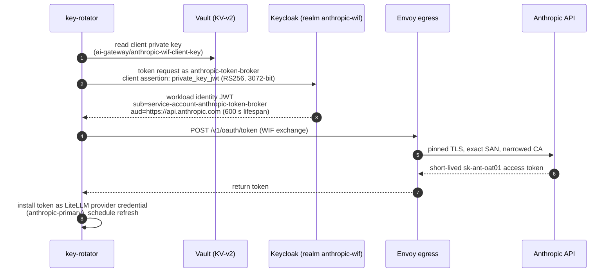

## 8. Security design — layered enforcement

Each layer fails closed on its own. One failed layer does not switch off the
rest.

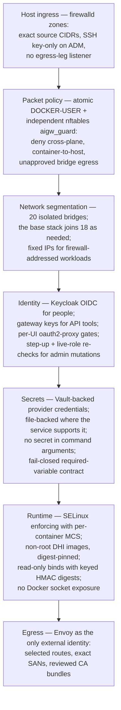

## 9. Telemetry and SOC log flow

Prompts and replies are sensitive. Alloy turns the reviewed `litellm_request`
span into a log. The raw span never leaves the gateway. The log stays in Loki
and may enter the narrow Cribl SOC feed.

Metrics, raw traces, normal service logs, and alert data never enter Cribl.
See [observability operations](observability-operations.md) and the
[Cribl SOC handoff](cribl-soc-handoff.md).

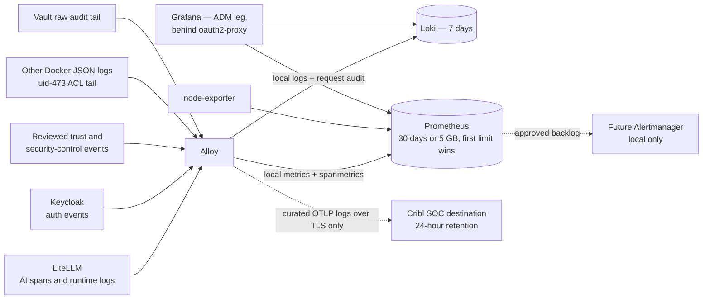

## 10. Deployment logic — Ansible converge order

The run stops at the first failed gate. `ansible/os-prep.yml` runs R1 through
R6 and starts no containers. `ansible/deploy-stack-only.yml` runs R7 through
R9. `ansible/site.yml` runs both files in that order.

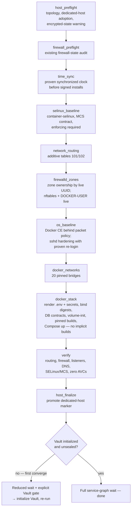

## 11. Provider selection and immutable Envoy build

Operators select reviewed names. They cannot pass a hostname or CA path. One
sorted policy drives the image and both seed files.

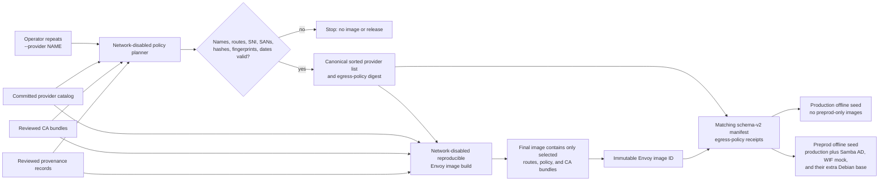

The catalog is not copied into the image. Only selected records enter the
policy. A different selection creates a different policy and image ID.

## 12. Runtime request path for selected providers

The host firewall lets only Envoy reach a provider. Envoy has no catch-all
provider route and no system trust fallback.

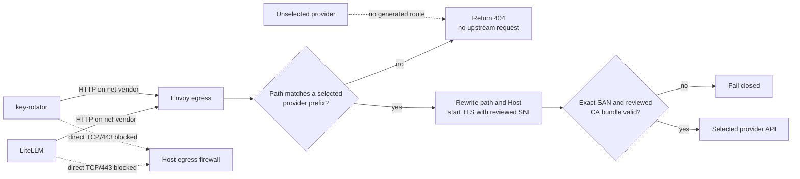

## 13. CA capture, review, rotation, and approval

A live capture is only evidence. A separate review and release approval must
pass before the CA can reach runtime.

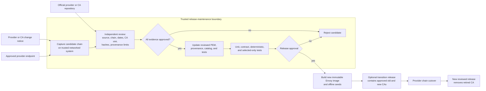

Ansible does not enter this flow. It receives the built release and never
downloads trust files.

The fingerprint proves the certificate bytes. The provenance record explains
the capture and review. Neither proves CA country, endpoint location, or data
residency. Those need separate proof.

## 14. Offline-seed validation, deployment, and rollback

One build makes separate production and preprod files. Local preprod must pass
with its exact seed before anyone transfers the production pair.

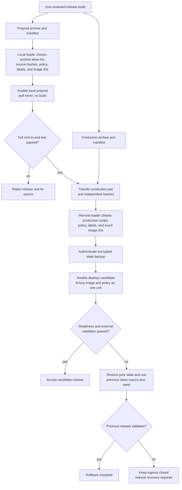

See the [image update workflow](image-update-workflow.md) for commands and
[offline image releases](offline-image-seed.md) for the manifest and loader
contracts.
