# AI Gateway — Technical Diagrams

This document is the visual companion to the
[solution map](solution-map.md). Each diagram reflects the implemented
configuration in `compose/`, `ansible/`, and `services/`; where a diagram
simplifies, the solution map's tables remain authoritative. Diagrams render
natively on GitHub/GitLab (Mermaid). Provider catalog and CA review details
are in [Provider onboarding](provider-onboarding.md) and the
[Provider CA maintenance SOP](sop/provider-ca-maintenance.md).

## 1. Network topology and trust zones

Three customer-owned interfaces map to three firewalld zones with distinct
inbound policy. Nothing publishes a listener on the egress leg; only the two
Traefik edges publish container ports, each bound to its exact host address.

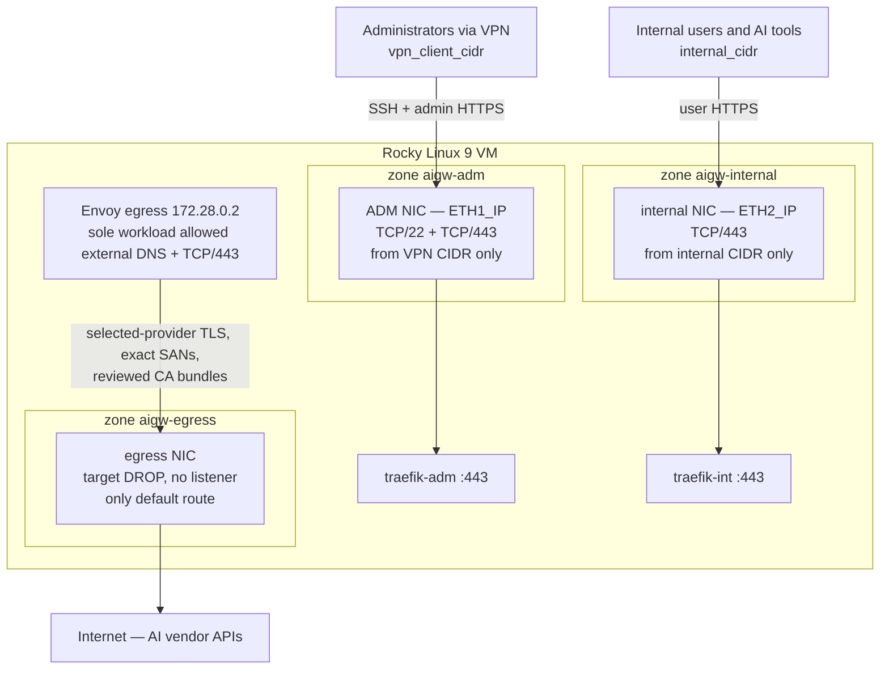

Reply traffic for the ADM and internal legs uses source-policy routing
(tables 101/102) so responses leave through the interface they arrived on.

## 2. Local preprod topology

Local preprod runs on one local Docker engine. It keeps the production service
networks but replaces physical host interfaces with three labeled Docker
planes. Only the two loopback HTTPS addresses are published. The exact
production Envoy image starts from the offline seed and its policy is checked.
The mock WIF request path stays separate, so test trust can never enter that
production Envoy image.

Docker Desktop requires one preprod-only Envoy TCP forwarder to own both IPv4
port 443 publications. It passes TLS through unchanged to the separate
Internal and ADM Traefik containers. This workaround is not in production.

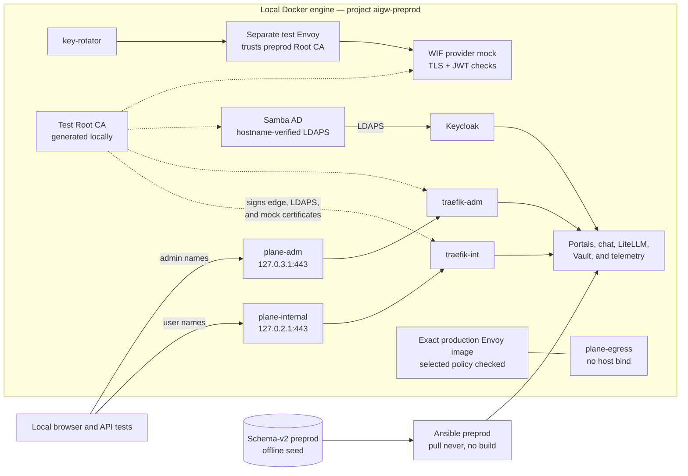

See [Local preprod](preprod.md) for the exact names, addresses, static users,
and bounded destroy command.

## 3. Segmented container planes

The stack pre-creates 20 Docker bridges and uses 18 in the base profile;
services join only the planes they need, and both an atomic `DOCKER-USER`
chain and an independent native nftables guard (`aigw_guard`) deny
cross-plane, container-to-host, and unapproved egress traffic. The full
per-bridge membership table is in the solution map.

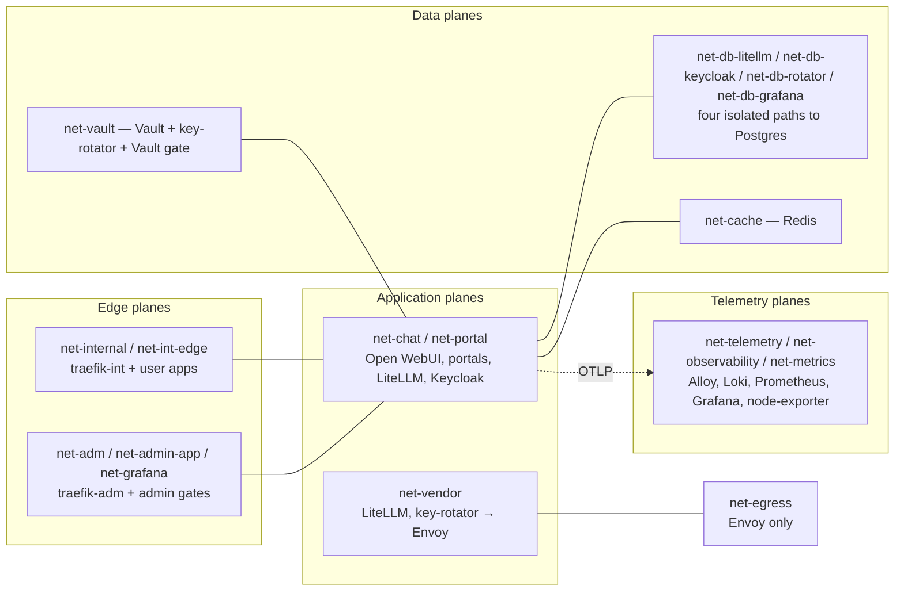

## 4. Software flow — user, developer, and administrator paths

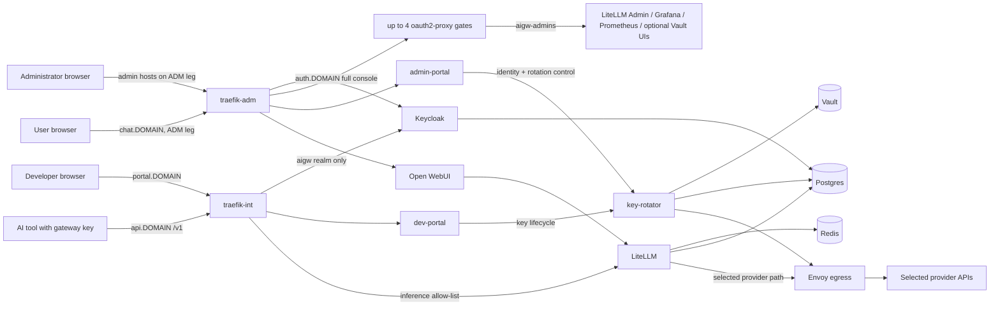

## 5. Authentication flow — browser OIDC and admin gates

All human access authenticates against Keycloak realm `aigw`, which emits
the four realm roles (`aigw-chat`, `aigw-users` (deprecated for chat),
`aigw-developers`, `aigw-admins`) in a
`roles` claim. Admin UIs sit behind dedicated oauth2-proxy instances.

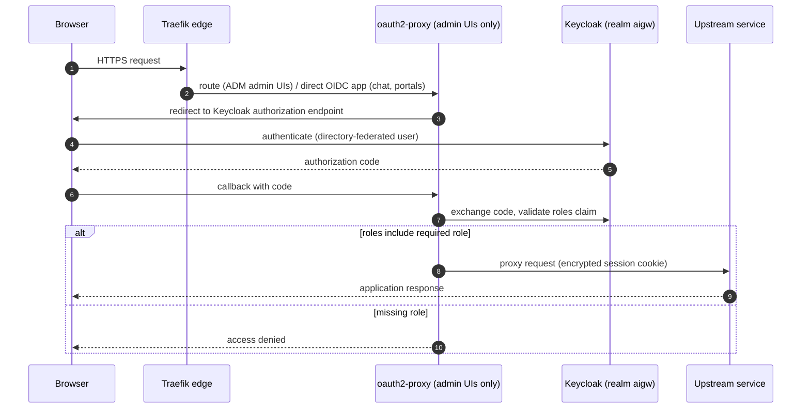

Admin-portal mutations additionally require a CSRF token and a fresh
Keycloak step-up (`prompt=login`, `max_age=0`) within a five-minute window,
and every page read re-checks the caller's live composite roles — a revoked
administrator fails closed even with a valid session cookie.

## 6. Logic flow — developer key lifecycle

Group membership in Keycloak is the authorization source; LiteLLM virtual
keys are always derived from it and revoked with it.

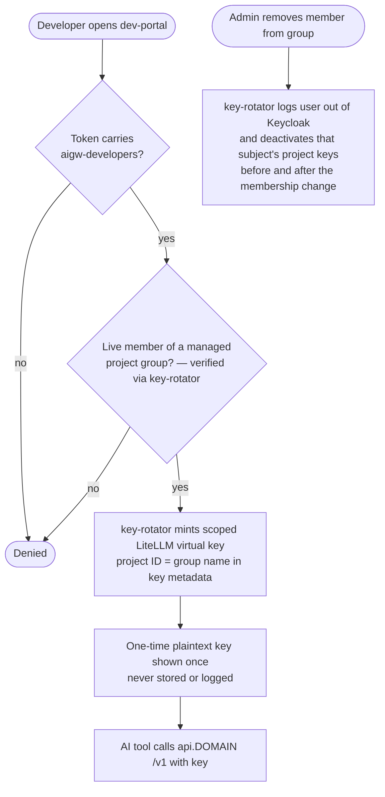

## 7. Security flow — provider credential rotation (Anthropic WIF)

No long-lived vendor API key sits in application configuration. key-rotator
brokers a short-lived Anthropic token through Keycloak's isolated
`anthropic-wif` realm using `private_key_jwt`; the private key exists only
in Vault (or a mounted PEM) and every vendor call leaves through Envoy.

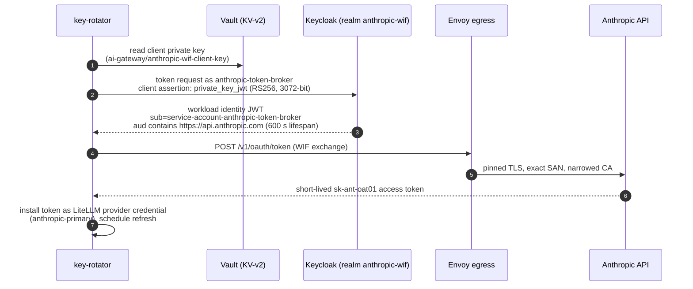

## 8. Security design — layered enforcement

Each layer fails closed independently; compromising one does not disable the
others.

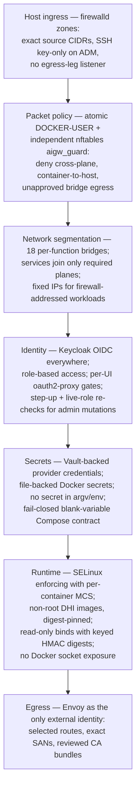

## 9. Telemetry and SOC log flow

Prompts and completions are sensitive. Alloy converts the reviewed
`litellm_request` span into a log record. The raw span never leaves the gateway.
The log stays locally in Loki and may enter the narrow Cribl SOC feed.

Metrics, raw traces, ordinary service logs, and alert payloads never enter
Cribl. Detailed routes and redaction rules are in
[observability operations](observability-operations.md). The logging-team
contract is in [Cribl SOC logging handoff](cribl-soc-handoff.md).

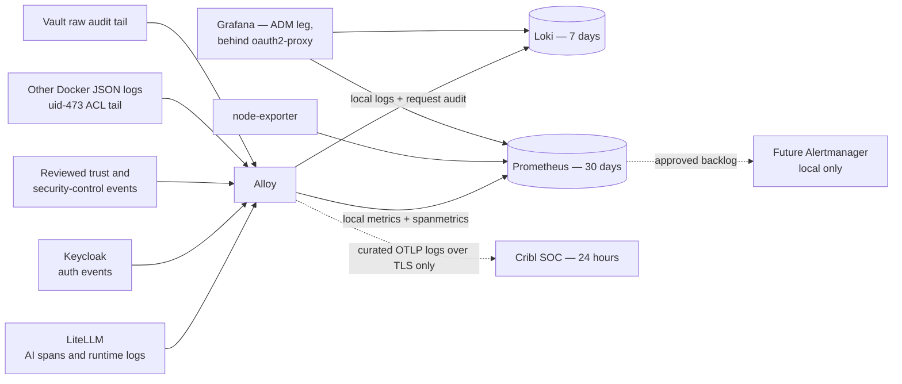

## 10. Deployment logic — Ansible converge order

The converge is a gated pipeline: each stage validates its contract and the
run stops at the first failure, before later stages can mutate the host.
Stages R1–R6 are `ansible/os-prep.yml` (host preparation, runs standalone and
starts no containers); R7–R9 are `ansible/deploy-stack-only.yml` (stack
phase); `ansible/site.yml` composes the two in this exact order.

## 11. Provider selection and immutable Envoy build

Operators select reviewed names. They cannot pass a hostname or CA path. The
same canonical policy is used to build the image and write both release
projections.

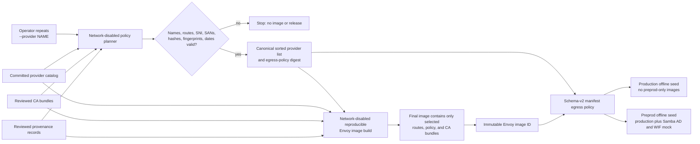

The catalog itself is not copied into the final image. The generated policy
contains only the selected records. Changing the selection changes the policy
and image identity.

## 12. Runtime request path for selected providers

The host firewall leaves Envoy as the only external workload identity. Envoy
has no catch-all provider route and no system-trust fallback.

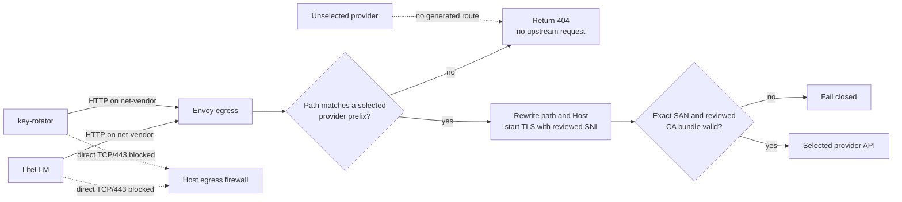

## 13. CA capture, review, rotation, and approval

Live capture is evidence, not approval. The reviewed source and a new release
must cross the release approval boundary before any CA reaches runtime.

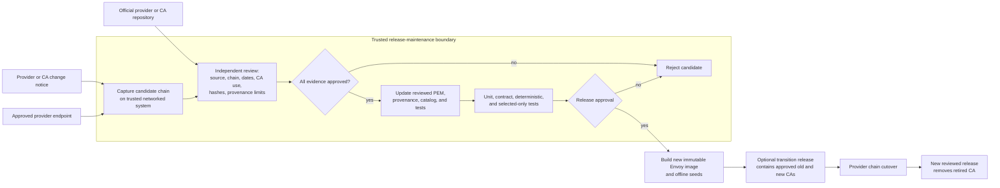

Ansible does not enter this flow. It receives the already-built release and
never downloads trust material.

## 14. Offline-seed validation, deployment, and rollback

The production and preprod files are separate projections from one build.
Local preprod must pass using its exact seed before the production pair is
transferred.

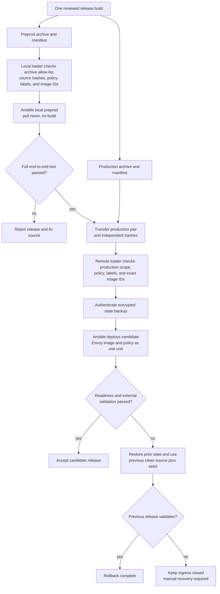

See the [image update workflow](image-update-workflow.md) for commands and
[offline image releases](offline-image-seed.md) for the manifest and loader
contracts.
