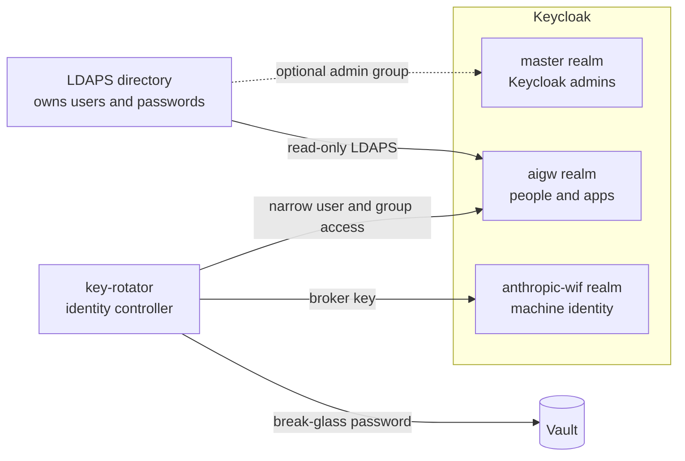

# Keycloak realms and admin access

This page explains how AI Gateway uses Keycloak. It covers the three realms,
admin accounts, and login gates. For commands, use
[identity operations](identity-operations.md). For security boundaries, use
the [solution map](solution-map.md).

## Key terms

- **Realm:** a separate identity area in Keycloak. It has its own users,
  logins, and apps.
- **Client:** an app or service registered in a realm.
- **Role:** a named permission that an app checks in a login token.
- **Group:** a set of users. A group grants roles in this design.

A Keycloak client can sign in users only from its own realm. Human users and
the apps they use must therefore share a realm. AI Gateway separates Keycloak
admins, gateway users, and machine identities instead.

## The three realms

| Realm | Purpose | Contents |
| --- | --- | --- |
| `master` | Keycloak admin | The `keycloak-admins` group and `break-glass-admin` user. A customer AD admin group may also be linked here. Temporary first-start accounts are removed after deployment. |
| `aigw` | People and gateway apps | LDAPS users, app clients, gateway roles, managed groups, and the `aigw-identity-controller` service client. |
| `anthropic-wif` | Machine identity | The `anthropic-token-broker` service client for Anthropic WIF. It has no human users. |

The `master` realm keeps its Keycloak name. Only a user from `master` can
administer other realms. A new realm called “admin” could manage only itself.

Apps check realm roles in the token. A managed group under `/aigw-managed`
grants one or more roles. See [identity operations](identity-operations.md).

`aigw-admins` and `keycloak-admins` are separate:

- `aigw-admins` grants access to AI Gateway admin pages.
- `keycloak-admins` grants access to Keycloak settings.

One role never grants the other.

## Automatic first deployment

On its first start, Keycloak creates two temporary items in `master`:

- the bootstrap admin user, normally `admin`; and
- the `aigw-bootstrap-controller` service client.

Keycloak marks both as temporary. Ansible uses them only after LDAPS and Vault
are ready. The admin portal has no setup button.

During the automatic step, key-rotator:

1. Uses the temporary client to get a short-lived admin token.
2. Creates `aigw-identity-controller` in the `aigw` realm and stores its private
   key in Vault. This controller can manage users and groups. It cannot manage
   clients, realms, roles, or the `master` realm.
3. Creates `keycloak-admins` and the disabled `break-glass-admin` user. It
   creates a random 48-byte password, writes it to Vault, and reads it back.
   Only then does it enable the user.
4. Proves every lasting control, then deletes the temporary user and client.

This order fails closed. A temporary admin is never removed before the lasting
admin is ready and its password is safe in Vault. A failure leaves the
temporary items in place so Ansible can retry.

Cleanup also checks Keycloak's temporary marker. It refuses to delete an
operator-created account with the same name. These names are fixed security
contracts:

| Object | Fixed name |
| --- | --- |
| Keycloak admin group | `keycloak-admins` |
| Break-glass user | `break-glass-admin` |
| Vault password path | `ai-gateway/keycloak/break-glass-admin` |

Do not rename `break-glass-admin` to `admin`. If an operator deletes the
break-glass items, the narrow `aigw` controller cannot rebuild them. Follow the
recovery steps in [identity operations](identity-operations.md). Do not erase
the Keycloak database to force another realm import.

## Day-to-day and emergency admin access

There are two ways to join `keycloak-admins`:

- **Emergency access:** use `break-glass-admin`. Its password stays in Vault.
  A root operator retrieves it through the stdin-only Vault procedure. Rotate
  the password after use.
- **Day-to-day access:** link an approved customer AD admin group to `master`.
  Each admin then uses a named account with its own audit trail.

Use both when possible. Directory-only access can fail when LDAPS is broken.
Break-glass-only access uses one shared name and gives a weaker audit trail.

Keycloak console MFA is not part of this release. These controls reduce that
risk:

- the console is available only on the ADM network from the approved VPN
  range;
- the emergency password is long, random, and stored in Vault;
- brute-force protection is on for `master`;
- Keycloak records admin events; and
- the emergency password is changed after use.

## Login gates

Admin pages use up to three gates:

1. **Network gate:** the ADM firewall allows only the approved VPN range.
2. **Identity gate:** OAuth2 Proxy checks an `aigw` login and the
   `aigw-admins` role. Each protected page has its own cookie key.
3. **App gate:** the app may ask for its own login or secret.

| Admin page | Identity gate | App gate |
| --- | --- | --- |
| `litellm-admin.<domain>` | OAuth2 Proxy and `aigw-admins` | LiteLLM master key |
| `grafana.<domain>` | OAuth2 Proxy and `aigw-admins` | None. Grafana trusts the proxy identity headers. |
| `prometheus.<domain>` | OAuth2 Proxy and `aigw-admins` | None |
| `vault.<domain>` | OAuth2 Proxy and `aigw-admins` | Vault OIDC with the scoped `vault-admins` policy |
| `admin.<domain>` | Portal OIDC and a live role check | A fresh Keycloak login for changes |
| `auth.<domain>` | ADM network only | A named AD admin or `break-glass-admin` login |

The Keycloak console does not sit behind OAuth2 Proxy. That proxy uses the
`aigw` realm. If a broken `aigw` login also guarded the recovery console, it
could block the repair path. The ADM network gate, Keycloak login, brute-force
rules, and admin-event log still protect the console.

Routine group, user, and key work belongs in the admin portal. Use the Keycloak
console for realm settings, clients, roles, and recovery work that the narrow
controller cannot do.

The deployment owner chooses the first people or directory group that receive
`aigw-admins`. Automation cannot make that business choice. Once the LDAPS
settings and bind password are supplied, Ansible sets up and checks federation,
OIDC clients, lasting admin controls, and temporary-account cleanup. The user
does not initialize this through the admin portal.
