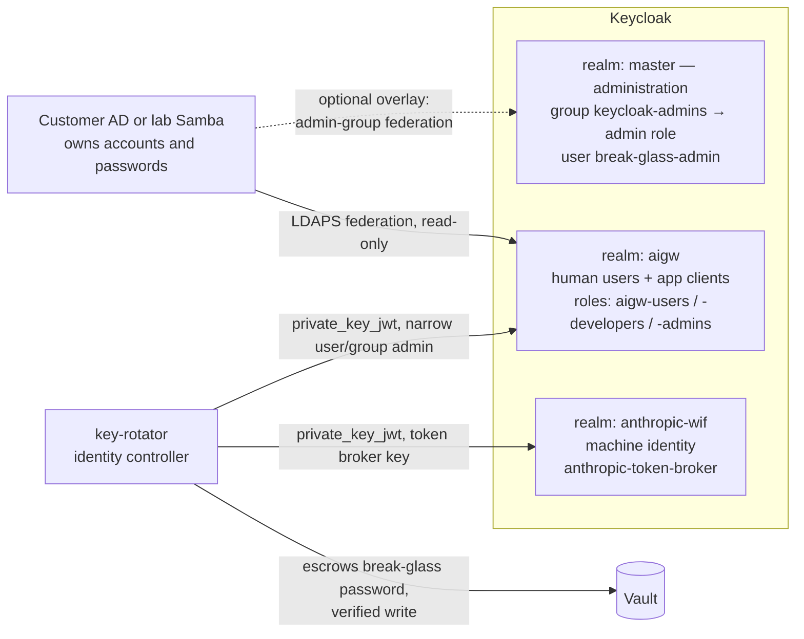

# Keycloak Realm Architecture and the Administrator Model

This document explains how identity is organized across the three Keycloak
realms, how the several admin login prompts fit together, and the decided
administrator model: a durable, group-gated Keycloak administrator with a
Vault-escrowed break-glass credential. The administrator model is the design
of record and lands with the current implementation cycle; the sections on
realms, roles, and login layers describe the deployed stack. For operational
procedures (bootstrap ceremony, group management), see
[identity-operations.md](identity-operations.md); for trust boundaries, see
the [solution map](solution-map.md).

## Keycloak terms used here

- **Realm** — an isolated identity domain inside one Keycloak server: its own
  users, logins, and applications. Realms do not see each other's users.
- **Client** — an application registered in a realm that users log into via
  that realm (Open WebUI, the portals) or that authenticates as itself (a
  service account).
- **Role** — a named capability (for example `aigw-admins`) that a user's
  login token carries and applications check.
- **Group** — a container of users; in this stack, membership in a group is
  how a user acquires roles.

One nuance shapes everything below: **a client can only authenticate users
from its own realm.** You cannot put human users in one realm and the
applications they log into in another. So "separate the user realm from the
app realm" is not an available split — users and their apps must co-reside,
and the meaningful separation is *administrators* vs *users + applications*
vs *machine identities*.

## The three realms

| Realm | Purpose | Who/what lives there |
|---|---|---|
| `master` | Keycloak administration | The `keycloak-admins` group, mapped to master's full `admin` composite role; the durable `break-glass-admin` user, password escrowed in Vault; optionally, admins federated from a designated AD admin group. Temporary bootstrap principals exist only between first start and the identity ceremony. |
| `aigw` | People and applications | Human users (federated from AD over LDAPS — lab Samba or the customer directory); the app clients `open-webui`, `dev-portal`, `admin-portal`, `admin-ui`; the realm roles `aigw-users`, `aigw-developers`, `aigw-admins`; the managed group tree under `/aigw-managed`; the durable `aigw-identity-controller` service client. |
| `anthropic-wif` | Machine / workload identity | The `anthropic-token-broker` service client used for the Anthropic workload-identity-federation token exchange. No human users, no roles. See [anthropic-wif-bootstrap.md](anthropic-wif-bootstrap.md). |

`master` keeps its built-in name: in Keycloak, administering *other* realms
is exclusive to master-realm users, so a separately-named "admin realm"
could only ever administer itself. It may carry a friendlier console display
name; that is cosmetic and changes nothing functionally.

Authorization inside `aigw` is carried as a realm-**role** claim, not a group
claim: each first-party client maps realm roles into a `roles` claim in the
token. Users acquire `aigw-admins` by being placed in a managed group (a
child of `/aigw-managed`) that maps to that role — see the
[authorization model](identity-operations.md#authorization-model).

Note that `aigw-admins` and `keycloak-admins` are **deliberately disjoint**:
`aigw-admins` authorizes the AI Gateway admin surfaces (admin portal, LiteLLM
UI, Grafana, Vault UI), while `keycloak-admins` authorizes Keycloak itself.
Holding one grants nothing in the other.

## The administrator lifecycle: bootstrap, escrow, teardown

On its first start, Keycloak creates two temporary principals in the `master`
realm: a password-backed bootstrap admin user (`admin` by default) and a
bootstrap service client (`aigw-bootstrap-controller`). Keycloak marks both
with an `is_temporary_admin` attribute. They exist so that the **identity
bootstrap ceremony** (admin-portal → **Initialize identity control**, run
once by the initial `aigw-admins` operator) can set up durable controls.

During that ceremony, the key-rotator service:

1. uses the temporary bootstrap client to obtain a short-lived master-realm
   admin token;
2. creates the durable `aigw-identity-controller` client in the `aigw` realm
   and escrows its private key in Vault — this controller holds only narrow
   user/group administration permissions (`manage-users`, `query-groups`,
   `query-users`, `view-realm`, `view-users`), deliberately not client,
   realm, or role management, and **no authority over the `master` realm**;
3. establishes the durable break-glass administrator
   (`_ensure_break_glass_admin`): the `keycloak-admins` group mapped to
   master's full `admin` composite role, with `break-glass-admin` as its
   member. The ordering is fail-closed — the user is **created disabled**,
   given a rotator-generated 48-byte random password, that password is
   written to Vault at `ai-gateway/keycloak/break-glass-admin` with the
   write read back and verified, and **only then is the user enabled**;
4. only after every durable control — including the break-glass
   administrator — is proven, deletes the temporary bootstrap admin user and
   the temporary bootstrap client.

The governing invariant: **the temporary admin is never destroyed until the
durable one is proven and escrowed.** A failure anywhere in step 3 leaves
the temporary principals in place and the ceremony retryable — never a
Keycloak with no administrator.

Teardown remains guarded the way it always was: the rotator's cleanup
(`_delete_bootstrap_principals` in `services/key-rotator/app/identity.py`)
looks up the exact bootstrap username and hard-fails on any master-realm
account that matches it without carrying the temporary marker, so it can
never remove an operator-created admin. This is why the durable account is
named `break-glass-admin` and must never be named `admin`. The three names
are **contract pins** asserted by the test suite; renaming any of them is a
contract change, not a cosmetic edit:

| Object | Pinned name |
|---|---|
| Master-realm admin group | `keycloak-admins` |
| Durable break-glass user | `break-glass-admin` |
| Vault escrow path | `ai-gateway/keycloak/break-glass-admin` |

If the break-glass objects are ever deleted out-of-band, the durable `aigw`
controller cannot recreate them — its lack of master-realm authority is a
deliberate boundary, not an oversight. Recovery is the documented path:
recreate the temporary bootstrap client (a realm re-seed into an empty
database, see
[identity-operations.md](identity-operations.md#domain-migration-on-an-existing-realm))
and re-run the identity ceremony.

`RETAIN_BOOTSTRAP_ADMIN_USER` (`retain_bootstrap_admin_user` in
`services/key-rotator/app/config.py`, default false) is unchanged this
cycle: it remains a disposable-lab-only convenience that converts the
temporary user into a marked lab recovery operator, and is slated for
deprecation now that every profile keeps a durable administrator.

## Who administers Keycloak, day to day and in a crisis

Membership in `keycloak-admins` arrives by two paths. The first is
mandatory; the second is recommended wherever a customer directory exists:

- **Break-glass (base profile, all deployments).** The `break-glass-admin`
  account with its Vault-escrowed password. Retrieval is an on-VM root Vault
  ceremony using the stack's stdin-only idiom — the password is never
  memorized, never in a wiki, never on argv — and console login works only
  via the ADM edge. Every retrieval is an auditable act, and the password is
  rotated after use.
- **AD-federated admins (optional, inventory-gated overlay).** A designated
  AD admin group is federated into the `master` realm and its members land
  in `keycloak-admins`. This is the intended day-to-day path: per-person
  credentials and a per-person audit trail, with membership managed where
  the customer already manages it.

Why both rather than either alone: **AD-only is circular** — a broken LDAP
federation locks out exactly the people who need to fix it, and the lab's AD
lives inside the same Compose stack it would be administering.
**Break-glass-only has a weak audit trail** — one shared account cannot tell
you which person acted. The escrowed account is the instance-recovery
principal; the federated group is the accountable everyday path.
`keycloak-admins` maps to the full `admin` composite role because recovery
must be able to repair anything; a scoped day-to-day operator tier may be
added later.

### Compensating controls (no MFA this iteration)

MFA on the Keycloak console is deferred. The compensating controls are:

- ADM-edge network gating — the console is reachable only from the VPN
  client range, like every other admin surface;
- a rotator-generated 48-byte random escrowed password, never human-chosen
  or human-memorized;
- master-realm brute-force protection **now enforced** — it was previously
  off on the master realm, a real gap this design closes alongside the
  missing administrator;
- Keycloak admin-event logging, so console actions are attributable and
  reviewable;
- post-use rotation of the escrowed password.

## The layered login model

Administrators encounter several login prompts in a row. That is intentional
defense-in-depth — three independent layers, each of which must pass:

1. **Network.** Admin hostnames exist only on the ADM edge, reachable only
   from the VPN client range (host firewall + DOCKER-USER rules).
2. **Identity gate.** oauth2-proxy (one instance per admin surface, with
   per-gate cookie secrets) requires a Keycloak `aigw`-realm login whose
   token carries the `aigw-admins` role. This layer decides **who may reach
   the UI at all**, and revocation propagates within the 5-minute cookie
   refresh.
3. **The application's own login.** Whatever the app natively requires.
   This layer decides **what you can do once inside**, using a credential
   Keycloak never sees (or, for Keycloak itself, its own admin login).

| Admin surface | Layer 2 (who gets in) | Layer 3 (the app's own login) |
|---|---|---|
| `litellm-admin.<domain>` — LiteLLM Admin UI | oauth2-proxy, `aigw-admins` | LiteLLM **master key** (its built-in SSO is enterprise-licensed) |
| `grafana.<domain>` | oauth2-proxy, `aigw-admins` | None by design — Grafana trusts identity headers from its proxy and shows no second login form |
| `prometheus.<domain>` | oauth2-proxy, `aigw-admins` | None — Prometheus has no native login |
| `vault.<domain>` (optional `vault-ui` profile) | oauth2-proxy, `aigw-admins` | **Vault token** — the Vault OIDC auth method is not wired up |
| `admin.<domain>` — admin portal | Portal's own Keycloak OIDC login (`aigw` realm) + live role re-check | Same login; mutations additionally require a fresh Keycloak step-up |
| `auth.<domain>` — Keycloak admin console | None — served directly on the ADM edge, deliberately outside oauth2-proxy | Keycloak admin login: **`break-glass-admin`** (password via the on-VM Vault ceremony) or a **federated AD admin account** (optional overlay) |

The Keycloak console stays outside oauth2-proxy on purpose: oauth2-proxy
authenticates against the `aigw` realm, so putting it in front of Keycloak's
own recovery surface would be circular — a broken Keycloak login would block
the console needed to fix it — and would recouple `aigw-admins` with
Keycloak administration, which the model keeps disjoint. The console's
protections are the layer-1 network gate, its own brute-force-protected
admin login, and admin-event logging.

So a Grafana session costs two prompts (VPN, then Keycloak), a Vault session
three (VPN, Keycloak, token), and the Keycloak console two (VPN, then a
master-realm admin login) — with the console's inner credential either a
per-person federated AD account or the escrowed break-glass password.

Routine identity work — creating groups, assigning users, key rotation —
continues to flow through the admin portal and the narrow `aigw` controller,
which never needed a Keycloak console login. The console, entered through
`keycloak-admins`, is for what the controller deliberately cannot do: realm
settings, clients, roles, and recovery. First-administrator provisioning for
the **`aigw`** realm (one pre-existing user carrying `aigw-admins` so the
portal can be entered at all) is a separate concern, tracked in
[project-status.md](project-status.md).
