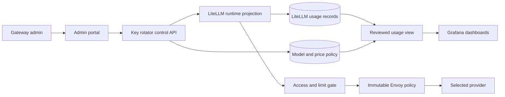

# Model controls, usage, pricing, and routing plan

This page tracks both finished work and later work. The governed catalog,
two per-model output controls, prompt-free usage ledger, five-part configured
cost, backdated-price adjustment flow, and Grafana usage dashboard are built
in the current source. They still need one exact offline-seed PreProd release
test. Automatic routing remains a later, disabled-by-default project.
The source backlog item is
[model-aware usage, limits, catalog, cost, dashboards, and routing](../TASKS.md#add-model-aware-usage-limits-catalog-cost-dashboards-and-routing).

The current release gates remain the first promotion priority. Source work may
be built in parallel. Build the feature in small releases. Each
release must work with the exact offline seed in local PreProd before it can
move to production.

The current code provides these safety boundaries:

- a model draft can use only a provider in the exact deployed Envoy receipt;
- configured prices use exact decimal math and complete effective-date checks;
- model and price versions are stored as append-only records;
- the admin portal can create, activate, show, hide, and retire a model after
  a recent Keycloak login;
- a draft never creates a LiteLLM deployment;
- the controller rebuilds or checks active LiteLLM database models at startup;
- the public `/v1/models` and `/models` routes remove hidden, retired,
  unmanaged, and ambiguous database models;
- a hidden active model can still be called by its exact name when the key is
  allowed to use it;
- retirement is blocked while a Keycloak project still assigns the model;
- the shared Open WebUI key is rebuilt from the filtered public model list;
- the native LiteLLM admin edge blocks model and config mutation routes;
- the admin portal can add a future USD price after a recent Keycloak login;
- the admin portal can preview and confirm a backdated price after a recent
  Keycloak login, without editing old evidence;
- the prompt-free usage callback records five token classes and keeps missing
  usage or price unknown;
- Grafana reads only reviewed usage views through a read-only login;
- an admin can set a per-project output cap and UTC-minute output limit for
  each allowed model; and
- the future `aigw-auto` name is reserved and denied at runtime.

The portal does not yet send a provider test request before activation. The
usage, pricing, adjustment, and dashboard source still needs exact-seed live
acceptance. An active router and more limit types remain open. The
[automatic routing ADR](automatic-model-routing-adr.md) records the routing
choices and the tests required before that feature can be enabled.

Operators should use the short
[model lifecycle SOP](sop/model-lifecycle.md). It lists the state changes,
checks, test commands, and rollback behavior without requiring knowledge of
the application code.

## What already exists

The gateway already has parts we can reuse:

| Current part | What it does now | Main gap |
| --- | --- | --- |
| Governed model catalog | Keeps append-only draft, active, visible, hidden, and retired state tied to the loaded Envoy policy | New exact-seed, backup, restore, and rollback evidence is still open |
| Project model policy | Uses an explicit model set, default model, and per-model output controls | More limit types need separate product decisions |
| Key limits | Keeps existing whole-key TPM, RPM, and budget controls; adds per-model request and fixed UTC-minute output controls | No per-user, rolling-window, or per-model money control is claimed |
| Prompt-free usage ledger | Stores requested and actual model, stable user and project, five token classes, three cost sources, and completeness | New exact-seed reconciliation and rollback evidence is still open |
| Request audit spans | Carry trusted user, project, requested model, actual model, token totals, and cost | They are audit records, not a long-term billing database |
| Grafana dashboards | Show LiteLLM spend plus reviewed gateway usage and cost by model, project, and user | New exact-seed totals and role checks are still open |
| Prompt cache report | Shows daily cache-read and cache-write token counts | It does not show every price part by model, user, and project |
| Immutable Envoy policy | Allows only providers selected in the offline release and binds the governed catalog to the loaded receipt | The new candidate still needs exact-seed acceptance |

The implementation captures the exact LiteLLM API and database schema from the
pinned image. Upstream documentation is useful, but the shipped image is the
contract. A LiteLLM update must refresh those fixtures and tests.

## Goals

This work adds six related capabilities:

1. Track token use by requested model, actual provider model, project, and user.
2. Enforce approved token limits for each model.
3. Add a model through the admin portal while keeping it out of `/v1/models`.
4. Show model usage and cost in Grafana.
5. Price normal input, cache creation, cache reads, and output separately.
6. Explore automatic model routing behind a disabled-by-default switch.

The admin portal will also manage model prices. An admin chooses the token
quantity and the price for that quantity. Examples are `$30 per 1,000,000`
normal input tokens and `$0.30 per 1,000,000` cache-read tokens.

## Rules that must not change

- Keycloak remains the source for people, roles, and project membership.
- The model policy database must never become a second identity source.
- A provider name must exist in the immutable provider catalog and in the
  loaded offline release.
- The portal must not accept a hostname, URL, CA file, Envoy route, or SNI
  value from an administrator.
- Provider credentials stay in Vault. They never enter the model or price
  tables.
- The admin portal requires the `aigw-admins` role, CSRF protection, and a
  recent Keycloak login for every write.
- Prompts, replies, headers, and keys must not enter usage or price tables.
- Request IDs must not become Prometheus labels.
- A missing model, policy, identity, provider, or price must not be guessed.
- Missing price data means `unknown`, not zero.
- A price change must not change the cost of an old request.
- A routed request may use only a model already allowed for that caller.
- No routing classifier may send a prompt to another provider unless that
  separate disclosure is reviewed and approved.

## Proposed design

Use the existing admin portal, key-rotator control API, PostgreSQL, LiteLLM,
and Grafana paths. Do not add a new public service.



The control API owns the model registry and price policy. Keycloak remains the
source for project membership, model assignment, and project limit policy.
LiteLLM is the request engine and receives a checked runtime copy. Envoy still
owns the provider network boundary.

The accounting ledger now uses the `aigw_governance` schema in the separate
`rotator` PostgreSQL database. It does not write into LiteLLM's vendor-owned
tables. The LiteLLM callback sends one normalized, prompt-free event to the
key-rotator. The `rotator` login can read and append evidence, but it cannot
update, delete, truncate, or own that evidence. The non-login
`aigw_governance_owner` role owns the schema and its mutation guards.

Grafana uses the `grafana_ro` login. It may connect to the `rotator` database
and read only the security-barrier `usage_reporting` and
`usage_component_reporting` views. It cannot read the base usage, preview, or
adjustment tables. The same login still has narrow column grants in the
LiteLLM database for older dashboards. Remove those older grants only after
every remaining dashboard moves to reviewed gateway views.

### Policy objects

Use small, versioned objects. Exact table names may change during the schema
review, but each object needs one clear job.

| Object | Required fields | Purpose |
| --- | --- | --- |
| Model catalog | Public name, provider name, provider model ID, visibility, state, revision | Defines one callable model without storing a provider URL or secret |
| Project policy | Keycloak project ID, explicit model IDs, default model, limit maps, revision | Keeps assignment and project limits with the existing Keycloak group policy |
| Model limit | Optional global or key scope, model ID, control type, amount, window, revision | Adds a model rule without replacing Keycloak membership |
| Price version | Model ID, usage class, token unit, price, currency, effective time, source, revision | Prices one type of token without rewriting history |
| Usage result | Request ID, trusted user and project snapshot, requested and actual model, terminal time, streaming and retry state, token classes, price revision, component costs | Stores one idempotent, prompt-free result after the provider call ends |
| Cost adjustment | Usage ID, superseding price version, component delta, operation ID, reason | Applies a backdated correction without editing the original cost |
| Policy audit | Actor subject, action, old digest, new digest, time, result | Records every checked admin change |

Use stable IDs for joins. Display names may change, but an old usage row must
still resolve to the model and price version used at that time.

## Plan 1: governed and hidden models

### Admin workflow

Add a Models page to the admin portal. It should let an admin:

1. Choose a provider from the providers in the loaded release receipt.
2. Enter a gateway model name and the provider's model ID.
3. Save the model as a draft. A draft is always hidden and cannot be called.
4. Activate it. The controller creates the exact checked LiteLLM deployment.
5. Assign it to one or more projects in a separate step.
6. Call the hidden model by its exact name and check the normal Envoy path.
7. Select **Show** only when it should appear in model discovery.
8. Select **Hide** to remove it from discovery without stopping exact-name
   calls by already allowed keys.
9. Remove every project assignment before selecting **Retire**.

The portal supports these state changes now. Provider entitlement testing
before activation remains a later hardening step. PreProd acceptance must
still prove a real call before a release is promoted.

After activation, the gateway model name, provider, and provider model ID are
immutable. Pointing the same gateway name at a different upstream model could
rewrite history. Create a new gateway model name instead.

The server derives the LiteLLM provider prefix, Envoy path, credential name,
and API base from the reviewed provider policy. Those fields are not form
inputs.

Ansible must mount the exact non-secret Envoy policy receipt into the control
service as a root-owned read-only file. The service checks the selected
provider and policy digest before it accepts or reconciles a model. A database
row alone is never proof that a provider is present in the deployed release.

### Visibility rules

- A hidden model stays out of `/v1/models`, even when a project may call it.
- An assigned caller may call a hidden model by its exact gateway name.
- A public model appears only to callers that are allowed to use it.
- The shared Open WebUI key receives only the public chat model set. A hidden
  model must not appear in browser chat during the first release.
- Before loading the first hidden model, replace every non-admin wildcard or
  empty model scope with an explicit effective model set. This includes portal
  keys and the shared Open WebUI key. A master-key management call may inspect
  the full catalog, but that response must never become a user discovery
  response.
- The current meaning of an empty model allowlist must change from "all
  configured models, including future models" to an explicit set of public
  models allowed by the project. Otherwise a new hidden model could become
  visible by accident.
- Retiring a model blocks new calls but keeps old usage and price joins valid.

### Runtime reconciliation

The control API writes policy first, validates it, then reconciles LiteLLM.
The saved policy holds a digest of the expected LiteLLM projection. A restart
must rebuild or verify the same projection. Unexpected drift fails closed and
emits a security event.

The projection uses LiteLLM database models. Each managed row carries the
immutable draft operation ID, an AIGW ownership marker, and a digest of every
projected field. PostgreSQL is the source of truth. LiteLLM is only a runtime
copy.

The controller reads the complete bounded LiteLLM inventory. It fails closed
on an unmanaged database row, changed managed field, duplicate ID, bad counter,
or a static model that uses the same name as a governed model. It creates a
missing active row and removes a draft or retired row. It reads the inventory
again and marks itself ready only when the result is exact.

`store_model_in_db` is enabled in the pinned LiteLLM configuration. The exact
management calls, response counters, projection digest, restart repair, and
rollback behavior have contract tests. The first source of schema truth is
[`02-governance.sql`](../compose/postgres/init/02-governance.sql); the service
does not keep a second copy of that DDL.

### Project policy changes are two-phase

A project policy change touches Keycloak and every active LiteLLM key. Those
systems cannot share one database transaction. The gateway uses a safe,
repeatable sequence instead:

1. Save the new policy as **pending** in Keycloak. The old policy stays active.
2. Block each active project key that still has the old policy revision.
3. Make the pending policy active after every stale active key is blocked.
4. Write the new limits, model list, and policy revision to every project key.
5. Verify each key. Only keys blocked by this change are unblocked.
6. Clear the pending record after the full key inventory matches.

Key creation and the key-rotator readiness check fail closed while any policy
change is pending. A failure leaves the pending record in place and keeps
affected keys blocked. The admin can submit the same policy again to resume
the work. The retry is safe and does not create a second policy change.

The gateway never claims that the Keycloak and LiteLLM writes are atomic. The
pending record is the durable work marker. It lets a restart or retry finish
the same change without leaving reduced limits unenforced.

The developer portal and admin portal run in separate containers. They cannot
share one in-memory lock. Admin key edits, membership removal, and policy
cutover are serialized inside the admin container. A developer deactivation
also writes a durable manual-block marker on the key. Policy retries preserve
that marker and never turn the key back on. A shielded post-deactivation check
waits for any pending policy revision, then verifies or restores the block.
Key creation performs the matching post-generation policy-revision check before
it shows the one-time plaintext key.

## Plan 2: per-request usage facts

Keep LiteLLM's existing spend records for comparison. The custom callback
uses the exact fields proved for the pinned image and writes this normalized
fact to the separate append-only ledger:

- logical request ID and optional provider response ID;
- terminal event time;
- stable user ID and project ID from server-owned authentication data;
- requested gateway model and actual provider model;
- normal input tokens;
- cache-creation tokens, including cache duration when the provider reports it;
- cache-read tokens;
- output tokens;
- total tokens;
- streaming state, final status, and retry state;
- LiteLLM/provider-reported cost when available;
- configured price version and configured cost for each usage class; and
- an explicit completeness state such as `complete`, `usage_unknown`, or
  `price_unknown`.

Use `NULL` for unknown values. Do not replace an unknown counter or price with
zero.

### Retry and streaming rules

- A failure before provider dispatch has no provider token charge.
- Record the terminal callback's provider response ID and bounded retry count
  when the pinned payload supplies them. Do not invent missing attempts.
- Use the logical request ID to reconcile duplicate callbacks and provider
  records without putting that high-cardinality value in a metric label.
- A streaming request is final only when the provider usage record is final.
- A client disconnect does not erase provider use that already happened.
- Replayed callbacks are idempotent. A unique provider-attempt key must stop a
  duplicate write.
- A missing final usage record raises a reconciliation signal. It does not
  invent token counts.

The pinned LiteLLM tables do not hold every fact needed here. The landed
append-only `aigw_governance` usage tables keep stable project snapshots,
separate 5-minute and 1-hour cache-write fields, and exact price-version IDs.
The reviewed report views reconcile those configured values with LiteLLM and
provider-reported cost. They do not claim to replace a provider invoice.

The current usage write happens after the provider result. If delivery fails,
the callback emits a prompt-free accounting-gap event but never fails or
retries the completed provider response. This avoids a second provider charge.
Any future money limit that must stop untracked spend needs a separate
pre-dispatch reservation design. It must not quietly reuse this after-call
ledger as a reservation system.

## Plan 3: configurable, historical pricing

### Dated provider contract check

The [Anthropic prompt-caching guide](https://platform.claude.com/docs/en/build-with-claude/prompt-caching)
was checked on 2026-07-22. It reports normal input, cache reads, cache writes,
and output separately. Cache writes can also be split into five-minute and
one-hour token counts. The top-level cache-write count is the sum of those two
parts.

Anthropic may apply other price rules for service tier, batch work, endpoint
geography, or data-residency choices. The gateway must store the reviewed rate
that an admin enters. It must not guess a rate from a cache multiplier or a
model name.

### Price classes

Create separate price rows for the usage classes a provider can bill:

- normal input;
- cache creation, with a separate class for each supported cache duration;
- cache read;
- output; and
- a future fixed provider charge, such as a paid tool call, only after a
  separate schema review.

Do not use one blended input price. Anthropic can price normal input, cache
creation, and cache reads differently.

### Admin price form

The price form contains:

- provider and model, selected from the governed catalog;
- usage class;
- token unit, such as `1`, `1,000`, or `1,000,000`;
- price for that unit;
- currency, limited to USD in the first release;
- effective date and time;
- reviewed source or contract reference ID, not an arbitrary URL;
- short review note; and
- a preview, such as `$30.00 per 1,000,000 normal input tokens`.

Use PostgreSQL `NUMERIC` and decimal application types. Never use a binary
floating-point value for stored price or cost. Calculate one component as:

```text
component cost = token count * price amount / token unit
```

Keep full precision in storage. Round only the displayed value.
The price amount divided by its token unit must have an exact decimal result.
For example, `$30 per 1,000,000 tokens` is exact. A repeating value such as
`$1 per 3 tokens` is rejected instead of being rounded in secret.

### Version and safety rules

- A saved price version is immutable.
- A change appends a new version with a new effective time.
- Two active versions for the same model, class, and effective time are
  rejected.
- An admin may set an effective time in the past. This starts a separate
  backdated-price workflow. Before confirmation, show the affected date range,
  request count, old configured cost, new configured cost, and difference.
  The page shows up to 100 rows; PostgreSQL stores and hashes the complete
  set. More than 10,000 affected rows is refused and must be split into
  smaller windows.
- A backdated change appends a superseding price version and a new cost
  adjustment revision. It never overwrites the old price or old calculation.
- Preview and confirmation each need a login from the last five minutes.
  Confirmation needs the exact phrase `CONFIRM BACKDATED PRICE`. A normal
  price edit cannot silently change old usage.
- Negative amounts, zero token units, unsupported currencies, NaN, infinity,
  excessive scale, and values outside reviewed bounds are rejected.
- Zero price is allowed only when an admin explicitly marks the class as free.
- No price row means `unknown`.
- A money limit fails closed when a required price is unknown.
- Every write records the admin subject, old and new digests, effective time,
  reason, and result in the security audit path.

The current portal accepts future prices and the separate backdate workflow.
Confirmation rechecks the saved price-policy digest, usage rows, prior
adjustments, and preview digest in one database transaction. A stale preview,
changed digest, reused operation ID with different input, or second
confirmation fails closed.

Call the calculated value `configured cost`. Keep LiteLLM or provider cost in
a separate field. A dashboard may show their difference. It must not claim an
admin-entered value proves the provider invoice.

The price page must show both the booked result and its adjustment history. A
normal dashboard shows the booked cost plus the latest approved adjustments.
An audit view can show the original value, every adjustment, and the admin who
approved each change.

## Plan 4: per-model limits

The product owner must choose each control by name. These controls are not the
same:

| Control | Example | When checked |
| --- | --- | --- |
| Maximum output per request | 4,096 output tokens | Before dispatch |
| Model TPM | 100,000 total tokens each minute | Reserve before dispatch; settle after response |
| Model RPM | 60 requests each minute | Before dispatch |
| Model token quota | 10 million tokens each month | Reserve before dispatch; settle after response |
| Model money budget | $500 each month | Requires complete price policy |

Start with per-project, per-model maximum output tokens and output tokens per
fixed UTC minute. Those can be reserved before dispatch. Keep the current
aggregate key TPM and RPM rules independent. Add per-user overrides, total
input-plus-output quotas, or money budgets only after their reset and
precedence rules are approved.

This first limit pair is now implemented. An admin sets both numbers beside a
checked model on the project policy form. The controller stores one canonical,
bounded JSON map on the Keycloak project group. The portal copies that same
map into each project key and re-tunes existing keys when the policy changes.
A model in the map must also be in the project's explicit model list. Portal
keys and the shared Open WebUI key never use LiteLLM's empty or
`all-proxy-models` wildcard. The Open WebUI key receives a sorted snapshot of
the current public model list during each converge. This keeps a future hidden
model from becoming allowed by accident.

The pinned LiteLLM `v1.93.0` native Redis limiter can fall back to a local
process counter after a Redis error. That is not safe for a hard shared limit,
so the gateway does not use that path for these controls. The pre-call hook
uses one atomic Redis Lua operation before provider dispatch. Redis supplies
the UTC clock. Parallel requests cannot both reserve the same remaining
capacity. Every Redis error denies the controlled request; there is no local
counter fallback.

Redis is temporary storage in this stack. If Redis starts after the current
UTC minute began, the hook denies quota-controlled calls until the next UTC
minute. It does not treat a new empty counter as unused capacity. This is safe
for a one-minute window without adding a durable quota ledger.

The hook reserves the caller's requested output cap. If the caller omits a
cap, the hook adds and reserves the policy's per-request cap. It does not refund
unused tokens during the minute. The exact `v1.93.0` callback lifecycle does
not give this hook one reliable settlement point across retries, streaming,
client disconnects, and failures. A refund could add capacity twice. Keeping
the conservative reservation is safer. A later durable usage ledger may add
settlement after its callback and idempotency contract is proven.

When more than one rule applies, an explicit deny wins and the smallest
numeric allowance wins. A database or policy read failure denies the request.
The denial response must be safe and must emit an audit event without a prompt
or key. Limit events contain only the project, model, control, result, and one
bounded reason. They use the normal Alloy path to local storage and Cribl.

## Plan 5: Grafana model dashboards

Keep Grafana behind the current admin role gate. Use bounded SQL queries from
the read-only reporting role. Do not put user IDs, request IDs, or key hashes
in Prometheus labels.

Add these views:

1. Tokens and requests by requested model and actual model.
2. Tokens and configured cost by model and project.
3. Tokens and configured cost by model and user.
4. Normal input, cache creation, cache read, and output token split.
5. Configured cost beside LiteLLM/provider cost and variance.
6. Unknown usage and unknown price counts.
7. Limit denials and remaining quota by model, without high-cardinality labels.
8. Routing choices and reason codes after routing is enabled.

Every panel must show its time range and source. Totals must reconcile with a
fixed seeded data set. A dashboard must keep an `unknown` row instead of
hiding incomplete records.

The current 30-day metrics retention does not decide accounting retention.
Set usage and price-history retention in a separate owner decision before
implementation. Do not delete data silently.

## Plan 6: automatic routing exploration

Automatic routing is last. It depends on the catalog, assignments, usage,
prices, and limits.

The current image is LiteLLM `v1.93.0`. Current upstream documentation says
its newer Auto Routing design starts in `v1.94.x`. A future implementation
therefore needs an image update, exact API review, offline build, and clean
PreProd test before any router code is enabled.

The `aigw-auto` name is now reserved and denied. Keep it disabled by default.
For each request, the eligible set is the intersection of:

- active models in the governed catalog;
- models assigned to the caller's project;
- providers present in the loaded immutable Envoy release;
- models with complete policy; and
- models that still have capacity under every hard limit.

Routing profiles must be committed, reviewed data. The portal may enable a
known profile for a project, but it may not accept arbitrary target models,
tiers, weights, keywords, or fallback models. Each profile records its exact
targets, provider names, local heuristic settings, default model, and canonical
SHA-256 digest. The offline manifest binds the profile digest and LiteLLM image
ID to the release.

Reject `aigw-auto` for an unrestricted key, an `all-proxy-models` key, a
service key, an operator key, or the shared Open WebUI key. Every possible
target must already be in the project and key allowlists before selection.

The first prototype should use LiteLLM's local heuristic or literal keyword
mode. It must not use an LLM classifier, semantic embedding provider, traffic
mirror, or second prompt disclosure. If no reviewed route matches, use the
project default only when it is still eligible. Otherwise deny the request.

Set every upstream routing option explicitly. Start with semantic matching,
LLM classification, adaptive routing, and session affinity off. Do not inherit
an upstream default whose behavior may change between releases.

After routing selects a model, run the access and limit gate again on that
exact model. Log the selected model, reason code, policy revision, and fallback
result. Do not log the prompt as part of the routing decision.

Study session affinity after the first prototype. It may keep a conversation
on a compatible model and preserve cache value, but it also adds state and a
new identifier. Test its storage, expiration, logout, privacy, and rollback
before enabling it.

Do not use cross-model fallback in the first prototype. Retry only the selected
model under the current bounded retry policy. A later fallback must pass the
same assignment, provider, price, and limit gates as a first choice.

The routing ADR must compare at least:

- no automatic routing;
- local deterministic rules;
- LiteLLM local complexity routing;
- an LLM classifier; and
- semantic embedding routing.

The ADR must cover privacy, extra cost, latency, quality, model eligibility,
failure behavior, auditability, and rollback. Approval of this plan does not
approve an external classifier call.

## Cribl telemetry for these features

All model telemetry goes through Alloy before Cribl. Alloy mirrors every
admitted metric, log, and trace to the local stores and to Cribl. Use the
existing verified OTLP/TLS connection and expand its persistent queue for the
measured full-stream volume:

```text
application telemetry -> Alloy validate and remove secrets -> OTLP ->
OTLP over gRPC and verified TLS -> Cribl TCP 4317
```

Add reviewed event classes for:

- model create, test, assign, activate, retire, and reconcile drift;
- price create, future-date, backdate, reprice, supersede, and reject;
- limit create, change, reserve, deny, fail closed, and recover; and
- routing enable, shadow decision, active decision, override, deny, and fail
  closed.

Each record carries a stable event ID, source time, deployment, admin or caller
subject, project, model, policy revision, action, result, and reason code when
those fields apply. A price event is built from the committed backend row. Its
reviewed Cribl schema carries the configured USD amount, token unit, usage
class, effective time, source reference, operation ID, review-note hash, and
old and new digests. The raw review note, provider invoice, and contract text
stay local. No record may carry a prompt, reply, API key, credential, header,
session ID, or raw request body beyond the already approved AI request audit
content.

The AI request audit already follows the same Alloy path. Extend its reviewed
schema with bounded model, token-class, limit, price-revision, and routing
fields only after redaction and attribution tests pass.

Do not collect a credential, API key, or other rejected secret just to export
it. Once safe telemetry is admitted to Alloy, do not drop it only because it is
a metric, trace, ordinary service log, or alert-state sample. Cribl export
remains OTLP/gRPC over TLS with a persistent retry buffer sized from measured
volume. The Cribl destination keeps 24 hours. Local metrics stay in Prometheus
for up to 30 days or until its configured size cap is reached, whichever comes
first. A Cribl outage must not stop inference.

## Delivery order

Current source status:

- Phases 0 through 4 are implemented and pass source-level tests.
- The PostgreSQL 18 application-schema reconciler passes clean-volume and
  repeated existing-volume checks. Existing evidence survives, and mutation
  guards are restored before commit.
- Phases 1 through 4 remain release-open until the same schema-v2 offline seed
  passes clean Ansible PreProd, browser, backup, restore, upgrade, rollback,
  Grafana, and Cribl acceptance.
- Phase 5 remains design-only and disabled.

### Phase 0: capture contracts

- Save the exact LiteLLM API and database shapes used by the pinned image.
- Prove model-specific limit behavior under concurrency.
- Record which cache counters exist per request and per daily aggregate.
- Add fixtures for successful, failed, retried, and streaming calls.
- Write ADRs for any new database table or LiteLLM runtime model API.
- Add ordered, additive migration tracking to the rotator database before the
  first model-registry table.

Exit: the team can state which upstream features are safe to reuse.

### Phase 1: catalog and price policy

- Add schema migrations and rollback migrations.
- Add the control API and admin pages.
- Add hidden model, project assignment, and immutable price-version flows.
- Keep runtime model changes behind a disabled feature flag.

Exit: policy can be created, read, audited, backed up, restored, and rolled
back without changing live inference.

### Phase 2: runtime models and usage

- Reconcile the model catalog to LiteLLM.
- Enforce hidden discovery and exact assignment.
- Add normalized usage and configured-cost calculation.
- Reconcile seeded totals with LiteLLM and provider-shaped fixtures.

Exit: a hidden model works by exact name for one assigned project and stays
absent from `/v1/models`.

### Phase 3: hard limits

- Start in observe-only mode and compare decisions with real use.
- Enable one reviewed model limit for one PreProd project.
- Run parallel, retry, streaming, restart, and fail-closed tests.
- Enable enforcement only after no bypass or unexplained denial remains.

Exit: concurrent requests cannot exceed the approved behavior.

### Phase 4: dashboards

- Add model, cache, price, unknown, variance, and denial panels.
- Add read-only grants for exact columns or views.
- Reconcile every panel with seeded SQL fixtures.

Exit: user, project, model, token class, and configured-cost totals agree.

### Phase 5: routing prototype

- Finish and approve the routing ADR.
- Update LiteLLM only through the normal image-release workflow.
- Add a disabled local-only router and fixed evaluation prompts.
- Prove access, pricing, limit, privacy, and fallback gates.

Exit: the prototype is measurable and reversible. Production stays disabled
until a separate approval.

### Remaining release plan for usage and pricing

The source-level work is present. Complete these steps in order before marking
usage and pricing ready:

1. Build one new schema-v2 offline seed from the reviewed image inputs.
2. Destroy only the owned PreProd project, volumes, networks, and candidate
   image aliases.
3. Load that seed with image pulls and source builds disabled.
4. Deploy `aigw.internal` through `ansible/preprod.yml`.
5. Use the real admin portal to prove recent Keycloak login, CSRF, exact
   preview totals, the confirmation phrase, stale-preview rejection, and
   trusted backend receipts.
6. Exercise normal, stream, retry, failure, missing-usage, missing-price,
   exact-replay, changed-replay, and callback-delivery-gap cases.
7. Query both report views as `grafana_ro`. Match every token and cost to the
   ledger and provider mock. Prove the role cannot read the private table.
8. Validate the exact natural price, usage, and delivery-gap producer lines.
   Pass only those bounded lines through PreProd's owned empty-log volume so
   the production Alloy filter reaches Loki and the Cribl mock. Never mount
   the workstation's Docker log root.
9. Restart services, back up and restore the database, rehearse upgrade and
   rollback, and prove append-only evidence remains.
10. Remove the test fixture, temporary model, key, and owned PreProd resources.
    Save every named acceptance marker with the release evidence.

Any failed step keeps this feature release-open. Do not skip a failed case by
changing an unknown cost to zero or by replaying the provider request.

## Test plan

### Unit tests

- Model and provider name validation.
- Visibility and assignment rules.
- Decimal price parsing and exact cost math.
- Price effective-time selection and immutable history.
- Backdated-price preview, superseding revision, reprice, and audit behavior.
- Limit precedence, reset windows, reservation, settlement, and denial.
- Usage normalization for normal, cache, retry, failure, and streaming cases.
- Routing eligibility, reason codes, session affinity, and fallback.

### Contract tests

- Exact LiteLLM request and response fields for the pinned image.
- Exact database columns and narrow Grafana grants.
- Provider names must match the loaded Envoy release policy.
- No admin request may carry a provider URL, hostname, route, CA, SNI, or
  credential.
- `/v1/models` never returns a hidden model.
- Old price versions cannot be edited or deleted.
- Unknown price remains unknown and blocks a money limit.
- Every new security and admin event uses the reviewed fixed-field Alloy log
  projection. Every admitted log, metric, and trace is mirrored through Alloy
  to Cribl after its redaction gate.
- Sensitive fields never enter usage, dashboard, or audit records.

### Integration tests

- Admin role, step-up login, CSRF, and audit events.
- Create, test, assign, call, retire, backup, restore, and roll back a model.
- Price a seeded request with normal, cache-create, cache-read, and output
  tokens using exact decimal results.
- Backdate one seeded price and prove the preview, new calculation revision,
  old audit history, Grafana result, and Cribl audit receipt agree.
- Reconcile a logical request that has retries and multiple provider attempts.
- Run parallel requests against each hard limit.
- Restart LiteLLM, Redis, PostgreSQL, and the policy controller at the limit
  boundary.
- Verify Grafana queries return only reviewed columns and bounded rows.

### Full PreProd acceptance

1. Build a new schema-v2 offline seed.
2. Destroy the owned PreProd project, volumes, networks, and seed image aliases.
3. Remove only images owned by the candidate test.
4. Load the exact seed with pulls and source builds disabled.
5. Deploy `aigw.internal` with `ansible/preprod.yml`.
6. Add one hidden Anthropic test model and a versioned test price.
7. Assign it to one project and prove another project is denied.
8. Prove it is absent from `/v1/models` and browser chat.
9. Send normal, cached, retried, streaming, over-limit, and routing test calls.
10. Reconcile database facts, Grafana totals, audit records, and mock-provider
    receipts.
11. Exercise upgrade and rollback as one release unit.
12. Tear down PreProd and save the cleanup receipt.

## Rollback rules

- Use expand-then-contract database migrations.
- Old code must tolerate new nullable columns during one release window.
- Disable routing first. It must not be needed to call an explicit model.
- Disable new limit writes before removing an enforcement hook.
- A rollback must not widen model access. If old code cannot understand a new
  policy, freeze affected models and fail closed.
- Keep usage facts, price versions, and audit rows through rollback.
- Restore the prior LiteLLM projection and compare its digest.
- A price correction is a new price version, not a database edit.

## Decisions still open

The source uses project-wide fixed UTC-minute output limits and one-admin
price approval today. The owner still needs to decide:

1. Are hidden models for API tools only, or should assigned users also see
   them in Open WebUI later?
2. Which additional controls are needed beyond maximum output per request and
   output tokens per fixed UTC minute?
3. Should a future limit apply per user as well as across all project keys?
4. How long must detailed usage and price history remain available?
5. Is an admin-entered price an internal chargeback price, an expected
   provider price, or both as separate versions?
6. Does a price change require one admin or two-person approval?
7. How far back may an admin backdate a price, and does a large reprice need a
   second approver?
8. Which fixed prompts and expected model choices will approve routing?

## Main repository starting points

- [`compose/litellm/config.yaml`](../compose/litellm/config.yaml) holds the
  current static model list and keeps database models off.
- [`services/key-rotator/app/identity.py`](../services/key-rotator/app/identity.py)
  owns current Keycloak project policy validation.
- [`services/dev-portal/app/litellm_client.py`](../services/dev-portal/app/litellm_client.py)
  mints and retunes model-scoped keys.
- [`scripts/reconcile-openwebui-key.py`](../scripts/reconcile-openwebui-key.py)
  snapshots the current public model list into the shared chat key. It rejects
  empty lists, wildcards, duplicate names, and malformed names.
- [`compose/litellm/aigw_default_model_hook.py`](../compose/litellm/aigw_default_model_hook.py)
  is the small pre-call policy hook.
- [`compose/litellm/aigw_model_limits.py`](../compose/litellm/aigw_model_limits.py)
  validates model-limit metadata and owns the atomic Redis reservation.
- [`scripts/test-preprod-model-limits.py`](../scripts/test-preprod-model-limits.py)
  proves the request cap, parallel minute reservation, and Redis fail-closed
  behavior against the running local PreProd stack.
- [`compose/litellm/aigw_otel_callback.py`](../compose/litellm/aigw_otel_callback.py)
  and [`compose/alloy/config.alloy`](../compose/alloy/config.alloy) provide the
  trusted request-audit path.
- [`compose/litellm/aigw_usage_callback.py`](../compose/litellm/aigw_usage_callback.py)
  sends the bounded prompt-free terminal usage event.
- [`compose/postgres/init/02-governance.sql`](../compose/postgres/init/02-governance.sql)
  and [`compose/postgres/init/03-usage-accounting.sql`](../compose/postgres/init/03-usage-accounting.sql)
  own the append-only model, price, usage, preview, adjustment, and reporting
  schema.
- [`services/dev-portal/app/model_admin.py`](../services/dev-portal/app/model_admin.py)
  owns the recent-login model and price forms, including stored backdate
  preview and confirmation.
- [`compose/grafana/provisioning/dashboards/json/ai-gateway-model-usage.json`](../compose/grafana/provisioning/dashboards/json/ai-gateway-model-usage.json)
  reads only the reviewed usage views.
- [`compose/postgres/init/01-init-databases.sh`](../compose/postgres/init/01-init-databases.sh)
  reconciles roles, then runs governance before usage accounting and requires
  both content-free schema receipts on every clean or existing volume.
- [`services/egress-proxy/providers/catalog.json`](../services/egress-proxy/providers/catalog.json)
  is the reviewed immutable provider catalog.

## Upstream references to recheck at implementation time

- [LiteLLM virtual keys](https://docs.litellm.ai/docs/proxy/virtual_keys)
- [LiteLLM budgets and rate limits](https://docs.litellm.ai/docs/proxy/users)
- [LiteLLM spend tracking](https://docs.litellm.ai/docs/proxy/cost_tracking)
- [LiteLLM Auto Routing](https://docs.litellm.ai/docs/proxy/auto_routing)
- [Anthropic pricing](https://docs.anthropic.com/en/docs/about-claude/pricing)
- [Anthropic prompt caching](https://docs.anthropic.com/en/docs/build-with-claude/prompt-caching)

These pages can change. Save dated fixtures and source links with the release.
Do not let a live documentation page change a deployed price automatically.
