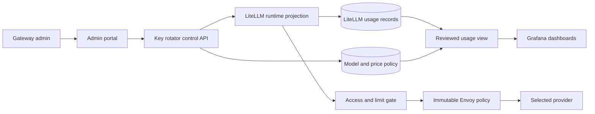

# Model controls, usage, pricing, and routing plan

This page is an implementation plan. It does not describe a finished feature.
The source backlog item is
[model-aware usage, limits, catalog, cost, dashboards, and routing](../TASKS.md#add-model-aware-usage-limits-catalog-cost-dashboards-and-routing).

The work should start only after the current release gates are complete. Build
it in small releases. Each release must work with the exact offline seed in
local PreProd before it can move to production.

## What already exists

The gateway already has parts we can reuse:

| Current part | What it does now | Main gap |
| --- | --- | --- |
| Project model policy | Limits a project key to selected models and sets a default model | No hidden model catalog |
| Key limits | Sets one TPM, RPM, or budget value for a whole key | No reviewed per-model control in the portal |
| LiteLLM spend tables | Store request tokens and LiteLLM-computed spend | Reports do not cover every model and cache price part we need |
| Request audit spans | Carry trusted user, project, requested model, actual model, token totals, and cost | They are audit records, not a long-term billing database |
| Grafana dashboards | Show spend and tokens by user and project | No complete per-model and price-version views |
| Prompt cache report | Shows daily cache-read and cache-write token counts | It does not show every price part by model, user, and project |
| Immutable Envoy policy | Allows only providers selected in the offline release | A runtime model catalog must be tied to this exact policy |

The first implementation step must capture the exact LiteLLM API and database
schema in the pinned image. Upstream documentation is useful, but the shipped
image is the contract we must test.

## Goals

This work adds six related capabilities:

1. Track token use by requested model, actual provider model, project, and user.
2. Enforce approved token limits for each model.
3. Add a model through the admin portal while keeping it out of `/v1/models`.
4. Show model usage and cost in Grafana.
5. Price normal input, cache creation, cache reads, and output separately.
6. Explore automatic model routing behind a disabled-by-default switch.

The admin portal will also manage model prices. An admin chooses the token
quantity and the price for that quantity. Examples are `$30 per 1,000,000`
normal input tokens and `$0.30 per 1,000,000` cache-read tokens.

## Rules that must not change

- Keycloak remains the source for people, roles, and project membership.
- The model policy database must never become a second identity source.
- A provider name must exist in the immutable provider catalog and in the
  loaded offline release.
- The portal must not accept a hostname, URL, CA file, Envoy route, or SNI
  value from an administrator.
- Provider credentials stay in Vault. They never enter the model or price
  tables.
- The admin portal requires the `aigw-admins` role, CSRF protection, and a
  recent Keycloak login for every write.
- Prompts, replies, headers, and keys must not enter usage or price tables.
- Request IDs must not become Prometheus labels.
- A missing model, policy, identity, provider, or price must not be guessed.
- Missing price data means `unknown`, not zero.
- A price change must not change the cost of an old request.
- A routed request may use only a model already allowed for that caller.
- No routing classifier may send a prompt to another provider unless that
  separate disclosure is reviewed and approved.

## Proposed design

Use the existing admin portal, key-rotator control API, PostgreSQL, LiteLLM,
and Grafana paths. Do not add a new public service.



The control API owns the model registry and price policy. Keycloak remains the
source for project membership, model assignment, and project limit policy.
LiteLLM is the request engine and receives a checked runtime copy. Envoy still
owns the provider network boundary.

The preferred accounting design is a new `aigw_usage` schema inside the
existing LiteLLM PostgreSQL database. It is not a new database or public
service. A LiteLLM callback writes normalized request facts. Grafana reads only
reviewed views. Before adding it, approve an ADR that covers callback order,
database roles, Docker network changes, failure behavior, and reconciliation
with LiteLLM's vendor-owned tables.

Use separate least-privilege roles:

- `aigw_usage_writer` may reserve and finish usage records;
- `aigw_pricing_admin` may append price and correction records through checked
  procedures; and
- `grafana_ro` may read only reviewed reporting views.

After dashboard cutover, remove Grafana's direct grants on LiteLLM vendor
tables. This keeps an upstream schema change from silently changing a report.

### Policy objects

Use small, versioned objects. Exact table names may change during the schema
review, but each object needs one clear job.

| Object | Required fields | Purpose |
| --- | --- | --- |
| Model catalog | Public name, provider name, provider model ID, visibility, state, revision | Defines one callable model without storing a provider URL or secret |
| Project policy | Keycloak project ID, explicit model IDs, default model, limit maps, revision | Keeps assignment and project limits with the existing Keycloak group policy |
| Model limit | Optional global or key scope, model ID, control type, amount, window, revision | Adds a model rule without replacing Keycloak membership |
| Price version | Model ID, usage class, token unit, price, currency, effective time, source, revision | Prices one type of token without rewriting history |
| Usage request | Request ID, trusted user and project snapshot, requested model, start time, streaming state | Reserves one logical request before provider dispatch |
| Usage outcome | Request ID, provider attempt, actual model, token classes, state, price revision, component costs | Stores one idempotent, prompt-free result |
| Cost adjustment | Usage ID, superseding price version, component delta, operation ID, reason | Applies a backdated correction without editing the original cost |
| Policy audit | Actor subject, action, old digest, new digest, time, result | Records every checked admin change |

Use stable IDs for joins. Display names may change, but an old usage row must
still resolve to the model and price version used at that time.

## Plan 1: governed and hidden models

### Admin workflow

Add a Models page to the admin portal. It should let an admin:

1. Choose a provider from the providers in the loaded release receipt.
2. Enter a gateway model name and the provider's model ID.
3. Keep `Visible in model list` off by default.
4. Test the model through the normal Envoy path without showing a credential.
5. Save the model only after the test and policy checks pass.
6. Assign the model to one or more projects in a separate step.
7. Activate, retire, or replace a model without deleting its history.

After activation, the gateway model name, provider, and provider model ID are
immutable. Pointing the same gateway name at a different upstream model could
rewrite history. Create a new gateway model name instead.

The server derives the LiteLLM provider prefix, Envoy path, credential name,
and API base from the reviewed provider policy. Those fields are not form
inputs.

Ansible must mount the exact non-secret Envoy policy receipt into the control
service as a root-owned read-only file. The service checks the selected
provider and policy digest before it accepts or reconciles a model. A database
row alone is never proof that a provider is present in the deployed release.

### Visibility rules

- A hidden model stays out of `/v1/models`, even when a project may call it.
- An assigned caller may call a hidden model by its exact gateway name.
- A public model appears only to callers that are allowed to use it.
- The shared Open WebUI key receives only the public chat model set. A hidden
  model must not appear in browser chat during the first release.
- Before loading the first hidden model, replace every non-admin wildcard or
  empty model scope with an explicit effective model set. This includes portal
  keys and the shared Open WebUI key. A master-key management call may inspect
  the full catalog, but that response must never become a user discovery
  response.
- The current meaning of an empty model allowlist must change from "all
  configured models, including future models" to an explicit set of public
  models allowed by the project. Otherwise a new hidden model could become
  visible by accident.
- Retiring a model blocks new calls but keeps old usage and price joins valid.

### Runtime reconciliation

The control API writes policy first, validates it, then reconciles LiteLLM.
The saved policy holds a digest of the expected LiteLLM projection. A restart
must rebuild or verify the same projection. Unexpected drift fails closed and
emits a security event.

The proposed projection enables LiteLLM database models and marks each managed
row with `managed_by=aigw`, the registry revision, and the Envoy policy digest.
Treat LiteLLM's model table as a projection, not the source of truth. Leave
unrelated operator rows untouched and block an ambiguous AIGW-managed row.

If the pinned LiteLLM image cannot safely add and remove runtime models, stop
at this step and write an ADR. Do not turn on `store_model_in_db` or call a new
management endpoint without exact-version contract tests and a rollback test.

## Plan 2: per-request usage facts

Prefer LiteLLM's existing spend records. First prove which fields the exact
image stores for every request. The required normalized fact is:

- logical request ID and provider attempt ID;
- start and finish time;
- stable user ID and project ID from server-owned authentication data;
- requested gateway model and actual provider model;
- normal input tokens;
- cache-creation tokens, including cache duration when the provider reports it;
- cache-read tokens;
- output tokens;
- total tokens;
- streaming state, final status, and retry state;
- LiteLLM/provider-reported cost when available;
- configured price version and configured cost for each usage class; and
- an explicit completeness state such as `complete`, `usage_unknown`, or
  `price_unknown`.

Use `NULL` for unknown values. Do not replace an unknown counter or price with
zero.

### Retry and streaming rules

- A failure before provider dispatch has no provider token charge.
- Record each provider attempt that reports billable use.
- Count a logical request once in request totals, while its billable attempts
  remain visible for cost reconciliation.
- A streaming request is final only when the provider usage record is final.
- A client disconnect does not erase provider use that already happened.
- Replayed callbacks are idempotent. A unique provider-attempt key must stop a
  duplicate write.
- A missing final usage record raises a reconciliation signal. It does not
  invent token counts.

If the pinned LiteLLM tables contain all required fields, add a reviewed SQL
view and narrow column grants during the contract spike. The expected outcome
is still an append-only `aigw_usage` schema because the current reports lack
stable historical project snapshots, per-request cache-duration fields, and
immutable price provenance. The ADR must prove that need, define the callback
contract, and explain how the new facts reconcile with LiteLLM and provider
reports. It must not become an unreviewed second billing source.

Reserve a server-generated request record before provider dispatch. When hard
accounting or money limits are enabled, a reservation database failure denies
the request so untracked spend cannot begin. Finish the outcome from LiteLLM's
success or failure callback. Verify callback ordering, streaming completion,
and internal retry behavior against the exact image before writing migrations.

## Plan 3: configurable, historical pricing

### Price classes

Create separate price rows for the usage classes a provider can bill:

- normal input;
- cache creation, with a separate class for each supported cache duration;
- cache read;
- output; and
- a future fixed provider charge, such as a paid tool call, only after a
  separate schema review.

Do not use one blended input price. Anthropic can price normal input, cache
creation, and cache reads differently.

### Admin price form

The price form should contain:

- provider and model, selected from the governed catalog;
- usage class;
- token unit, such as `1`, `1,000`, or `1,000,000`;
- price for that unit;
- currency, limited to USD in the first release;
- effective date and time;
- source URL or contract reference;
- short review note; and
- a preview, such as `$30.00 per 1,000,000 normal input tokens`.

Use PostgreSQL `NUMERIC` and decimal application types. Never use a binary
floating-point value for stored price or cost. Calculate one component as:

```text
component cost = token count * price amount / token unit
```

Keep full precision in storage. Round only the displayed value.

### Version and safety rules

- A saved price version is immutable.
- A change appends a new version with a new effective time.
- Two active versions for the same model, class, and effective time are
  rejected.
- An admin may set an effective time in the past. This starts a separate
  backdated-price workflow. Before confirmation, show the affected date range,
  request count, old configured cost, new configured cost, and difference.
- A backdated change appends a superseding price version and a new cost
  adjustment revision. It never overwrites the old price or old calculation.
- Backdating needs a recent login, a reason, and an explicit confirmation. A
  normal price edit cannot silently change old usage.
- Negative amounts, zero token units, unsupported currencies, NaN, infinity,
  excessive scale, and values outside reviewed bounds are rejected.
- Zero price is allowed only when an admin explicitly marks the class as free.
- No price row means `unknown`.
- A money limit fails closed when a required price is unknown.
- Every write records the admin subject, old and new digests, effective time,
  reason, and result in the security audit path.

Call the calculated value `configured cost`. Keep LiteLLM or provider cost in
a separate field. A dashboard may show their difference. It must not claim an
admin-entered value proves the provider invoice.

The price page must show both the booked result and its adjustment history. A
normal dashboard shows the booked cost plus the latest approved adjustments.
An audit view can show the original value, every adjustment, and the admin who
approved each change.

## Plan 4: per-model limits

The product owner must choose each control by name. These controls are not the
same:

| Control | Example | When checked |
| --- | --- | --- |
| Maximum output per request | 4,096 output tokens | Before dispatch |
| Model TPM | 100,000 total tokens each minute | Reserve before dispatch; settle after response |
| Model RPM | 60 requests each minute | Before dispatch |
| Model token quota | 10 million tokens each month | Reserve before dispatch; settle after response |
| Model money budget | $500 each month | Requires complete price policy |

Start with per-project, per-model maximum output tokens and output tokens per
fixed UTC minute. Those can be reserved before dispatch. Keep the current
aggregate key TPM and RPM rules independent. Add per-user overrides, total
input-plus-output quotas, or money budgets only after their reset and
precedence rules are approved.

Use the exact pinned LiteLLM image to prove native `model_tpm_limit` and
`model_rpm_limit` behavior under parallel load, multiple keys, retries,
streaming, and Redis restart. Use the native path only if it meets the hard
limit and fail-closed requirements.

The current `v1.93.0` source needs special attention: its Redis limit path can
fall back to process-local counters after a Redis error. Treat that fallback as
noncompliant for a hard limit unless the exact release is configured or changed
to fail closed and the failure test proves it. Process-local counters cannot be
the sole control across several workers.

If native enforcement can overshoot or reset in a way the product cannot
accept, use an atomic reservation design. Reserve the maximum possible charge
before provider dispatch, then settle to actual use. PostgreSQL must preserve
a hard quota across restarts. Redis may speed checks but must not be the only
record for a durable hard quota.

For a one-minute output quota, a small reviewed Redis Lua script may reserve
capacity only when every Redis error fails closed. If Redis loses its current
window state, deny quota-controlled calls until the next UTC minute or restore
the window from the durable reservation ledger. Never restart into an empty
counter and treat it as unused capacity.

When more than one rule applies, an explicit deny wins and the smallest
numeric allowance wins. A database or policy read failure denies the request.
The denial response must be safe and must emit an audit event without a prompt
or key.

## Plan 5: Grafana model dashboards

Keep Grafana behind the current admin role gate. Use bounded SQL queries from
the read-only reporting role. Do not put user IDs, request IDs, or key hashes
in Prometheus labels.

Add these views:

1. Tokens and requests by requested model and actual model.
2. Tokens and configured cost by model and project.
3. Tokens and configured cost by model and user.
4. Normal input, cache creation, cache read, and output token split.
5. Configured cost beside LiteLLM/provider cost and variance.
6. Unknown usage and unknown price counts.
7. Limit denials and remaining quota by model, without high-cardinality labels.
8. Routing choices and reason codes after routing is enabled.

Every panel must show its time range and source. Totals must reconcile with a
fixed seeded data set. A dashboard must keep an `unknown` row instead of
hiding incomplete records.

The current 30-day metrics retention does not decide accounting retention.
Set usage and price-history retention in a separate owner decision before
implementation. Do not delete data silently.

## Plan 6: automatic routing exploration

Automatic routing is last. It depends on the catalog, assignments, usage,
prices, and limits.

The current image is LiteLLM `v1.93.0`. Current upstream documentation says
its newer Auto Routing design starts in `v1.94.x`. A future implementation
therefore needs an image update, exact API review, offline build, and clean
PreProd test before any router code is enabled.

Create a synthetic model such as `aigw-auto`. Keep it disabled by default.
For each request, the eligible set is the intersection of:

- active models in the governed catalog;
- models assigned to the caller's project;
- providers present in the loaded immutable Envoy release;
- models with complete policy; and
- models that still have capacity under every hard limit.

Routing profiles must be committed, reviewed data. The portal may enable a
known profile for a project, but it may not accept arbitrary target models,
tiers, weights, keywords, or fallback models. Each profile records its exact
targets, provider names, local heuristic settings, default model, and canonical
SHA-256 digest. The offline manifest binds the profile digest and LiteLLM image
ID to the release.

Reject `aigw-auto` for an unrestricted key, an `all-proxy-models` key, a
service key, an operator key, or the shared Open WebUI key. Every possible
target must already be in the project and key allowlists before selection.

The first prototype should use LiteLLM's local heuristic or literal keyword
mode. It must not use an LLM classifier, semantic embedding provider, traffic
mirror, or second prompt disclosure. If no reviewed route matches, use the
project default only when it is still eligible. Otherwise deny the request.

Set every upstream routing option explicitly. Start with semantic matching,
LLM classification, adaptive routing, and session affinity off. Do not inherit
an upstream default whose behavior may change between releases.

After routing selects a model, run the access and limit gate again on that
exact model. Log the selected model, reason code, policy revision, and fallback
result. Do not log the prompt as part of the routing decision.

Study session affinity after the first prototype. It may keep a conversation
on a compatible model and preserve cache value, but it also adds state and a
new identifier. Test its storage, expiration, logout, privacy, and rollback
before enabling it.

Do not use cross-model fallback in the first prototype. Retry only the selected
model under the current bounded retry policy. A later fallback must pass the
same assignment, provider, price, and limit gates as a first choice.

The routing ADR must compare at least:

- no automatic routing;
- local deterministic rules;
- LiteLLM local complexity routing;
- an LLM classifier; and
- semantic embedding routing.

The ADR must cover privacy, extra cost, latency, quality, model eligibility,
failure behavior, auditability, and rollback. Approval of this plan does not
approve an external classifier call.

## SOC logging for these features

All new security and admin audit events go through Alloy before Cribl. Use the
existing curated SOC path:

```text
application event -> Alloy classify and redact -> OTLP log ->
OTLP over gRPC and verified TLS -> Cribl TCP 4317
```

Add reviewed event classes for:

- model create, test, assign, activate, retire, and reconcile drift;
- price create, future-date, backdate, reprice, supersede, and reject;
- limit create, change, reserve, deny, fail closed, and recover; and
- routing enable, shadow decision, active decision, override, deny, and fail
  closed.

Each record carries a stable event ID, source time, deployment, admin or caller
subject, project, model, policy revision, action, result, and reason code when
those fields apply. A price event carries the usage class, currency, effective
time, version ID, and old and new digests. Treat the actual contract rate as
business-sensitive and keep it local unless the owner separately approves that
field for Cribl. No record may carry a prompt, reply, API key, credential,
header, session ID, or raw request body beyond the already approved AI request
audit content.

The AI request audit already follows the same Alloy path. Extend its reviewed
schema with bounded model, token-class, limit, price-revision, and routing
fields only after redaction and attribution tests pass.

This requirement does not send metrics, raw traces, alert payloads, or ordinary
debug logs to Cribl. Those remain local under the current SOC contract. The
Cribl export remains OTLP/gRPC over TLS with the persistent 24-hour retry
buffer. A Cribl outage must not stop inference.

## Delivery order

### Phase 0: capture contracts

- Save the exact LiteLLM API and database shapes used by the pinned image.
- Prove model-specific limit behavior under concurrency.
- Record which cache counters exist per request and per daily aggregate.
- Add fixtures for successful, failed, retried, and streaming calls.
- Write ADRs for any new database table or LiteLLM runtime model API.
- Add ordered, additive migration tracking to the rotator database before the
  first model-registry table.

Exit: the team can state which upstream features are safe to reuse.

### Phase 1: catalog and price policy

- Add schema migrations and rollback migrations.
- Add the control API and admin pages.
- Add hidden model, project assignment, and immutable price-version flows.
- Keep runtime model changes behind a disabled feature flag.

Exit: policy can be created, read, audited, backed up, restored, and rolled
back without changing live inference.

### Phase 2: runtime models and usage

- Reconcile the model catalog to LiteLLM.
- Enforce hidden discovery and exact assignment.
- Add normalized usage and configured-cost calculation.
- Reconcile seeded totals with LiteLLM and provider-shaped fixtures.

Exit: a hidden model works by exact name for one assigned project and stays
absent from `/v1/models`.

### Phase 3: hard limits

- Start in observe-only mode and compare decisions with real use.
- Enable one reviewed model limit for one PreProd project.
- Run parallel, retry, streaming, restart, and fail-closed tests.
- Enable enforcement only after no bypass or unexplained denial remains.

Exit: concurrent requests cannot exceed the approved behavior.

### Phase 4: dashboards

- Add model, cache, price, unknown, variance, and denial panels.
- Add read-only grants for exact columns or views.
- Reconcile every panel with seeded SQL fixtures.

Exit: user, project, model, token class, and configured-cost totals agree.

### Phase 5: routing prototype

- Finish and approve the routing ADR.
- Update LiteLLM only through the normal image-release workflow.
- Add a disabled local-only router and fixed evaluation prompts.
- Prove access, pricing, limit, privacy, and fallback gates.

Exit: the prototype is measurable and reversible. Production stays disabled
until a separate approval.

## Test plan

### Unit tests

- Model and provider name validation.
- Visibility and assignment rules.
- Decimal price parsing and exact cost math.
- Price effective-time selection and immutable history.
- Backdated-price preview, superseding revision, reprice, and audit behavior.
- Limit precedence, reset windows, reservation, settlement, and denial.
- Usage normalization for normal, cache, retry, failure, and streaming cases.
- Routing eligibility, reason codes, session affinity, and fallback.

### Contract tests

- Exact LiteLLM request and response fields for the pinned image.
- Exact database columns and narrow Grafana grants.
- Provider names must match the loaded Envoy release policy.
- No admin request may carry a provider URL, hostname, route, CA, SNI, or
  credential.
- `/v1/models` never returns a hidden model.
- Old price versions cannot be edited or deleted.
- Unknown price remains unknown and blocks a money limit.
- Every new security and admin event reaches only the reviewed Alloy-to-Cribl
  log branch; metrics, raw traces, and unrelated logs do not.
- Sensitive fields never enter usage, dashboard, or audit records.

### Integration tests

- Admin role, step-up login, CSRF, and audit events.
- Create, test, assign, call, retire, backup, restore, and roll back a model.
- Price a seeded request with normal, cache-create, cache-read, and output
  tokens using exact decimal results.
- Backdate one seeded price and prove the preview, new calculation revision,
  old audit history, Grafana result, and Cribl audit receipt agree.
- Reconcile a logical request that has retries and multiple provider attempts.
- Run parallel requests against each hard limit.
- Restart LiteLLM, Redis, PostgreSQL, and the policy controller at the limit
  boundary.
- Verify Grafana queries return only reviewed columns and bounded rows.

### Full PreProd acceptance

1. Build a new schema-v2 offline seed.
2. Destroy the owned PreProd project, volumes, networks, and seed image aliases.
3. Remove only images owned by the candidate test.
4. Load the exact seed with pulls and source builds disabled.
5. Deploy `aigw.internal` with `ansible/preprod.yml`.
6. Add one hidden Anthropic test model and a versioned test price.
7. Assign it to one project and prove another project is denied.
8. Prove it is absent from `/v1/models` and browser chat.
9. Send normal, cached, retried, streaming, over-limit, and routing test calls.
10. Reconcile database facts, Grafana totals, audit records, and mock-provider
    receipts.
11. Exercise upgrade and rollback as one release unit.
12. Tear down PreProd and save the cleanup receipt.

## Rollback rules

- Use expand-then-contract database migrations.
- Old code must tolerate new nullable columns during one release window.
- Disable routing first. It must not be needed to call an explicit model.
- Disable new limit writes before removing an enforcement hook.
- A rollback must not widen model access. If old code cannot understand a new
  policy, freeze affected models and fail closed.
- Keep usage facts, price versions, and audit rows through rollback.
- Restore the prior LiteLLM projection and compare its digest.
- A price correction is a new price version, not a database edit.

## Decisions needed before implementation

The owner should answer these before Phase 1 ends:

1. Are hidden models for API tools only, or should assigned users also see
   them in Open WebUI later?
2. Which first hard limit is required: output tokens, TPM, RPM, quota, money,
   or a specific combination?
3. Does a project limit apply across all project keys, per user, or both?
4. What are the reset window and time zone for a quota or money budget?
5. How long must detailed usage and price history remain available?
6. Is an admin-entered price an internal chargeback price, an expected
   provider price, or both as separate versions?
7. Does a price change require one admin or two-person approval?
8. How far back may an admin backdate a price, and does a large reprice need a
   second approver?
9. Which fixed prompts and expected model choices will approve routing?

## Main repository starting points

- [`compose/litellm/config.yaml`](../compose/litellm/config.yaml) holds the
  current static model list and keeps database models off.
- [`services/key-rotator/app/identity.py`](../services/key-rotator/app/identity.py)
  owns current Keycloak project policy validation.
- [`services/dev-portal/app/litellm_client.py`](../services/dev-portal/app/litellm_client.py)
  mints and retunes model-scoped keys.
- [`scripts/reconcile-openwebui-key.py`](../scripts/reconcile-openwebui-key.py)
  currently gives the shared chat key wildcard model access.
- [`compose/litellm/aigw_default_model_hook.py`](../compose/litellm/aigw_default_model_hook.py)
  is the current pre-call policy hook.
- [`compose/litellm/aigw_otel_callback.py`](../compose/litellm/aigw_otel_callback.py)
  and [`compose/alloy/config.alloy`](../compose/alloy/config.alloy) provide the
  trusted request-audit path.
- [`compose/postgres/init/01-init-databases.sh`](../compose/postgres/init/01-init-databases.sh)
  owns current reporting roles and grants.
- [`services/egress-proxy/providers/catalog.json`](../services/egress-proxy/providers/catalog.json)
  is the reviewed immutable provider catalog.

## Upstream references to recheck at implementation time

- [LiteLLM virtual keys](https://docs.litellm.ai/docs/proxy/virtual_keys)
- [LiteLLM budgets and rate limits](https://docs.litellm.ai/docs/proxy/users)
- [LiteLLM spend tracking](https://docs.litellm.ai/docs/proxy/cost_tracking)
- [LiteLLM Auto Routing](https://docs.litellm.ai/docs/proxy/auto_routing)
- [Anthropic pricing](https://docs.anthropic.com/en/docs/about-claude/pricing)
- [Anthropic prompt caching](https://docs.anthropic.com/en/docs/build-with-claude/prompt-caching)

These pages can change. Save dated fixtures and source links with the release.
Do not let a live documentation page change a deployed price automatically.
