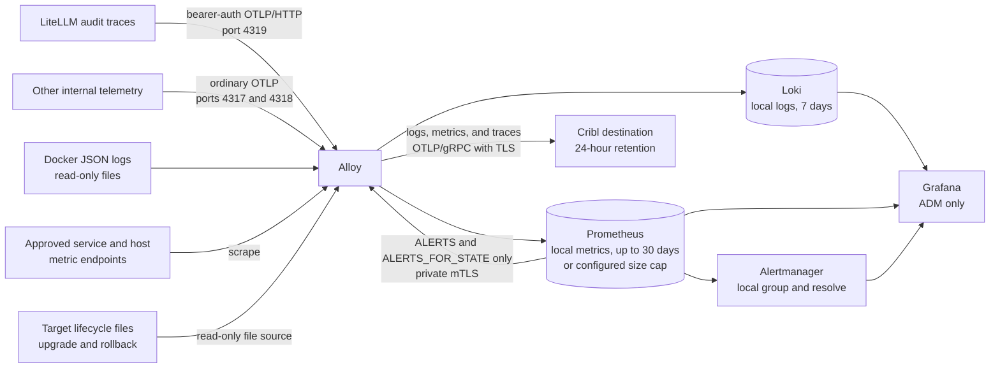

# Observability operations

The gateway has one collection path with two destinations. Grafana Alloy
collects the admitted logs, metrics, and traces. It keeps logs and metrics
local, and it mirrors all three signal types to the optional Cribl endpoint.
No service, Prometheus process, or alert component sends straight to Cribl.
Prometheus returns only its generated alert-state series to a private Alloy
listener. Alloy then sends those samples through the normal Cribl exporter.

Alloy applies the same redaction and server-owned context before either
destination. The exact external contract is in
[Cribl telemetry handoff](cribl-soc-handoff.md). The
[security model](security-model.md#local-operations-data-and-the-soc-feed)
shows how this data boundary fits the rest of the system.

## Collection and routing

Grafana Alloy is the only collector and router. It accepts OTLP on its fixed
`net-telemetry` address. It also tails Docker JSON logs through a read-only host
mount and scrapes the approved metric endpoints. Prometheus does not scrape
services itself. Alloy sends the collected metric samples to local Prometheus
and to Cribl. Alloy never receives the Docker socket.



The paths are:

| Data | Local destination | Cribl |
|---|---|---|
| Admitted service stdout and stderr | Loki | Yes, after redaction |
| AI request audit | Loki `service_name="aigw-requests"` | Yes, as a sanitized OTLP log and trace |
| Keycloak authentication events | Loki | Yes, through the reviewed fixed projection |
| Trust and security-control events | Loki | Yes, through the reviewed fixed projection |
| Vault audit | Raw audit stays in Loki | Reviewed fixed projection only; raw audit never leaves |
| Service and host metrics | Prometheus, up to 30 days or the configured size cap | Yes |
| Admitted traces | No local trace store | Yes |
| Alert state | Prometheus and local Alertmanager/Grafana | Yes, through a fail-closed Prometheus-to-Alloy mTLS feedback path |

Local preprod uses an empty preprod-owned Docker-log volume instead of the
workstation Docker data root. It can test application OTLP, Loki, Prometheus,
Grafana, and the `cribl-mock` receipt path. It cannot prove the
production Docker-log ACL, SELinux policy, real host metrics, or a real Cribl
wire.

## AI request audit

LiteLLM emits a `litellm_request` span for an AI request. Alloy sanitizes it and
creates one structured log record. The log is stored locally in Loki as
`service_name="aigw-requests"`. The same sanitized record and sanitized source
trace go to Cribl. There is no local trace database.

LiteLLM sends this span to a separate OTLP/HTTP receiver on Alloy port 4319.
Its callback reads a private bearer token from a read-only file. The token does
not appear in Compose environment data, command arguments, LiteLLM settings, or
logs. Alloy checks the token, then stamps its own source marker. The request
audit filter requires that marker.

The ordinary receivers on ports 4317 and 4318 are still available for other
internal telemetry. They remove a caller-supplied trust marker and reject any
trace that claims `service.name=litellm`. Port 4319 uses HTTP only on the
private telemetry network and is not published on the host. Preprod tests prove
that a missing token, wrong token, and forged marker cannot create an AI
request record.

Production creates one stable target-local token. After a state restore,
Ansible validates the restored file and token before it restores the reader
group and mode. Never copy the preprod token into production or put this token
in an inventory value.

The request log may contain prompt and completion content. This is approved
high-sensitivity data. It must not appear in ordinary service logs, metrics, or
another SOC dataset.

Alloy promotes these bounded request fields before deleting the raw metadata:

- `aigw.user.id` — stable enforced subject;
- `aigw.user.name` — readable attribution only;
- `aigw.user.name_source` — the reviewed source used for the readable name;
- `aigw.api_key.id` — lowercase SHA-256 key identifier;
- `aigw.project.id` — bounded project identifier; and
- `aigw.request.id` — the LiteLLM call ID.

LiteLLM's reviewed callback selects the readable name. It accepts only these
sources:

1. A portal-owned key with exact `created_via=dev-portal` metadata and a
   bounded portal username. The source is `portal_key_metadata`.
2. The exact Open WebUI service key plus a valid, short-lived HS256 assertion
   signed by Open WebUI. The assertion subject becomes the stable user ID. Its
   signed username or e-mail becomes the readable name and may contain `@`.
   The source is `open_webui_signed_oidc`.
3. The bounded subject of the authenticated key. The source is `key_subject`.

A request body, plain forwarded user header, caller end-user field, and key
alias can never supply the readable name. The exact Open WebUI alias is only
one part of identifying its reviewed service key. It is not used as a person's
name. Alloy keeps the selected source in `aigw.user.name_source`, removes the
raw assertion, headers, end-user fields, alias, and LiteLLM authentication
metadata, and drops a request whose name cannot be resolved.

This name is for attribution, not authorization. Key and OIDC checks decide
access before this audit record is made. For Open WebUI, the signed subject is
the stable per-user audit ID. The shared LiteLLM key remains proof that the
authorized service made the call.

`aigw.user.name` and `aigw.project.id` become the Loki labels
`aigw_user_name` and `aigw_project_id`. Request and key IDs stay line fields so
they do not create too many streams.

Use this LogQL query in Grafana:

```logql
{service_name="aigw-requests", aigw_user_name="jdoe", aigw_project_id="team-blue"} | logfmt
```

Search for a request ID after parsing the line:

```logql
{service_name="aigw-requests"} | logfmt | aigw_request_id="<litellm.call_id>"
```

LiteLLM spend rows are a cost index. They are not a prompt store.
`store_prompts_in_spend_logs` stays off. Grafana joins the hashed key to the
key metadata when it needs a project.

Open WebUI uses one shared inference-only key. Its enforced service identity is
the `svc-open-webui` service and project. The signed assertion adds a stable
per-user subject and readable browser-user name to the request audit. LiteLLM's
spend ledger still records the shared service key, so spend-based top-user
reports do not become per-browser-user reports.

## Structured security record

Alloy adds the same server-owned fields to each structured security record
before the Cribl queue:

- `aigw.security.schema_version=1`;
- `deployment.environment=preprod` or `production`;
- `aigw.security.producer`, set from the reviewed event class; and
- `service.name`, which must exactly match the producer.

The OTLP log time remains the real UTC source time. Alloy drops a record with a
zero time, a time more than 24 hours old, or a time more than one minute in the
future. It also drops an unknown producer or a producer/service mismatch. This
check happens before the queue. Time spent waiting in the queue is covered by
the separate queue rules below.

## Redaction

Alloy is the redaction gate for both local derived records and the Cribl copy. It
removes:

- authorization values, API keys, tokens, cookies, and passwords;
- client secrets, Vault tokens, unseal shares, and LDAP bind credentials;
- raw JWTs and Open WebUI signed assertions;
- raw headers, query strings, redirect URIs, and OIDC codes;
- caller end-user fields, key aliases, and raw LiteLLM authentication metadata;
- e-mail addresses and network peer addresses, except the reviewed signed
  Open WebUI username or e-mail selected as `aigw.user.name`; and
- nested maps that cannot be proven safe.

A transform error must drop the outbound record instead of sending an unsafe
fallback. Prompts and completions are allowed only in the AI request audit
record. Credential-shaped values are still redacted inside that content.

Traefik access logs omit request headers, query parameters, request paths, and
request lines. This keeps OIDC codes and logout JWTs out of Docker logs. Method,
host, router, status, byte count, timing, and TLS fields remain local.

## Local dashboards and data sources

See [Usage and cost accounting](usage-and-cost-accounting.md) for the
prompt-free usage ledger, exact five-part Anthropic token split, price-version
rules, and model/project/user reconciliation panels.

Grafana is provisioned from Git and cannot be changed in the UI. It reads:

- Prometheus for metrics and health;
- Loki for service and request-audit logs;
- a private Alertmanager data source for lifecycle checks; and
- two read-only PostgreSQL sources: **LiteLLM Spend** for the vendor-owned
  spend records and **AI Gateway Usage** for the append-only gateway ledger
  and reviewed cost views.

The PostgreSQL role can read only approved LiteLLM columns and the two gateway
reporting views. It cannot administer either database or read the gateway's
base evidence tables. The usage dashboard keeps LiteLLM, provider-reported,
and configured cost separate. It never fills an unknown value with zero.

The Grafana UI is available only on the ADM leg. Its oauth2-proxy gate requires
the Keycloak `aigw-admins` role. Grafana has no local login form, anonymous
access, or sign-up.

The same outer gate protects the Prometheus UI. Loki, Alloy, and Alertmanager
have no published host port. Alertmanager has no FQDN or direct browser route.
Grafana unified alerting is disabled, so Prometheus stays the only rule
evaluator. Dashboard panels query Prometheus's retained `ALERTS` series. The
private Alertmanager data source stays provisioned for lifecycle checks. It
does not create a second set of rules.

Open **AI Gateway Overview** and use its **Alerts and Capacity** link. The
dashboard URL is
`/d/aigw-alerts-capacity/ai-gateway-alerts-and-capacity`. It starts with the
watchdog, active critical and warning counts, active alerts, and recently
resolved alerts. The lower panels show the capacity inputs used by the rules.
The dashboard links to its built-in response runbook. It does not link to
Grafana's `/alerting/list` page because unified alerting is disabled. This
release does not expose a browser silence workflow.

Every alert's `runbook_url` is a same-origin relative Grafana link to panel 17,
**Alert Response Runbooks**. It therefore follows the deployed, domain-derived
Grafana origin and the existing ADM/OIDC gate; it does not name a fake docs
host. The separate `runbook_source` annotation gives the exact release-checkout
anchor, such as
`docs/observability-operations.md#host-capacity-alerts`, for the full procedure.

Do not embed Grafana panels in the Admin Portal in this release. A normal link
keeps the existing ADM-only origin and login boundary clear. An embedded design
would need a separate review of authentication sessions, RBAC and data scope,
clickjacking and frame policy, CSRF, token leakage, and same-origin or reverse-
proxy behavior. It must never copy a Grafana token or session cookie into the
portal.

## Local alerts

Prometheus is the only rule evaluator. It evaluates the committed health and
capacity rules every 15 seconds and sends firing and resolved updates to the
private Alertmanager. Use two operator levels:

- **Warning** means a trend is getting worse and an operator still has time to
  act.
- **Critical** means a control has failed badly or data loss is occurring.

Alertmanager groups by alert name, class, severity, and owner. It waits 30
seconds before creating a group, sends group changes no more often than every
five minutes, and deduplicates unchanged groups for 12 hours. A critical alert
inhibits its warning partner for the same resource. Prometheus sends a resolved
update after recovery. Alertmanager keeps local state for five days. The
dashboard also reconstructs recently resolved alerts from the retained
Prometheus `ALERTS` series for the last 24 hours.

There is no e-mail, Slack, Teams, webhook, or direct Cribl Alertmanager receiver.
The only Alertmanager receiver is a local null receiver. Operators use Grafana
for the lifecycle. Prometheus sends only `ALERTS` and `ALERTS_FOR_STATE` back
to Alloy over a dedicated mTLS listener on the private observability network.
Both sides keep an exact alert-name allow-list and a short label allow-list.
Generated alerts without a scrape target get fixed `prometheus-alert-state`
and `prometheus-observability:9090` labels. Existing target labels stay as-is.
Alloy adds the deployment and `alert-state` labels, then sends the samples to
Cribl only. It never writes this branch back to Prometheus. This fail-closed
split prevents a telemetry loop. There is no direct Alertmanager-to-Cribl path.

Production Ansible creates a separate target-local CA for this one mTLS hop.
The CA key stays in the root-only `.state/alert-state-mtls` directory. Alloy
and Prometheus receive only their exact certificate files. The reconcile step
rejects partial files, links, wrong owners or modes, a mismatched key and
certificate, the wrong SAN or certificate purpose, and any certificate with
less than 30 days left. It does not silently replace suspect material.

The committed rules cover signals that this hardened stack continuously
collects:

- the always-firing watchdog, a down scrape target, and Prometheus delivery to
  Alertmanager;
- sustained Cribl exporter send failures;
- Cribl enqueue failure, which means a record was lost;
- Cribl queue use above 80 percent;
- Loki write drops and retry growth;
- Prometheus remote-write failures and backlog;
- host CPU, load, memory, swap, OOM kills, file descriptors, disk I/O, free
  filesystem space, free inodes, and predicted filesystem exhaustion;
- service p95 latency and 5xx rate from Traefik; and
- edge certificate expiry from Traefik.

There is no reliable per-record queue-age metric or hard queue TTL today. Do
not invent an age alert from queue size.

The following requested signals are not claimed by this release:

- **Host network errors, drops, throughput, and connection-table pressure:**
  node-exporter runs in a private container network. Its network view is not a
  faithful view of the Rocky host network namespace.
- **Repeated container restarts or unhealthy containers:** continuous Docker
  lifecycle data requires the Docker API or another privileged collector.
  Alloy and node-exporter do not receive the Docker socket. Ansible still
  checks restart counts and health during a converge.
- **Vault sealed after reboot:** the converge and Vault health checks fail when
  an initialized Vault stays sealed, but no reliable continuous Vault seal
  metric crosses the current network boundary.
- **Failed backups:** the pre-upgrade gate checks for a recent authenticated
  backup. The backup job does not publish a continuous success metric.

These are visible gaps, not green checks. Add a rule only after a reviewed,
continuous producer exists without adding Docker-socket access or widening a
service network.

## Alert response runbooks

Start every response in the **AI Gateway Alerts and Capacity** dashboard. Read
the alert name, severity, affected resource, start time, and linked runbook.
When the condition clears, confirm it leaves the active table and appears in
the recently resolved table. Record the time and action for a critical alert.

## Alert path watchdog

The watchdog must always be firing. A red watchdog panel means one part of the
Prometheus-to-Alertmanager-to-Grafana path is missing.

1. Check `up{job="prometheus"}` and `up{job="alertmanager"}` in Grafana.
2. Check that `AIGatewayWatchdog` is firing in Prometheus.
3. Open Grafana's Alerting view and look for the same watchdog.
4. Run the full Ansible converge if the target, rule, receiver, or provisioned
   data source is missing. Do not add a public Alertmanager route as a repair.

## Service availability alerts

1. Find the failed `job` and `instance` in the alert.
2. Check that service's Grafana metrics and recent Loki logs.
3. Check its Docker health through the approved operator workflow.
4. Fix the service or its private network. Confirm its single `up` series
   returns to 1 and the alert resolves.

## Local telemetry alerts

1. Decide whether the alert is for Loki writes or the Alloy-to-Prometheus
   remote-write path.
2. Check free disk space and the destination service health.
3. Check Alloy logs for the exact writer or remote name. Never print record
   bodies or credentials.
4. Restore the local destination, then confirm retries or pending samples fall
   and no new permanent-drop counter appears.

## Cribl delivery alerts

Use this response for the three Cribl rules above:

1. Check that Alloy is healthy in Grafana.
2. Check the queue-use panel. A value above 80 percent means the outage buffer
   is close to full.
3. Ask the Cribl team to check its OTLP listener, TLS certificate, routes, and
   destination health.
4. Check the configured CA file, TLS server name, destination IP, port, and
   firewall rule. Do not turn off certificate checks.
5. When delivery resumes, confirm the queue falls and Cribl receives a known
   test event. Cribl should deduplicate repeated event IDs.

An enqueue-failure alert means at least one admitted telemetry item was lost
before export. Record the time window and open an incident. A send-failure or
high-queue alert does not prove loss by itself, but it needs prompt action.
Keep inference and local operations data running while the Cribl path
recovers.

## Host capacity alerts

1. Read the alert class and resource. Check the matching CPU, load, memory,
   swap, disk, inode, filesystem, or file-descriptor panel.
2. Check whether traffic or telemetry growth explains the change. Do not
   delete state or restart every container just to clear a graph.
3. For low space or inodes, stop unneeded growth and follow the approved
   backup and retention process. Never use `docker compose down -v`.
4. For CPU, load, memory, OOM, disk, or file descriptors, identify the process
   with the normal Rocky operator tools. Reduce load or apply a reviewed size
   change.
5. Confirm the warning clears. A paired critical alert should suppress its
   warning while both conditions are true.

## Service latency and error alerts

1. Find the Traefik `service` label. Check its request rate, p95 latency, and
   5xx rate on the dashboard.
2. Check the service's recent Loki logs and its downstream health.
3. If the service is overloaded, reduce traffic or apply the reviewed capacity
   change. If a dependency failed, repair that private path first.
4. Confirm normal requests succeed and both the rate floor and bad condition
   have cleared before closing the event.

## Certificate expiry alerts

1. Find the Traefik instance in the alert and inspect the certificate dates
   from the approved source.
2. Start the normal certificate replacement process. Do not fetch or trust a
   new CA or certificate from an unreviewed path.
3. Converge the replacement through Ansible.
4. Confirm Traefik loaded the new certificate and the shortest-lifetime panel
   shows the expected number of days.

## Retention and limits

| Store or buffer | Bound |
|---|---|
| Docker stdout and stderr | 5 files x 20 MiB per container |
| Loki | 7 days, including `aigw-requests` |
| Prometheus | Up to 30 days or `PROMETHEUS_RETENTION_SIZE`; the first limit reached wins |
| Cribl destination | 24 hours, owned by the Cribl team |
| Alloy process | 384 MiB normal limit plus 64 MiB spike allowance in a 512 MiB container |
| Alloy to Cribl queue | Persistent 2 GiB cap; 24-hour retry window after a batch is dequeued; no hard per-record age limit |

The default Prometheus byte cap is 5 GB. Set `prometheus_retention_size` in
Ansible inventory; Ansible writes `PROMETHEUS_RETENTION_SIZE` into the stack
environment. Measure daily growth on
production-shaped traffic and leave compaction headroom. A `30d` setting alone
does not prove 30-day retention. If 5 GB is too small, change the inventory
value and rerun the full PreProd and production checks.

The Cribl queue is an outage buffer, not an archive. It survives an Alloy
restart and is capped at 2 GiB. A failed batch is retried for at most 24 hours
after the exporter dequeues it. Alloy has no per-record queue TTL, so a record
waiting behind other work can be older than 24 hours. The byte cap can also
cause an earlier drop. Local logging, metrics, and inference must continue.
Delivery is at least once, so Cribl should deduplicate by stable event ID.

Cribl retention is a separate 24-hour destination setting. A large gateway
queue must not silently extend that retention policy.

## Docker-log access boundary

Alloy runs as uid 473. The host gives it:

- traverse-only access on the Docker data root;
- read and traverse on the `containers` directory and each container child;
- read-only access to `*-json.log*`; and
- no access to other container metadata.

The Docker socket is never mounted. A systemd reconciler repairs the bounded
ACL during converge, after Compose starts, and every 15 seconds for log
rotation. Do not grant broad Docker-root read access to fix a missing ACL.

The separate controller lifecycle source is
`/var/log/ai-gateway-controller`. Production permits only `lifecycle.jsonl`
and `lifecycle.jsonl.1`, each root-owned, read-only to Alloy, and at most
8 MiB. Ansible validates this boundary before Compose. The fixed writer records
only upgrade or rollback `started`, `success`, and `failed` results. It never
exports Ansible stdout. Source rollback preserves the files.

Local preprod does not inspect the workstation's Docker root. Check the real
ACL after a planned Docker restart on the production host. Do not add a
separate rehearsal VM for this host-only check.

## Cribl TLS, firewall, and queue

A real Cribl endpoint uses a literal `IP:4317`, native OTLP/gRPC, verified TLS,
a dedicated CA file, and an exact TLS server name. Plaintext is allowed only
for the in-stack `cribl-mock`.

The external Cribl sender does not support a bearer token or client
certificate. If the customer requires either, the release is blocked until
that feature is implemented and tested. This is separate from LiteLLM's
internal bearer token on port 4319.

The host firewall permits only Alloy's fixed `172.28.2.2` address to one Cribl
destination `/32` and TCP port over the internal NIC. The Cribl listener should
allow only the gateway internal-leg host IP.

The full setup, schema, receipt test, failure test, and ownership table are in
[Cribl telemetry handoff](cribl-soc-handoff.md).

## Capacity planning

Do not size production from a workstation preprod disk. Measure representative
traffic for at least a week. Include:

```text
daily Loki bytes x 7 days x 2 headroom
+ daily Prometheus bytes x 30 days x 2 headroom
+ the bounded Alloy-to-Cribl queue
+ Postgres, Vault, images, and Docker log files
```

Prompt and completion size drives most request-audit growth. A full filesystem
is a gateway availability failure, not only an observability failure.

## Backup and restore

Telemetry state lives in `loki_data`, `prom_data`, `alertmanager_data`,
`grafana_data`, `alloy_data`, and `vault_audit`. They are local single-node
stores.

`scripts/state-backup.sh` stops writers and includes these volumes in one
age-encrypted backup on another filesystem. Never copy live database or
telemetry files as a backup.

After a destructive restore:

1. Keep ingress in maintenance.
2. Require zero running project containers and the exact restore marker.
3. Run the full current-source Ansible converge while Vault stays sealed.
4. Unseal with the separately held share.
5. Confirm new local logs and metrics arrive, and confirm Cribl receives
   admitted logs, metrics, and traces.
6. Reopen access only after the complete graph passes.

Losing `alloy_data` can create duplicates or gaps and discards the buffered
Cribl backlog. Losing Loki or Prometheus loses local history but should not
block inference. Losing Alertmanager discards silences and local notification
state; Prometheus rebuilds active alerts from its rules. `docker compose down -v`
deletes application and telemetry state and is only for an explicitly
disposable environment.

## Alert test scope

Validate Alertmanager syntax and Prometheus rule behavior with the pinned
runtime images. These commands use no network and mount the source read-only:

```bash
docker run --rm --network none --read-only --cap-drop ALL \
  --security-opt no-new-privileges:true --user 65532:65532 \
  --volume "$PWD/compose/alertmanager:/work:ro" --workdir /work \
  --entrypoint amtool \
  dhi.io/alertmanager:0.33.1@sha256:137ab07843ffd9879e904c8eb0d8cca0a147c6232ed401802e5d7cf03a926c47 \
  check-config --enable-feature=utf8-strict-mode alertmanager.yml

docker run --rm --network none --read-only --cap-drop ALL \
  --security-opt no-new-privileges:true --user 65532:65532 \
  --tmpfs /tmp:uid=65532,gid=65532,mode=0700,noexec,nosuid,nodev \
  --volume "$PWD/compose/prometheus:/work:ro" --workdir /work \
  --entrypoint promtool \
  dhi.io/prometheus:3.13.1@sha256:cb1c6077e4e0e31dcabf927a3017419b48262885d6fb61a827f063005f61a68e \
  test rules rules.test.yml
```

The rule test injects CPU, memory, disk-I/O, filesystem-space, and Cribl queue
pressure. It proves warning or critical activation and recovery. `preprod.py
verify` runs that same test with the exact running Prometheus image in a
disposable, networkless container. It then uses a bounded, label-free metric
fixture to fire one non-watchdog alert. The check proves that alert appears in
Prometheus, private Alertmanager, the Grafana dashboard query, and Cribl through
the filtered Alloy path. It resets the fixture and proves the alert resolves.
The fixture has no host stress control and no Docker socket.

Docker Desktop preprod does not expose the Rocky host. Its node-exporter view
is the local container or Docker Desktop VM, not production CPU, memory, disk,
network, or connection-table state. It also cannot inject Docker restart or
health history without the forbidden Docker socket, and there are no
continuous Vault-seal or backup-success metrics to inject. Treat those cases as
the documented signal gaps above. Do not report them as passed and do not add a
separate rehearsal VM.

## Verification

Run the render and contract checks after every telemetry change:

```bash
bash scripts/validate-compose.sh
python3 -I -m unittest discover -v -s scripts/tests -p 'test_*.py'
```

The Ansible verify role checks:

- Alloy, Loki, Prometheus, Alertmanager, and Grafana readiness;
- the exact Prometheus scrape and rule graph;
- the exact Grafana data-source and dashboard graph;
- the exact private Alertmanager config, null receiver, and active watchdog;
- the Cribl all-signal fan-out, redaction gates, and fixed security-event
  projections; and
- the narrow Cribl TLS and firewall path when external export is enabled.

After an identity-flow test, scan local logs and the Cribl feed for OAuth codes,
`id_token_hint`, three-part JWT values, passwords, and API keys. Any match is a
release blocker.

For the request audit, prove:

- LiteLLM uses the authenticated receiver, and missing, wrong, or forged source
  proof is rejected;
- portal, Open WebUI, and key-subject requests get the expected readable name
  and exact `aigw.user.name_source`;
- one valid request has the expected user, key, project, model, and request ID;
- caller body values, plain user headers, end-user fields, and key aliases do
  not become trusted names;
- an unresolved or malformed identity is dropped;
- prompt and completion content appears only in the approved request dataset;
- every structured Cribl security record has schema version 1, a reviewed
  matching producer and service, the exact deployment environment, and a
  recent UTC event time;
- admitted, sanitized logs, metrics, and traces reach Cribl;
- raw Vault audit records and unprojected security-producer records do not
  reach Cribl; and
- local Loki, Prometheus, and Grafana stay healthy during a Cribl
  outage.

Local seeded preprod must run the same telemetry boundary against
`cribl-mock`. A real
Cribl connection, production Docker ACL, SELinux behavior, and host metrics are
checked on the actual production host during its approved deployment or
maintenance window. Do not create a separate rehearsal VM.

Save the source commit, offline-seed manifest, commands, results, Cribl receipt
proof, and any blocked check with the release evidence. A synthetic collector
record does not prove provider inference, and a healthy receiver does not prove
the outbound scope.
