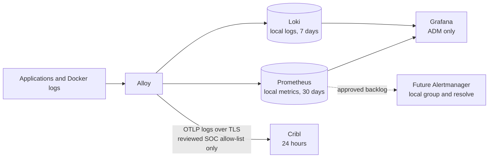

# Observability operations

The gateway has two separate telemetry paths:

1. A local operations path stores logs and metrics for the gateway team.
2. An optional Cribl path sends only reviewed SOC security and audit logs.

Cribl is not a copy of the local stack. No metric, raw trace, ordinary service
log, or alert payload may enter the Cribl exporter. The exact SOC contract is
in [Cribl SOC logging handoff](cribl-soc-handoff.md).

## Collection and routing

Grafana Alloy is the only collector and router. It accepts OTLP on its fixed
`net-telemetry` address. It also tails Docker JSON logs through a read-only host
mount. Alloy never receives the Docker socket.



The paths are:

| Data | Local destination | Cribl |
|---|---|---|
| Service stdout and stderr | Loki | No, except exact structured security-event markers |
| AI request audit | Loki `service_name="aigw-requests"` | Yes, as a sanitized OTLP log |
| Keycloak authentication events | Loki | Yes, reviewed event types only |
| Curated trust and security-control events | Loki | Yes, reviewed structured events only |
| Vault raw audit file | Loki | No |
| Service and host metrics | Prometheus | No |
| Raw traces | No local trace store | No |
| Alerts and resolved notices | Prometheus rule state today; local Alertmanager and Grafana lifecycle view are backlog work | No |

Local preprod uses an empty preprod-owned Docker-log volume instead of the
workstation Docker data root. It can test application OTLP, Loki, Prometheus,
Grafana, and the `cribl-mock` receipt path. It cannot prove the
production Docker-log ACL, SELinux policy, host metrics, or a real Cribl wire.

## AI request audit

LiteLLM emits a `litellm_request` span for an AI request. Alloy sanitizes it and
creates one structured log record. The log is stored locally in Loki as
`service_name="aigw-requests"`. The same log may enter the reviewed Cribl SOC
feed. The raw span must never reach Cribl.

The request log may contain prompt and completion content. This is approved
high-sensitivity data. It must not appear in ordinary service logs, metrics, or
another SOC dataset.

Alloy promotes these bounded request fields before deleting the raw metadata:

- `aigw.user.id` — stable enforced subject;
- `aigw.user.name` — readable attribution only;
- `aigw.enduser.id` — the forwarded chat identity, when valid;
- `aigw.api_key.id` — lowercase SHA-256 key identifier;
- `aigw.project.id` — bounded project identifier; and
- `aigw.request.id` — the LiteLLM call ID.

The readable name comes from the first valid source: the forwarded chat user,
the portal-stamped username, the key alias, or the subject ID. A caller can
mislabel its own request, so this field never grants access. The enforced user
and key IDs remain the audit boundary.

`aigw.user.name` and `aigw.project.id` become the Loki labels
`aigw_user_name` and `aigw_project_id`. Request and key IDs stay line fields so
they do not create too many streams.

Use this LogQL query in Grafana:

```logql
{service_name="aigw-requests", aigw_user_name="jdoe", aigw_project_id="team-blue"} | logfmt
```

Search for a request ID after parsing the line:

```logql
{service_name="aigw-requests"} | logfmt | aigw_request_id="<litellm.call_id>"
```

LiteLLM spend rows are a cost index. They are not a prompt store.
`store_prompts_in_spend_logs` stays off. Grafana joins the hashed key to the
key metadata when it needs a project.

Open WebUI uses one shared inference-only key. Its enforced identity is the
`svc-open-webui` service and project. The forwarded person name is useful
attribution, but it is not independent proof of the person.

## Redaction

Alloy is the redaction gate for both local derived records and the SOC copy. It
removes:

- authorization values, API keys, tokens, cookies, and passwords;
- client secrets, Vault tokens, unseal shares, and LDAP bind credentials;
- raw headers, query strings, redirect URIs, and OIDC codes;
- e-mail addresses and network peer addresses; and
- nested maps that cannot be proven safe.

A transform error must drop the outbound record instead of sending an unsafe
fallback. Prompts and completions are allowed only in the AI request audit
record. Credential-shaped values are still redacted inside that content.

Traefik access logs omit request headers, query parameters, request paths, and
request lines. This keeps OIDC codes and logout JWTs out of Docker logs. Method,
host, router, status, byte count, timing, and TLS fields remain local.

## Local dashboards and data sources

Grafana is provisioned from Git and cannot be changed in the UI. It reads:

- Prometheus for metrics and health;
- Loki for service and request-audit logs; and
- the read-only LiteLLM Spend PostgreSQL source for cost and usage.

The PostgreSQL role can read only the approved LiteLLM accounting tables. It
cannot administer the database. Queries use LiteLLM's computed spend instead
of multiplying tokens by a guessed price.

The Grafana UI is available only on the ADM leg. Its oauth2-proxy gate requires
the Keycloak `aigw-admins` role. Grafana has no local login form, anonymous
access, or sign-up.

The same outer gate protects the Prometheus UI. Loki and Alloy have no
published host port. The approved future Alertmanager must also stay private.

## Local alerts

Prometheus evaluates the committed health and capacity rules. Use two levels:

- **Warning** means a trend is getting worse and an operator still has time to
  act.
- **Critical** means a control has failed badly or data loss is occurring.

Local Alertmanager grouping, inhibition, resolved state, and the Grafana alert
view remain backlog work. Prometheus evaluates the current rules, but this is
not a complete notification or lifecycle path.

There is no e-mail, Slack, Teams, webhook, or Cribl alert receiver. An operator
must view Grafana. Alert payloads and resolved notices never enter the Cribl
SOC log path.

At minimum, alert on:

- Cribl exporter send and enqueue failures;
- queue age, queue size, overflow, and dropped records;
- recovery after an exporter outage;
- Loki write drops and retry growth;
- Prometheus remote-write failures and backlog;
- host filesystem below 15 percent and 5 percent free; and
- predicted filesystem exhaustion within 24 hours.

## Retention and limits

| Store or buffer | Bound |
|---|---|
| Docker stdout and stderr | 5 files x 20 MiB per container |
| Loki | 7 days, including `aigw-requests` |
| Prometheus | 30 days plus a byte cap; the first limit reached wins |
| Cribl destination | 24 hours, owned by the Cribl team |
| Alloy process | 384 MiB normal limit plus 64 MiB spike allowance in a 512 MiB container |
| Alloy to Cribl queue | Persistent, byte-bounded, and no record older than 24 hours |

The Prometheus byte cap must be large enough to hold 30 days. Measure daily
growth on production-shaped traffic and leave compaction headroom. A `30d`
setting alone does not prove 30-day retention.

The Cribl queue is an outage buffer, not an archive. It survives an Alloy
restart, but it is bounded by age and bytes. If either limit is reached, the
outbound copy is dropped. Local logging, metrics, and inference must continue.
Delivery is at least once, so Cribl should deduplicate by stable event ID.

Cribl retention is a separate 24-hour destination setting. A large gateway
queue must not silently extend that SOC retention policy.

## Docker-log access boundary

Alloy runs as uid 473. The host gives it:

- traverse-only access on the Docker data root;
- read and traverse on the `containers` directory and each container child;
- read-only access to `*-json.log*`; and
- no access to other container metadata.

The Docker socket is never mounted. A systemd reconciler repairs the bounded
ACL during converge, after Compose starts, and every 15 seconds for log
rotation. Do not grant broad Docker-root read access to fix a missing ACL.

Local preprod does not inspect the workstation's Docker root. Check the real
ACL after a planned Docker restart on the production host. This does not
require a separate Rocky or Parallels test VM.

## Cribl TLS, firewall, and queue

A real Cribl endpoint uses a literal `IP:4317`, native OTLP/gRPC, verified TLS,
a dedicated CA file, and an exact TLS server name. Plaintext is allowed only
for the in-stack `cribl-mock`.

The current sender does not support a bearer token or client certificate. If
the customer requires either, the release is blocked until that feature is
implemented and tested.

The host firewall permits only Alloy's fixed `172.28.2.2` address to one Cribl
destination `/32` and TCP port over the internal NIC. The Cribl listener should
allow only the gateway internal-leg host IP.

The full setup, schema, receipt test, failure test, and ownership table are in
[Cribl SOC logging handoff](cribl-soc-handoff.md).

## Capacity planning

Do not size production from a workstation preprod disk. Measure representative
traffic for at least a week. Include:

```text
daily Loki bytes x 7 days x 2 headroom
+ daily Prometheus bytes x 30 days x 2 headroom
+ the bounded Alloy-to-Cribl queue
+ Postgres, Vault, images, and Docker log files
```

Prompt and completion size drives most request-audit growth. A full filesystem
is a gateway availability failure, not only an observability failure.

## Backup and restore

Telemetry state lives in `loki_data`, `prom_data`, `grafana_data`,
`alloy_data`, and `vault_audit`. They are local single-node stores.

`scripts/state-backup.sh` stops writers and includes these volumes in one
age-encrypted backup on another filesystem. Never copy live database or
telemetry files as a backup.

After a destructive restore:

1. Keep ingress in maintenance.
2. Require zero running project containers and the exact restore marker.
3. Run the full current-source Ansible converge while Vault stays sealed.
4. Unseal with the separately held share.
5. Confirm new logs, metrics, alerts, and approved SOC records arrive.
6. Reopen access only after the complete graph passes.

Losing `alloy_data` can create duplicates or gaps and discards the buffered
Cribl backlog. Losing Loki or Prometheus loses local history but should not
block inference. `docker compose down -v` deletes application and telemetry
state and is only for an explicitly disposable environment.

## Verification

Run the render and contract checks after every telemetry change:

```bash
bash scripts/validate-compose.sh
python3 -I -m unittest discover -v -s scripts/tests -p 'test_*.py'
```

The Ansible verify role must check:

- Alloy, Loki, Prometheus, and Grafana readiness;
- the exact Prometheus scrape and rule graph;
- the exact Grafana data-source and dashboard graph;
- local Alertmanager routing after the backlog item is implemented;
- the Cribl log-only allow-list; and
- the narrow Cribl TLS and firewall path when external export is enabled.

After an identity-flow test, scan local logs and the SOC feed for OAuth codes,
`id_token_hint`, three-part JWT values, passwords, and API keys. Any match is a
release blocker.

For the request audit, prove:

- one valid request has the expected user, key, project, model, and request ID;
- malformed identity fields do not become trusted fields;
- prompt and completion content appears only in the approved request dataset;
- raw spans, metrics, and unrelated service logs do not reach Cribl; and
- local Loki, Prometheus, and Grafana stay healthy during a Cribl
  outage.

Local seeded preprod must run the same allow-list against `cribl-mock`. A real
Cribl connection, production Docker ACL, SELinux behavior, and host metrics are
checked on the actual production host during its approved deployment or
maintenance window. Do not create a separate Rocky or Parallels test VM.

Save the source commit, offline-seed manifest, commands, results, Cribl receipt
proof, and any blocked check with the release evidence. A synthetic collector
record does not prove provider inference, and a healthy receiver does not prove
the outbound scope.
