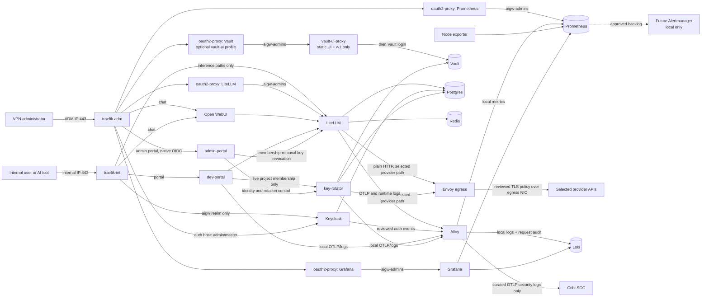

# AI Gateway — Current Architecture and Trust Boundaries

This document describes the implementation currently present in `compose/`,
`ansible/`, and `services/`. The companion diagram set is in
[architecture-diagrams.md](architecture-diagrams.md); the plain-language
security overview is [security-model.md](security-model.md). Exact security
references are [network-security.md](network-security.md),
[os-security.md](os-security.md), and [docker-security.md](docker-security.md).
The following operator guides use this page as their architecture anchor:
[deploy-guide.md](deploy-guide.md),
[operations.md](operations.md),
[identity-operations.md](identity-operations.md),
[observability-operations.md](observability-operations.md),
[litellm-scaling.md](litellm-scaling.md),
[high-availability.md](high-availability.md),
[anthropic-wif-bootstrap.md](anthropic-wif-bootstrap.md), and
[test-runbook.md](test-runbook.md). Provider trust and release operations are
documented in [Provider onboarding](provider-onboarding.md), the
[Provider CA maintenance SOP](sop/provider-ca-maintenance.md), and the
[image update workflow](image-update-workflow.md). Live release and gate status lives in
[project-status.md](project-status.md). This is a customer prototype, not a
turnkey production appliance; historical design notes are superseded by the
configuration described here.

If you are new to the project, read the [security model](security-model.md)
first, then use this page for exact service, network, and data-flow details.

## Scope and deployment model

Production runs as one Docker Compose project on one existing Rocky Linux 9
VM. The customer creates the VM, its three NetworkManager connections, static
addresses, gateways, DNS, and upstream routing. Ansible validates those facts
and then configures policy routing, firewalld, Docker, segmented bridges, the
application stack, and post-deploy checks. It does not create the VM or change
customer-owned addresses, routes, gateways, or DNS.

Local preprod is a separate localhost-only Ansible workflow. It uses one local
Docker engine, the fixed `aigw.internal` domain, loopback HTTPS bindings, and
three outer Docker networks that model egress, ADM, and internal planes. It
includes a test root CA, Samba AD over LDAPS, a WIF provider mock, and static
test users. It does not run the Rocky host roles. See
[local preprod](preprod.md).

The physical trust zones are:

| Leg | Inbound policy | Outbound purpose |
|---|---|---|
| Egress | no gateway listener; zone target `DROP` | fixed Envoy identity only: approved DNS and vendor TCP/443 |
| ADM (`ETH1_IP`) | VPN source CIDR only: configured management SSH port and published TCP/443; optional authoritative TCP/UDP 53 | source-based reply routing through the ADM gateway |
| Internal (`ETH2_IP`) | internal source CIDR only: published TCP/443; optional authoritative TCP/UDP 53 | source-based replies and optional exact Alloy-to-Cribl tuple |

The main routing table must already contain exactly one default route through
the egress NIC. Ansible adds tables 101 (`adm`, priority 10101) and 102
(`internal`, priority 10102) for replies sourced from the two corresponding
host addresses. It does not create or reactivate NetworkManager profiles and
never changes their addresses, routes, gateways, DNS, or interface bindings.
It does own exactly one bounded property on each supplied active physical
profile, the saved `connection.zone` keyed by live UUID, because
NetworkManager otherwise re-imports a blank value into firewalld's default zone
after reload. A vanilla Rocky 9 host may correctly have only the vendor
table-name registry at `/usr/share/iproute2/rt_tables`. Read-only preflight
uses an existing safe `/etc/iproute2/rt_tables` override when present and
otherwise reads the vendor file. The routing role then seeds a missing `/etc`
override from that vendor registry before adding the bounded project block,
preserving standard table names instead of shadowing them.

Ansible orchestrates the host through eleven ordered roles. `ansible/site.yml`
is the full converge, composed of `ansible/os-prep.yml` (host preparation:
`host_preflight`, `firewall_preflight`, `time_sync`, `selinux_baseline`,
`network_routing`, `firewalld_zones`, `os_baseline`, `docker_networks`) then
`ansible/deploy-stack-only.yml` (stack phase: `docker_stack`, `verify`,
`host_finalize`). `os-prep.yml` runs standalone for host-prep-only converges;
`deploy-stack-only.yml` runs standalone for app-only rollouts and refuses an
unprepared host or a stale firewall or network ABI. Production inventories are
created by `scripts/bootstrap-rocky9-production.py`. Local preprod uses only
`ansible/inventory/preprod.yml`. See [deploy-guide.md](deploy-guide.md).

## Implemented component inventory

The base stack defines 24 services: the one-shot `volume-init` plus 23
long-running services. Two — `vault-ui-proxy` and its
`oauth2-proxy-vault` gate — are enabled only by the optional `vault-ui`
Compose profile (`aigw_vault_ui_enabled`, default off), so the default runs 21
long-running services plus the one-shot initializer. All third-party runtime
bases are pinned by tag and immutable OCI digest. Locally built services use
reviewed Dockerfiles and pinned bases; several add a static health probe to an
otherwise shellless final stage.

| Compose service | Responsibility | Exposed path or persistence |
|---|---|---|
| `volume-init` | versioned one-shot ownership/mode initialization for non-root state volumes | no network; runs only when absent, failed, definition-changed, or owner/mode-drifted, then exits before stateful services start |
| `traefik-int` | TLS edge for internal users | exact internal host IP:443 |
| `traefik-adm` | TLS edge for administrators | exact ADM host IP:443 |
| `oauth2-proxy` | Keycloak `aigw-admins` gate for the LiteLLM Admin UI | internal to `net-admin-app` |
| `oauth2-proxy-grafana` | Keycloak `aigw-admins` gate for Grafana | internal to `net-grafana`/`net-admin-app` |
| `oauth2-proxy-prometheus` | Keycloak `aigw-admins` gate for Prometheus | internal to `net-admin-app`/`net-observability` |
| `oauth2-proxy-vault` | Keycloak `aigw-admins` gate before Vault's own login | internal to `net-admin-app`/`net-vault` |
| `litellm` | OpenAI/Anthropic-compatible gateway, virtual keys, provider routing | inference allow-list through `api.<domain>`; DB in `pg_data` |
| `open-webui` | OIDC browser chat | `chat.<domain>` dual-homed on the ADM and internal edges (one OIDC client, `aigw-chat` gate); `openwebui_data` |
| `keycloak` | `aigw` user realm and isolated `anthropic-wif` realm | `auth.<domain>` scoped to the `aigw` realm on the internal leg; full console and master realm through the same `auth.<domain>` host on the ADM leg; DB in `pg_data` |
| `dev-portal` | OIDC self-service gateway keys and tool snippets; no admin route | `portal.<domain>` on the internal edge |
| `admin-portal` | separate OIDC application for managed Keycloak projects/users and provider rotation | `admin.<domain>` on the ADM edge |
| `vault-ui-proxy` (optional `vault-ui` profile) | static Go proxy serving the extracted, analytics-disabled Vault 2.0.3 browser UI and forwarding only `/v1` to the fixed `http://vault:8200` backend | `net-vault` only; behind `oauth2-proxy-vault` |
| `envoy-egress` | sole vendor egress; immutable selected-provider routes, exact SNI/SAN rules, and reviewed CA bundles | no host port; loopback admin; read-only Prometheus facade |
| `key-rotator` | static Anthropic seed, Anthropic WIF, scheduler, identity controller, and a reviewed driver interface for future providers | internal API with `X-Internal-Auth`; DB in `pg_data` |
| `vault` | KV v2, PKI, rotator and identity key material, audit | isolated plaintext API on `net-vault`; ADM UI only through OAuth2 Proxy; `vault_data`, `vault_audit` |
| `postgres` | separate LiteLLM, Keycloak, and rotator databases, plus a read-only Grafana reporting login | `pg_data`; four isolated client database planes |
| `redis` | LiteLLM cache/router state | ACL-authenticated from root-rendered files (no server argv/environment credential), tmpfs only, intentionally non-persistent |
| `alloy` | OTLP receive/fan-out, Docker log tail, Vault audit tail, spanmetrics | `alloy_data`; fixed receiver/export identities |
| `prometheus` | metrics, Alloy remote-write receiver, and local alert evaluation | 30-day time limit plus a 5 GB cap in `prom_data`; the first limit wins; ADM UI only through OAuth2 Proxy |
| `node-exporter` | host filesystem/capacity metrics for local alert rules | read-only host-root view; metrics-only network; no persistence |
| `loki` | operational and Vault audit logs plus the prompt-bearing per-request stream (`service_name="aigw-requests"`) Alloy derives from `litellm_request` spans | 7-day `loki_data` |
| `grafana` | query UI for Prometheus, Loki, and local alert state | `grafana_data`; ADM-only behind `oauth2-proxy-grafana`, auth-proxy header trust, org Admin auto-assign, own login form disabled |
| `cribl-mock` | in-stack OTLP log-only receipt proof | basic debug counts; no durable storage |
| `platform-dns` (optional overlay) | authoritative, non-recursive DNS for the configured `<domain>` | exact ADM/internal host IPs:53 TCP+UDP; dedicated no-peer bridge; enabled by `platform_authoritative_dns_enabled` |

The four OAuth2 Proxy instances share one image
(`ai-gateway/dhi-oauth2-proxy:7.15.3-probe`) and are reverse-proxy OIDC gates
on the ADM leg behind `traefik-adm`, one per admin UI. The two portals share
one image (`ai-gateway/portal:1`, the FastAPI/ASGI app in `services/dev-portal`)
but run as different ASGI applications in different containers, Docker planes,
OIDC clients, session secrets, and hostnames. `key-rotator` is the rotation
engine and Keycloak identity controller built from `services/key-rotator`.

The optional platform-DNS overlay adds `platform-dns`. The production external
directory overlay joins Keycloak to `net-identity` and supplies key-rotator the
inventory-owned LDAPS reconciliation contract and bind-password file.
See [identity-operations.md](identity-operations.md).

Every long-running service has an explicit exec-form health contract. Shellless
images use either an image-native client (Traefik's `traefik healthcheck`)
or the static `aigw-health-probe` binary
built from `services/dhi-health-probe` and copied onto the pinned runtime.
Platform DNS carries a purpose-built `dns-healthcheck`. `volume-init`
intentionally has no healthcheck
because successful completion and its definition/metadata hash — not continued
execution — is its contract.

Native health has two documented blind spots: Traefik `/ping` does not prove a
non-root process loaded its dynamic TLS/router files, and Grafana
`/api/health` does not prove datasource provisioning loaded. The Ansible
`verify` role therefore performs trusted TLS/SNI/status checks across both edge
legs and queries Grafana's authenticated API from an isolated network probe for
the exact healthy Prometheus/Loki graph. Deterministic `0755`/`0644`
non-secret configuration modes and narrower verified Keycloak/Traefik private
bind ownership prevent controller checkout or restored root ownership from
silently defeating those services. During recovery maintenance, host-origin
traffic to the published physical addresses is intentionally denied, so
verification connects directly to the reviewed Traefik service-plane
attachments and requires exact `portal=200`, `api=403`, and `admin=403` results
with CA and SNI validation.

### Versioned state-volume initialization

Ansible hashes the effective Compose definition for `volume-init`. Before
starting the application graph it requires an existing successful one-shot
container with that hash and compares the owner/group/mode of all eight
managed state volumes (`pg_data`, `openwebui_data`, `vault_data`,
`vault_audit`, `alloy_data`, `prom_data`, `loki_data`, and `grafana_data`). It
reruns the initializer only when the container is absent, its last exit was
nonzero, its definition hash changed, or one of those metadata contracts
drifted, then verifies the exact metadata again.

The initializer has no network, a read-only root filesystem, all capabilities
dropped, and only `CHOWN`, `FOWNER`, and `FSETID` added back. `FSETID` is
required to retain `2750` on `vault_audit` after assigning group `473`.
Initialization changes only each mounted volume root's ownership and mode,
except `openwebui_data`. That volume uses a reviewed recursive ownership fix
because Open WebUI creates nested files that must stay owned by its non-root
user.

Lifecycle automation starts the long-running graph through
`scripts/aigw-runtime-up.sh`, which derives the service list from the effective
profile, excludes the one initializer, and invokes Compose with dependency
traversal and implicit builds disabled. A broad raw `docker compose up` is
forbidden because it can re-enter the initializer as a dependency during normal
lifecycle operations.

### Deployed-code boundary and stateful build gate

Ansible does not recursively copy the controller's `scripts/` tree. `docker_stack`
declares a flat, root-owned operational-script manifest — 24 entries, including
`compute-bind-source-digests.py` — inventories the complete target tree on every
converge, removes non-manifest entries, and proves the exact count, type, owner,
group, mode, and top-level path. `scripts/safe-inventory-marker.py` is
deliberately controller-only and is excluded from the deployed allow-list. The
retired `services/egress-proxy/docker-entrypoint.sh` is removed explicitly from
older or restored trees; current Envoy uses the compiled
`aigw-envoy-entrypoint` in its shellless DHI image.

A content-addressed build planner (`plan-compose-builds.py`) is shared by the
pre-upgrade gate and the Ansible build step. It hashes the effective build
definition, the allow-listed context including modes and symlinks, and the
current local image ID with a length-framed, domain-separated stream so a file
payload cannot absorb a following inventory record and suppress a required
rebuild. A source-only or Dockerfile change beneath a stable image tag is
therefore a stateful image change: if an affected stateful container already
exists, the gate requires a recent encrypted backup whose receipt and SHA-256
match before any build. A container-free first deployment has no old state to
protect. Immediately before building, `preserve-compose-rollbacks.py` records
an immutable schema-2 binary rollback reference for every service that already
has state, failing closed on ambiguous, unhealthy, tag-drifted, or racing
sources. This complements the encrypted backup; it does not reverse a
state-schema migration. Live-deployment status for these controls is tracked in
[operations.md](operations.md) and [project-status.md](project-status.md).

The portal image has an extra dependency boundary. Its direct requirements use
exact pins. A generated `requirements.lock` contains the full Python dependency
tree and SHA-256 hashes. The DHI builder installs only that lock with pip
`--require-hashes`. Production cannot fall back to the direct-only file.

### Hardened-image policy and reviewed exceptions

DHI is the preferred runtime source, but it is not a reason to downgrade a
working component. BusyBox `1.38.0-alpine` and Postgres `18.4` run directly
from the DHI catalog. Ten local DHI images add the static
`aigw-health-probe` to a shellless runtime:

- OAuth2 Proxy `7.15.3`, Keycloak `26.7.0`, Vault `2.0.3`, and Redis `8.8.0`;
- Alloy `1.17.1`, Prometheus `3.13.1`, node-exporter `1.12.1`, Loki `3.7.3`,
  and Grafana `13.1.0`; and
- the OpenTelemetry Collector `0.156.0-contrib` behind `cribl-mock`.

Envoy, the portal image, and
the optional platform DNS image (`dhi.io/coredns:1.14.6`) also use DHI final
stages. Every source image remains
tag-and-digest pinned. The following derivative and three exceptions must be
re-evaluated at every image upgrade:

| Status | Workload/current pin | Rationale |
|---|---|---|
| DHI derivative | Traefik: `dhi.io/traefik:3.7.6` runtime plus upstream `v3.7.8` binary → `ai-gateway/dhi-traefik:3.7.8-patched` | the catalog DHI trails the fix for `GHSA-cxjq-mrr5-89rv`; the build keeps the non-root, shellless DHI runtime and replaces only `/usr/bin/traefik` from the immutable patched upstream image |
| Non-DHI | LiteLLM upstream `v1.93.0` (`ghcr.io/berriai/litellm`) | the evaluated DHI artifact contained a fixable High CVE in `sigstore`; the signed upstream release passed the project scan and compatibility review |
| Non-DHI | Open WebUI upstream `0.10.2` (`ai-gateway/open-webui:0.10.2-aigw1`) | no application-specific DHI catalog image was available; the shared probe is still layered on |
| Non-DHI | Preprod Samba AD: pinned Debian plus pinned Samba packages | no application-specific DHI image was available; this image is built only for disposable local preprod and is never a production directory |

An exception is not permission to float a tag or skip scanning. Replace it with
DHI only after the candidate is at least as secure, supports the required
architecture, and passes its state, health, and integration tests.

## Request and authentication flows

Two Traefik instances run
`ai-gateway/dhi-traefik:3.7.8-patched`. They use file configuration and never
read the Docker socket.

`traefik-int` binds `${ETH2_IP}:443`. It sends allow-listed inference, model,
and health paths on `api.<domain>` to LiteLLM. Other API paths return `403`.
It also routes the scoped `auth.<domain>` paths to Keycloak,
`portal.<domain>` to the developer portal, and `chat.<domain>` to Open WebUI.
The same Open WebUI OIDC client and `aigw-chat` gate serve both edges.

`traefik-adm` binds `${ETH1_IP}:443`. It routes `chat.<domain>` to Open WebUI,
`admin.<domain>` to the admin portal, and the full-console `auth.<domain>` to
Keycloak. Separate oauth2-proxy gates protect `litellm-admin.<domain>`,
`grafana.<domain>`, and `prometheus.<domain>`. The optional Vault UI profile
also adds `vault.<domain>` through `oauth2-proxy-vault` to `vault-ui-proxy`.

Only Traefik publishes container ports in the base stack, bound to the exact
ADM/internal host IPs; nothing binds the egress IP or `0.0.0.0`. The `verify`
role DNS-checks `portal`, `auth`, `admin`, `litellm-admin`,
`grafana`, `prometheus`, and `vault`.

### User and administrator authorization

The `aigw` realm emits realm roles in a multivalued `roles` claim:

- `aigw-chat`: Open WebUI access (the dedicated chat gate);
- `aigw-users`: DEPRECATED — no longer gates chat; retained for existing assignments;
- `aigw-developers`: dev-portal key issuance and tool snippets;
- `aigw-admins`: developer functions plus the ADM admin portal, LiteLLM Admin
  UI, Grafana, Prometheus, and Vault edge gates.

Open WebUI's own API keys are disabled. Developer tools use LiteLLM virtual
keys minted by the dev portal, preserving per-key ownership and gateway-level
budgets and rate limits. The internal `api.<domain>` router permits only
inference, model, and liveness/readiness paths; LiteLLM management endpoints
fall through to the explicit `403` middleware.

A portal-issued virtual key is plaintext only in the successful creation
response. It is never written to the portal session or cookie, redisplayed by a
later GET, or inserted into a later tool snippet, which contains only
`YOUR_KEY`. A project is exactly one lowercase direct child group of
`/aigw-managed` with the `aigw-developers` capability. The portal asks the
identity controller for the subject's live direct group memberships on every
key page and mutation; nested, malformed, duplicate, stale, or non-developer
groups fail closed. LiteLLM Community does not provide the native project
hierarchy this design uses, so the canonical group name is stored as namespaced
`aigw_project_id` key metadata rather than an invented native project row.

Each OIDC subject may have at most one active key per live project group and
must explicitly deactivate the current key before creating a replacement.
Creation is serialized by a process-local owner/project lock and rechecks
membership after minting before the one-time plaintext is disclosed. Admin
membership removal deactivates that subject/project's active portal keys both
before and after the Keycloak mutation, closing the normal mint/removal race.
The reviewed deployment therefore remains exactly one dev-portal container with
one Uvicorn worker until the lock moves to a database transaction or
distributed lock.

Open WebUI uses a shared workload key from the encrypted overlay. After
LiteLLM is ready, Ansible matches the key by alias and token hash. The key owner
is `svc-open-webui`, and the service and project are `open-webui`. It can use
only the reviewed `claude-sonnet`, `claude-haiku`, and `gpt` model groups plus
`/v1/models` and `/v1/chat/completions`. Ansible proves the key cannot reach a
management endpoint and never prints it.

The enforced identity is the Open WebUI service, not the person in the
browser. Open WebUI forwards a readable username for attribution, but that
field does not grant access and a client-supplied `llm.user` value is not
trusted. Portal-issued user keys remain the trusted per-person API identity.

The internal `dev-portal` application registers no admin route. Identity, group,
and rotation workflows exist only at `admin.<domain>/admin` on the ADM
edge; every page rechecks the caller's live admin role, and mutations also
require CSRF plus a fresh `prompt=login,max_age=0` Keycloak step-up.

Up to four admin UIs run on the ADM leg: LiteLLM Admin, Grafana, Prometheus,
and the optional Vault UI. Each has its own OAuth2 Proxy callback and cookie
namespace, and each requires `aigw-admins`. Vault then requires its own login.

Grafana uses auth-proxy mode instead of native Keycloak OIDC. It trusts only
the fixed `oauth2-proxy-grafana` source and the forwarded
`X-Forwarded-Preferred-Username` header. It creates the already-gated user as
an org Admin and disables its own login form and basic auth.

Keycloak administration uses `auth.<domain>` on the ADM leg. That leg is
limited to the VPN CIDR and serves the full console and master realm. The same
name on the internal leg allow-lists only the `aigw` realm browser paths and
static `/resources`; every other path is denied. Every production deployment keeps one
Vault-escrowed, ADM-only break-glass administrator. Ansible removes marked
temporary bootstrap principals only after it proves the durable controls.

Open-source Traefik supplies TLS, exact-host routing, and network placement; it
has no native OIDC middleware. Keeping OIDC in the applications or the dedicated
DHI OAuth2 Proxy sidecars avoids running a third-party authentication plugin
inside the edge process.

## Docker network segmentation

There is no flat `net-backend`. The `docker_networks` role pre-creates all 20
bridges from `172.28.0.0/24` through `172.28.20.0/24`, with
`172.28.16.0/24` reserved. Each network uses `external: true`, a stable Linux
bridge name shorter than 16 characters, and no IPv6. Containers receive
addresses from the `.128/25` half of each subnet. The base Compose project attaches to
18 of them; the production directory and platform-DNS overlays add
`net-identity` and `net-platform-dns` respectively.
Five bridges are ordinary `internal: false` — the three physical planes
(`net-egress`, `net-adm`, `net-internal`) plus the two no-peer port-publication
bridges (`net-int-edge`, `net-platform-dns`) — while every application/data plane is
`internal: true`. Docker 29 omits published-port DNAT when every attached bridge
is internal, so the no-peer bridges preserve exact-host-IP publication while both
host firewall layers still deny their container-originated egress.

| Network / bridge | Subnet | Attached services |
|---|---|---|
| `net-egress` / `br-egress` | `172.28.0.0/24` | Envoy (`172.28.0.2`) |
| `net-adm` / `br-adm` | `172.28.1.0/24` | `traefik-adm` |
| `net-internal` / `br-internal` | `172.28.2.0/24` | Alloy (`172.28.2.2`), `cribl-mock` |
| `net-chat` / `br-chat` | `172.28.3.0/24` | `traefik-int` (`.2`), LiteLLM, Open WebUI, Keycloak |
| `net-portal` / `br-portal` | `172.28.4.0/24` | `traefik-int` (`.2`), LiteLLM, Keycloak, dev portal, key-rotator |
| `net-admin-app` / `br-admin` | `172.28.5.0/24` | `traefik-adm` (`.2`), all four OAuth2 proxies, admin portal, LiteLLM, Keycloak, key-rotator |
| `net-grafana` / `br-graf` | `172.28.6.0/24` | `traefik-adm` (`.2`), `oauth2-proxy-grafana` (`.3`), Grafana |
| `net-vendor` / `br-vendor` | `172.28.7.0/24` | LiteLLM, key-rotator, Envoy |
| `net-vault` / `br-vault` | `172.28.8.0/24` | key-rotator, Vault, Vault OAuth2 proxy |
| `net-db-litellm` / `br-db-llm` | `172.28.9.0/24` | LiteLLM, Postgres |
| `net-db-keycloak` / `br-db-kc` | `172.28.10.0/24` | Keycloak, Postgres |
| `net-db-rotator` / `br-db-rot` | `172.28.11.0/24` | key-rotator, Postgres |
| `net-db-grafana` / `br-db-graf` | `172.28.20.0/24` | Grafana (read-only spend datasource), Postgres |
| `net-cache` / `br-cache` | `172.28.12.0/24` | LiteLLM, Redis |
| `net-telemetry` / `br-otel` | `172.28.13.0/24` | LiteLLM, dev/admin portals, key-rotator, Alloy (`.2`) |
| `net-metrics` / `br-metrics` | `172.28.14.0/24` | both Traefik instances, Keycloak, Envoy, Prometheus, node-exporter |
| `net-observability` / `br-obs` | `172.28.15.0/24` | Alloy (`.2`), Prometheus (`.3`), Prometheus OAuth2 proxy, Loki, Grafana |
| _(retired)_ | `172.28.16.0/24` | formerly `net-traces`/`br-traces` (Alloy→Tempo); removed with the local trace store — subnet stays reserved |
| `net-identity` / `br-ident` | `172.28.17.0/24` | production external-directory overlay: Keycloak only |
| `net-platform-dns` / `br-platform-dns` | `172.28.18.0/24` | optional authoritative DNS (`172.28.18.2`); no application peers |
| `net-int-edge` / `br-int-edge` | `172.28.19.0/24` | `traefik-int` only; no application peers |

The fixed addresses are a security ABI: trusted-proxy lists, receiver binds, and
host firewall exceptions depend on them. Change a subnet or address only as a
single reviewed update across group variables, Compose, proxy trust, and
firewall assertions.

LiteLLM currently has one container and the default one Uvicorn worker. This is
a capacity and availability limit, not an implicit Docker-DNS load-balancing
design. Vertical tuning and the required static, socket-free multi-replica
architecture are in [litellm-scaling.md](litellm-scaling.md). The dev portal's
separate one-worker lock remains mandatory regardless of any future LiteLLM
replica count.

### SELinux/MCS and bind-source freshness

The full playbook requires Rocky's `targeted` SELinux policy to be enabled and
enforcing before it mutates the host; it does not turn a permissive or disabled
host into enforcing mode. The baseline installs the container policy and tools,
enables Docker's SELinux integration, and verifies the daemon reports the active
security option.

Ordinary long-running services run as `container_t` with unique MCS process and
mount levels. Every application bind is read-only with exactly one shared `z` or
private `Z` contract, and postflight compares each host object with the effective
container mount level. Alloy and node-exporter are the only bounded
`label=disable` exceptions because they read policy-owned system trees that must
never be relabeled; their DAC, capability, network, publication, and read-only
boundaries remain independently asserted. Docker's data root and containers tree
must retain `container_var_lib_t`, and any AVC/USER_AVC in the converge window
fails the deployment.

Atomic configuration replacement is paired with a per-service bind-source digest.
A stable, root-only key is consumed only on stdin to HMAC a bounded,
length-framed inventory of source paths, metadata, and bytes; unsafe links,
special files, overlaps, limits, and read races fail closed. The digest enters
only that consumer's Compose labels, so an affected service is recreated and
cannot retain a deleted inode while unrelated services stay stable. Restore
deletes the local key as a new epoch, forcing every restored bind consumer to be
recreated by the designated current source. `volume-init` is deliberately
outside this mechanism and keeps its separate one-shot definition/state contract.

## Host and container packet policy

firewalld controls host-terminated input with source-scoped rich rules. It is
not trusted to protect Docker-published ports by itself. Two additional layers
cover container traffic:

1. An atomic iptables `DOCKER-USER` policy, installed before Docker starts and
   reasserted by a firewalld D-Bus reload watcher.
2. An independent native nftables `inet aigw_guard` table. Its input hook drops
   new container-to-host connections; its forward hook mirrors same-plane,
   cross-plane, physical-ingress, exact-egress, and default-drop behavior even
   while firewalld rebuilds its own tables.

Both layers permit reply-direction established traffic, same-bridge traffic, and
inbound TCP/443 or optional authoritative DNS only when conntrack proves Docker DNAT from the exact
published host address to a managed bridge. A physical source CIDR and
destination port alone are never sufficient, so enabling IP forwarding cannot
turn this host into a transit router. Envoy DNS is restricted to one resolver,
Envoy TCP/443 to the egress leg, and — only when explicitly enabled — Alloy to
one literal Cribl `/32` and port. Cross-bridge flows and every other
bridge-originated physical flow are dropped. Docker remains on its iptables
firewall backend; its experimental nftables backend would remove the supported
`DOCKER-USER` integration.

All containers receive an explicit non-loopback DNS resolver so upstream DNS
originates in the container namespace, and only Envoy's fixed source address is
allowed to reach that resolver. An external Cribl endpoint must be a literal IP
because Alloy receives no DNS exception; TLS server-name validation is
configured separately.

For host-input zone ownership, the firewalld role requires one valid, distinct
active NetworkManager UUID per physical interface. It changes only a drifted
saved `connection.zone`, binds the same interface immediately and permanently in
firewalld, and never cycles the link. Inventory spells the reject target as
`%%REJECT%%` for Ansible/YAML compatibility while firewalld reports canonical
`REJECT`; target drift compares canonical forms so an unchanged converge does
not trigger another ruleset reload.

## Vendor egress and provider credentials

LiteLLM and key-rotator call selected provider paths, such as
`http://envoy-egress:8080/anthropic/...`, over `net-vendor`. Envoy at the fixed
`172.28.0.2` is the only workload the host firewall allows external DNS and
TCP/443.

Anthropic is the only approved provider today. The release operator repeats
`--provider NAME`. A network-disabled planner
resolves those names through the committed provider catalog. The catalog pins
each API hostname, route prefix, SNI, exact SAN list, reviewed CA bundle,
certificate fingerprints, and provenance evidence. The release CLI accepts no
arbitrary hostname or CA path. Names are deduplicated and sorted before the
policy is generated.

The network-disabled image build copies only selected routes, provider records,
and CA bundles into the final shellless Envoy image. There is no catch-all
route and no system-trust fallback. Changing the provider selection or CA
evidence changes the policy digest and immutable image ID. The schema-v2
manifest records both and the offline loader checks the image labels before
activation. Ansible never downloads or discovers CA trust at deployment time.

The compiled startup gate rejects changed policy or config bytes; a missing,
unexpected, malformed, expired, or fingerprint-mismatched CA; SNI or SAN
drift; `ENVOY_CONFIG`; and caller-supplied config flags. The unauthenticated
admin API stays on `127.0.0.1:9901`. The `0.0.0.0:9902` listener exposes only
the exact read-only `/stats/prometheus` path.

CA capture and approval are separate. A matching certificate hash proves byte
integrity, not the original capture path. A CA subject country does not prove
endpoint geography or data residency. Follow [Provider onboarding](provider-onboarding.md)
and the [Provider CA maintenance SOP](sop/provider-ca-maintenance.md). The
project has no automatic CA-drift monitor; Envoy TLS counters and access logs
detect a mismatch at or after failure.

Provider runtime credentials live in Vault and enter LiteLLM through its
credential API. The `static-anthropic` driver is a bounded, one-time bootstrap
path. Anthropic WIF starts disabled. Anthropic's broker client uses
`private_key_jwt` and has no shared-secret fallback. No other provider driver
is registered. Adding one requires a reviewed driver, catalog change, tests,
and new offline release.

The browser form can change only enabled state, interval, and grace window.
Anthropic federation IDs remain an operator-controlled Vault step. See
[anthropic-wif-bootstrap.md](anthropic-wif-bootstrap.md).

Startup jobs use one-use scheduler triggers. The deployed scheduler patch
classifies a sealed or temporarily unavailable Vault as a deferral, writes no
rotation-history row, and recreates the bounded retry when the Vault gate or a
driver requests one; generic failures remain terminal. This avoids losing a
run-once job during ordinary sealed boot without turning permanent configuration
failures into an infinite loop.

The Anthropic JWKS watcher is intentionally detection-only. It canonicalizes the
internal realm key set, persists a pending public candidate/hash, and alerts
until an operator replaces the full inline JWKS in Anthropic using a fresh
interactive `org:admin` session and records that exact approved hash in Vault.
The workspace-scoped inference broker makes zero issuer-administration calls and
is never elevated to organization administrator.

## Data, secrets, and telemetry

Postgres uses four isolated client network attachments, SCRAM host
authentication, separate database users, and this exact `CONNECT` matrix.
`PUBLIC` is revoked from all four databases; the `postgres` superuser retains
maintenance access.

| Login role | `litellm` DB | `keycloak` DB | `rotator` DB | `postgres` DB |
|---|---:|---:|---:|---:|
| `litellm` | allow | deny | deny | deny |
| `keycloak` | deny | allow | deny | deny |
| `rotator` | deny | deny | allow | deny |
| `grafana_ro` | allow | deny | deny | deny |

On every converge, Ansible runs one repeatable reconciler over the trusted local
Unix socket. It tests each password with real SCRAM TCP authentication and
changes only a mismatch. This avoids creating a new salted verifier on an
unchanged run.

Every service role must have `LOGIN`, no superuser rights, `NOCREATEDB`,
`NOCREATEROLE`, `NOINHERIT`, `NOREPLICATION`, `NOBYPASSRLS`, connection limit
`-1`, no role-local settings, and no expiry. The reconciler also enforces
database ownership, removes role memberships involving a service role, and
changes the `CONNECT` ACL only on drift. A separate read-only assertion
verifies all 16 service-role/database decisions, the three database owners,
all four role contracts, zero memberships, and `postgres|postgres|true`.
`grafana_ro` then receives column-level `SELECT` access to approved spend and
identity fields only. It cannot read prompt-bearing spend columns.

Redis is a password-protected, non-persistent cache. The server reads only a
SHA-256 ACL verifier file. Docker command and environment metadata contain no
Redis secret. A separate client password file is mounted only for authenticated
probes. Vault uses barrier encryption, but
its single-node file backend and unseal material still require protected
backups.

The repository does not create or unlock LUKS. Production playbooks check
whether the Docker data root and `/opt/ai-gateway` have a `crypto_LUKS`
ancestor. A missing encrypted ancestor produces a clear warning; it does not
stop the converge. Local preprod does not run this production host check.
Prompt and completion content starts in the exact `litellm_request` span.
Alloy converts that span into one sanitized OTLP log. The log may enter the
curated Cribl SOC feed, while the raw span never leaves the gateway. The same
log is retained locally for 7 days in the Loki per-request stream
(`service_name="aigw-requests"`). Before either log route, Alloy
promotes only validated, server-authenticated LiteLLM metadata into canonical
`aigw.user.id`, hashed `aigw.api_key.id`, bounded `aigw.api_key.alias`,
`aigw.project.id`, and `aigw.request.id` trace attributes. The spend index joins
the hashed key to that metadata while prompt bodies stay disabled in spend logs.
This gives direct API traffic the required timestamp, user, prompt, key
identifier, and project link without storing bearer plaintext. A readable
`aigw.user.name` comes from the forwarded chat user, the portal-stamped
username, the key alias, or the subject UUID, in that order.
`aigw.enduser.id` is also kept for clarity. `aigw.user.name` and
`aigw.project.id` become bounded Loki labels for dashboard filters. These
fields provide attribution, not authorization. The enforced identity remains
`aigw.user.id` and `aigw.api_key.id`, which a forwarded header cannot change.
Open WebUI's *enforced* identity remains a documented service/project-only
attribution exception. Ordinary operations and raw Vault audit logs go to Loki,
not Cribl. Metrics stay in Prometheus for up to 30 days, subject to its 5 GB
size cap. The first limit reached wins.
The approved future Alertmanager stays local and has no external receiver. See
[observability operations](observability-operations.md) and the
[Cribl SOC handoff](cribl-soc-handoff.md).

Alloy has no Docker socket. Named-user ACLs let it traverse the Docker data
root, read the `containers` root and child directories, and read only
`*-json.log*`. Other container metadata is explicitly denied. The
reconciler repairs the containers-root ACL before its bounded child walk,
verifies Docker enumeration succeeded, and confines systemd writes to the
containers subtree; it never grants uid 473 broad Docker-root read or write.

## Security controls and current residuals

Implemented controls include:

- tag-and-digest image pins;
- non-root custom services, `no-new-privileges`, and dropped capabilities;
- read-only filesystems where verified and bounded CPU, memory, and logs;
- no Docker socket in Alloy;
- exact proxy trust lists and OIDC issuer checks;
- CSRF protection, short portal sessions, and fresh admin step-up;
- constant-time internal-token checks;
- least-privilege Vault rotation rules; and
- separate database and network planes.

Important residuals before production:

- production LDAP federation is automated only when the generated inventory
  supplies a complete external LDAPS contract and the protected bind password;
  the preprod Samba directory is test-only and must never be presented as a
  customer integration;
- the durable identity controller necessarily holds broad Keycloak
  `manage-users` plus read-only `view-realm` authority; controller-side
  allow-lists and tree checks reduce exposure but do not make compromise of that
  client low impact;
- one process-local identity-topology lock serializes managed-group creation,
  deletion, and membership changes with the last-admin check; it closes
  in-process races but does not protect multiple key-rotator workers or replicas,
  which remain unsupported until a database-backed or distributed fenced lock
  exists;
- the two ADM OAuth2 Proxy cookies revalidate every five minutes and expire
  after ten hours, leaving a bounded post-revocation edge window that
  acceptance must verify;
- Vault initialization, recovery-share custody, and customer-root PKI remain
  reviewed operator ceremonies and replacement initialization is forbidden on
  the restore path;
- LUKS provisioning/unlock, backup scheduling/off-host custody, HA, and site
  disaster recovery are external; Ansible checks and warns about encrypted
  backing and enforces a recent-artifact pre-upgrade gate, but the single-VM
  deployment does not prove controller or site loss, production custody,
  customer RTO/RPO, or HA;
- full prompt capture is intentionally high sensitivity and can exhaust a small
  disk; Cribl supports verified server TLS but no bearer token or mTLS in the
  current Alloy exporter. The exporter has a 2 GiB queue and a 24-hour retry
  window, but no hard per-record queue TTL;
- filesystem capacity rules, node-exporter, and provisioned dashboards are
  present. Local Alertmanager lifecycle handling remains backlog work, with no
  external receiver in the approved design;
- there is no cAdvisor/database-exporter set or automatic vendor-CA drift
  monitor;
- node-exporter's read-only host-root mount is unprivileged, capability-dropped,
  metrics-network-only, and unpublished, but its compromise can still expose host
  metadata/files readable by its UID;
- realm imports populate an empty Keycloak database only; Ansible therefore
  reconciles and reads back client secrets, callbacks, origins, logout URLs,
  and domain-dependent issuer settings on an existing realm;
- Open WebUI's bounded workload key provides service/project attribution only;
  trusted per-human browser-chat attribution is not implemented;
- this is a single VM with no application or telemetry replication. Capacity
  is added by vertically scaling the VM; HA and horizontal scaling require a
  separate Kubernetes design (see
  [high-availability.md](high-availability.md)). Duplicate containers on this
  host are not host redundancy.

Current release gates are recorded in [project-status.md](project-status.md).
Archived lab material is historical evidence, not an active deployment path.

## Decision history

| Decision | Current outcome |
|---|---|
| Ansible rather than Terraform | The VM and NICs already exist; Ansible orders host firewall, routing, Docker, and Compose without provisioning state or `remote-exec`. Terraform may own VM lifecycle later and hand off to the same playbook. |
| NAT bridges plus source PBR | Preserves ordinary Docker behavior; tables 101/102 solve asymmetric replies without macvlan host-reachability complexity. |
| Traefik rather than Caddy | Two explicit file-provider instances bind the internal and ADM addresses; no Docker-socket discovery. |
| Envoy reverse proxy rather than CONNECT proxy | Envoy must originate TLS to enforce vendor CA/SAN policy; an opaque CONNECT tunnel cannot do so without interception. |
| Immutable catalog-selected CA stores rather than leaf-only SPKI | Issuing CAs are more stable than leaf keys. The release build includes only selected, reviewed bundles and binds them to one Envoy image and manifest policy. Every rotation requires review, build, seed test, and release approval. |
| dev portal plus one bounded Open WebUI workload key | Human API keys stay portal-owned and one-time-visible. Open WebUI's own key issuance stays disabled; Ansible reconciles one shared LiteLLM workload key with inference-only routes and service/project attribution. |
| Four OAuth2 Proxy gates rather than in-app admin SSO | LiteLLM Admin, Grafana, Prometheus, and Vault lack a common OIDC gate at their license tier; a dedicated DHI proxy per UI enforces the `aigw-admins` role with an isolated cookie namespace. |
| Vault CE rather than OpenBao | Customer accepted Vault's license for internal use; the implementation uses KV v2, PKI, audit, and metrics-capable CE features only. |
| Curated Cribl SOC logs and one dedicated Loki request stream locally | Alloy converts the reviewed request span into a sanitized log. Raw traces, metrics, alerts, and ordinary service logs never enter Cribl. The SOC destination retains 24 hours; the local request stream retains 7 days. |
| Full prompt capture | Customer requirement; access control, encrypted storage, capacity planning, and retention are load-bearing controls. |

Earlier Caddy, flat `net-backend`, CONNECT-proxy, native-OIDC-Grafana,
`keycloak.<domain>`-hostname, three-OAuth2-proxy, Loki-prompt, OpenBao, and
"implementation pending" statements in historical drafts are superseded by the
implementation described above.
