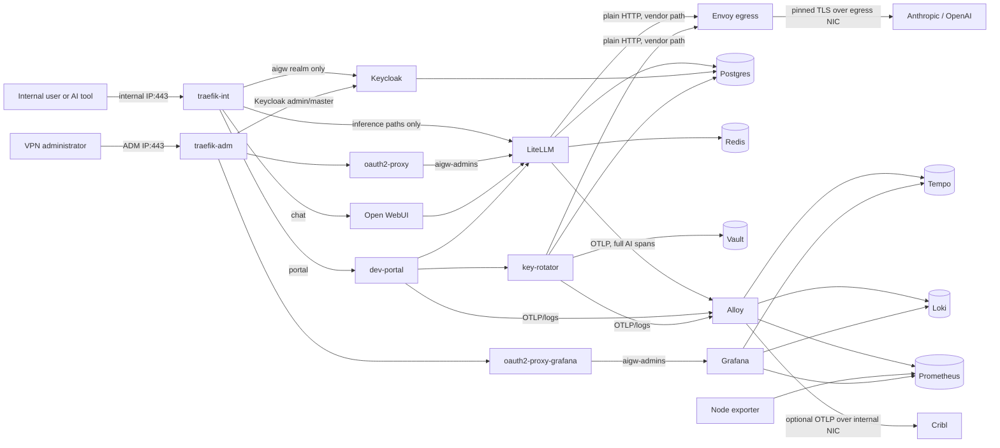

# AI Gateway — Current Architecture and Trust Boundaries

This document describes the implementation currently present in `compose/`,
`ansible/`, and `services/`. Historical design choices are retained at the end;
they are not substitutes for the current configuration.

## Scope and deployment model

AI Gateway runs as one Docker Compose project on one existing Rocky Linux 9
VM. The customer or lab owner creates the VM, its three NetworkManager
connections, static addressing, gateways, DNS, and upstream routing. Ansible
validates those facts and then configures policy routing, firewalld, Docker,
segmented bridges, the application stack, and post-deploy assertions.

The physical trust zones are:

| Leg | Inbound policy | Outbound purpose |
|---|---|---|
| Egress | no gateway listener; zone target `DROP` | fixed Envoy identity only: approved DNS and vendor TCP/443 |
| ADM | VPN source CIDR only: host TCP/22 and published TCP/443; lab-only TCP/UDP 53 | source-based reply routing through the ADM gateway |
| Internal | internal source CIDR only: published TCP/443; lab-only TCP/UDP 53 | source-based replies and optional exact Alloy-to-Cribl tuple |

The main routing table must already contain exactly one default route through
the egress NIC. Ansible adds tables 101 (`adm`, priority 10101) and 102
(`internal`, priority 10102) for replies sourced from the two corresponding
host addresses. It does not create or reactivate NetworkManager profiles and
never changes their addresses, routes, gateways, DNS, or interface bindings.
It does own the saved `connection.zone` property on each supplied active
physical profile, by exact UUID, because NetworkManager otherwise re-imports a
blank value into firewalld's default zone after reload. A vanilla Rocky 9 host
may correctly have only the vendor table-name registry at
`/usr/share/iproute2/rt_tables`. Read-only preflight uses an existing safe
`/etc/iproute2/rt_tables` override when present and otherwise reads the vendor
file. The routing role then seeds a missing `/etc` override from that vendor
registry before adding the bounded project block, preserving standard table
names instead of shadowing them with a project-only file.

## Implemented component inventory

All third-party runtime bases in the base stack are pinned by tag and immutable
OCI digest. Locally built services use reviewed Dockerfiles and pinned bases;
several add a static health/startup probe to an otherwise shellless DHI final
stage.

| Compose service | Responsibility | Exposed path or persistence |
|---|---|---|
| `volume-init` | versioned one-shot ownership/mode initialization for non-root DHI services | no network; runs only when absent, failed, definition-changed, or owner/mode-drifted, then exits successfully before stateful services start |
| `traefik-int` | TLS edge for internal users | exact internal host IP:443 |
| `traefik-adm` | TLS edge for administrators | exact ADM host IP:443 |
| `oauth2-proxy` | Keycloak `aigw-admins` gate for LiteLLM Admin UI | internal to `net-admin-app` |
| `oauth2-proxy-grafana` | Keycloak `aigw-admins` gate for Grafana | internal to admin/Grafana planes |
| `litellm` | OpenAI/Anthropic-compatible gateway, virtual keys, provider routing | inference allow-list through `api.<domain>`; DB in `pg_data` |
| `open-webui` | OIDC browser chat | `chat.<domain>`; `openwebui_data` |
| `keycloak` | `aigw` user realm and isolated `anthropic-wif` realm | user realm on internal edge; admin/master surface on ADM edge; DB in `pg_data` |
| `dev-portal` | OIDC self-service gateway keys, tool snippets, rotation and identity UI | `portal.<domain>` on the internal edge |
| `envoy-egress` | sole vendor egress; originating TLS, exact routes/SANs, narrowed CA stores | no host port; loopback admin; read-only Prometheus facade |
| `key-rotator` | static seed, Anthropic WIF, OpenAI rotation, scheduler, identity controller | internal API with `X-Internal-Auth`; DB in `pg_data` |
| `vault` | KV v2, PKI, rotator and identity key material, audit | isolated plaintext API on `net-vault`; `vault_data`, `vault_audit` |
| `postgres` | separate LiteLLM, Keycloak, and rotator databases | `pg_data`; three isolated database planes |
| `redis` | LiteLLM cache/router state | ACL-authenticated from root-rendered files (no server argv/environment credential), tmpfs only, intentionally non-persistent |
| `alloy` | OTLP receive/fan-out, Docker log tail, Vault audit tail, spanmetrics | `alloy_data`; fixed receiver/export identities |
| `prometheus` | metrics and Alloy remote-write receiver | 15-day `prom_data` |
| `node-exporter` | host filesystem/capacity metrics for local alert rules | read-only host-root view; metrics-only network; no persistence |
| `loki` | operational and Vault audit logs | 30-day `loki_data` |
| `tempo` | prompt-bearing distributed traces | 30-day `tempo_data` |
| `grafana` | query UI for Prometheus, Loki, and Tempo | `grafana_data`; ADM gate plus local login |
| `cribl-mock` | lab-only OTLP receipt proof | basic debug counts; no durable storage |
| `lab-dns` (lab overlay only) | authoritative, non-recursive `aigw.internal` DNS for host-side lab clients | exact ADM/internal host IPs:53 TCP+UDP; dedicated no-peer bridge |
| `samba-ad` (lab overlay only) | disposable AD-compatible directory and hostname-verified LDAPS | isolated `net-identity`; no published host port; three persistent lab volumes |

The base stack has 20 long-running services plus the one-shot `volume-init`.
The explicit Parallels lab overlay adds `samba-ad` and `lab-dns` under the
`lab-ad` profile. It joins only Samba and Keycloak to `net-identity`, mounts
password files as Compose secrets, and enables the rotator's lab LDAP
initialization path. Lab DNS has no application peers and no forwarding
plugin. Generic deployment deliberately does not start either lab service or
silently create a customer LDAP provider. See
[identity operations](identity-operations.md) for bootstrap and ownership
boundaries.

Every long-running service has an explicit exec-form health contract.
Shellless images use either their native health client (Traefik and Tempo) or
the static `aigw-health-probe` copied onto the exact pinned runtime. Samba's
probe checks domain state, policy, and LDAPS; lab DNS's container probe checks
CoreDNS's private health endpoint, while authoritative answers and egress
denial remain functional acceptance tests. `volume-init` intentionally has no
healthcheck because successful completion and its definition/metadata hash—not
continued execution—is its contract.

Native health has two documented blind spots: Traefik `/ping` does not prove a
non-root process loaded its dynamic TLS/router files, and Grafana
`/api/health` does not prove datasource provisioning loaded. The Ansible verify
role therefore performs trusted TLS/SNI/status checks across both edge legs and
queries Grafana's authenticated API from an isolated network probe for the
exact healthy Prometheus/Loki/Tempo graph. Deterministic `0755`/`0644`
non-secret configuration modes and narrower verified Keycloak/Traefik private
bind ownership prevent controller checkout or restored root ownership from
silently defeating those services.

During recovery maintenance, host-origin traffic to the published physical
addresses is intentionally denied. Verification therefore connects directly
to the three reviewed Traefik service-plane attachments and requires exact
`portal=200`, `api=403`, and `admin=403` results with CA and SNI validation;
listener/DNAT/firewall checks prove the separate physical-publication
contract. The Grafana API probe is bounded to 12 attempts at five-second
intervals and receives its password through exact no-newline stdin under
`no_log` with probe-container logging disabled.

### Versioned state-volume initialization

Ansible hashes the effective Compose definition for `volume-init`. Before
starting the application graph, it requires an existing successful one-shot
container with that hash and compares the root owner/group/mode of all eight
managed state volumes. It reruns the initializer only when the container is
absent, its last exit was nonzero, its definition hash changed, or one of those
metadata contracts drifted. Ansible then verifies the exact metadata again.

The initializer has no network, a read-only root filesystem, all capabilities
dropped, and only `CHOWN`, `FOWNER`, and `FSETID` added back. `FSETID` is
required to retain `2750` on `vault_audit` after assigning group `473`.
Initialization changes only each mounted volume root's ownership and mode; it
does not recursively rewrite volume contents.

Lifecycle automation starts the long-running graph through
`scripts/aigw-runtime-up.sh`. That helper derives the service list from the
effective profile, excludes the exactly-one initializer, and invokes Compose
with dependency traversal and implicit builds disabled. A broad raw
`docker compose up` is forbidden because it can re-enter the initializer as a
dependency during normal lifecycle operations.

### Deployed-code boundary and stateful build gate

Ansible does not recursively copy the controller's `scripts/` tree. Current
source declares exactly this flat, root-owned 23-file operational manifest and
no nested or symlinked entry:

```text
aigw-compose.sh                    aigw-runtime-up.sh
load-offline-image-seed.py         plan-compose-builds.py
pre-upgrade-check.sh               preserve-compose-rollbacks.py
reconcile-openwebui-key.py         remove-lab-local-keycloak-users.py
restore_archive.py                 rotate-vault-audit.sh
state-backup.sh                    state-restore.sh
test-portal-group-flow.py          test-portal-identity-flow.py
test-portal-key-lifecycle.py       test-portal-login.py
validate-build-contract.py         validate-compose.sh
validate-identity-policy.py        validate-vault-config.sh
vault-bootstrap.sh                 vault-unseal.sh
verify-live-lab-identity.py
```

The running replacement VM still has the earlier manifest until the controlled
G7 source converge deploys `preserve-compose-rollbacks.py`; source declaration
is not live-deployment evidence.

Every converge inventories the complete target tree, removes non-manifest
entries, and then proves the exact count, type, owner, group, mode, and
top-level path. Service build contexts also have a bounded source-file policy.
The retired `services/egress-proxy/docker-entrypoint.sh` is removed explicitly
from restored or older target trees; current Envoy uses the compiled
`aigw-envoy-entrypoint` in its shellless DHI image.

`scripts/safe-inventory-marker.py` is deliberately controller-only and is
excluded from the deployed operational-script allow-list. It canonicalizes a
bounded non-secret `aigw.safe-inventory/v1` JSON schema, produces a separate
SHA-256/count receipt, rejects sensitive field names and malformed hash fields,
and compares exact durable facts while permitting only explicitly declared
volatile scalar leaves or append-only list prefixes. It provides a reproducible
contract for future evidence; it cannot retroactively supply the missing
canonicalizer/provenance for the pre-destroy marker used in the 2026-07-13
rehearsal.

The same content-addressed build planner is used by both the pre-upgrade gate
and the later Ansible build step. It hashes the effective build definition,
the allow-listed context including modes/symlinks, and the current local image
ID. Its version-2 stream is domain-separated and explicitly length-frames each
definition, path, metadata record, and payload; regular-file identity and
metadata are rechecked after streaming. This prevents a file payload from
absorbing the following inventory record and suppressing a required rebuild.
The older unframed digest is accepted only as a one-converge comparison for a
pre-existing marker; current source always persists the framed digest. Thus a
source-only or Dockerfile change beneath a stable image tag is a stateful image
change. If an affected stateful container already exists, the gate requires a
recent available encrypted artifact whose receipt and SHA-256 match before any
build occurs. A container-free first deployment has no old state to protect
and does not require that receipt.

Current source then preserves binary rollback before the build. For every
planned service with existing state, it requires exactly one healthy, running,
zero-restart Compose container; proves its desired local tag and immutable
image ID agree; writes an immutable project/service/full-source-digest rollback
reference; closes the inspect/tag race; and atomically records schema 2 in a
single-link `root:root 0600` manifest. A new generation cannot move a reference
named by the committed manifest, and every retained service mapping is
revalidated before any image mutation. A first-build proof is interruption-
safe and is retired once the successful build-input marker is durable.
Ambiguous or unhealthy sources, Docker-context changes, malformed manifests,
tag drift, and races fail closed. This complements the encrypted backup; it
does not reverse a state-schema migration.

Focused source tests pass, but the live gate remains open. The predecessor
key-rotator OCI image with digest prefix `e97456` was garbage-collected before
this control existed; it has since been recovered from the neutral OCI
artifact and loaded under the exact immutable schema-2 rollback reference.
That closes the recovery prerequisite, not the pending live source-deployment,
restart, and unchanged-converge gates.

The dev-portal image has an additional dependency boundary. Its direct
requirements remain exact-pinned for review, while a generated
`requirements.lock` contains the complete transitive Python graph with
SHA-256 hashes. The DHI builder installs only that lock with pip
`--require-hashes`; validation proves every direct pin is present and forbids a
production fallback to the direct-only file.

### Hardened-image policy and reviewed exceptions

DHI is the preferred runtime source, not an unconditional downgrade rule. The
deployed DHI images are shellless/non-root where the product permits it, and
custom Python, Traefik, Envoy, CoreDNS, and health-probe builds use DHI final
stages. Every source image remains tag-and-digest pinned. The following
derivative and exceptions were reviewed on 2026-07-13 and must be re-evaluated
at every image upgrade:

| Status | Workload/current pin | Rationale |
|---|---|---|
| DHI derivative | Traefik: `dhi.io/traefik:3.7.6` runtime plus upstream `3.7.7` binary | the catalog DHI trails the fix for `GHSA-cxjq-mrr5-89rv`; the build preserves the non-root, shellless DHI runtime and replaces only `/usr/bin/traefik` from the immutable patched upstream image |
| LiteLLM | upstream `1.91.3` | the evaluated DHI artifact contained fixable High `CVE-2026-48815` in `sigstore`; the selected signed upstream release passed the project scan/compatibility review |
| Open WebUI | upstream `0.10.2` | no application-specific DHI catalog image was available |
| Samba AD lab | pinned Debian 13 plus pinned Samba packages | no application-specific DHI image was available, and this directory exists only in the disposable lab profile |

An exception is not permission to float a tag or skip scanning. Replace it
with DHI only after the candidate version is at least as secure, supports the
required architecture, and passes its state, health, and integration tests.

## Request and authentication flows



### User and administrator authorization

The `aigw` realm emits realm roles in a multivalued `roles` claim:

- `aigw-users`: Open WebUI access;
- `aigw-developers`: dev-portal key issuance and tool snippets;
- `aigw-admins`: developer functions plus portal administration, LiteLLM
  Admin UI, and Grafana edge gates.

Open WebUI's own API keys are disabled. Developer tools use LiteLLM virtual
keys minted by the dev portal, preserving per-key ownership and gateway-level
budgets/rate limits. The internal `api.<domain>` router permits only inference,
model, and liveness/readiness paths; LiteLLM management endpoints fall through
to an explicit 403 middleware.

A portal-issued virtual key is plaintext only in the successful creation
response. It is never written to the portal session/cookie, redisplayed by a
later GET, or inserted into a later tool snippet; later snippets contain only
`YOUR_KEY`. Each OIDC subject may have at most one active key per allow-listed,
stable project ID (default `ai-gateway`). The project is recorded as
`aigw_project_id` metadata, and ownership/project checks are performed locally
instead of trusting LiteLLM list filters. The user must explicitly deactivate
the current concrete key before creating a replacement. Creation is serialized
by a process-local owner/project lock, so the reviewed deployment is exactly
one portal container with one Uvicorn worker until that lock is moved to a
database transaction or distributed lock.

Open WebUI uses a separate, shared workload key supplied from the encrypted
overlay. After LiteLLM is ready, Ansible reconciles the exact candidate by
both alias and token hash as owner `svc-open-webui`, service/project
`open-webui`, with only `claude-sonnet`, `claude-haiku`, and `gpt` plus
`/v1/models` and `/v1/chat/completions`. It proves the key cannot reach a
management endpoint and never prints its plaintext. This is service identity,
not human identity: all browser-chat traffic is attributed to
`svc-open-webui`. Open WebUI does not currently propagate a trusted per-human
identity to LiteLLM, and client-supplied `llm.user` is explicitly not an
authorization or audit authority. Per-human chat attribution requires a
separate server-side integration and acceptance test.

The LiteLLM Admin UI and Grafana are reachable only through the ADM Traefik
instance and separate oauth2-proxy processes. These proxies run as isolated
reverse-proxy services: Traefik routes each protected host to oauth2-proxy,
which completes Keycloak OIDC and forwards authorized requests to the
application. This avoids putting a third-party authentication plugin inside
the edge proxy; native OIDC middleware is a Traefik Hub feature rather than an
open-source Traefik feature. Grafana then requires its local login as a second
control. Keycloak's admin/master surface is also ADM-only, but relies on
Keycloak's own administrator authentication rather than oauth2-proxy.

The dev portal `/admin` route currently shares `portal.<domain>` on the
**internal** edge. It requires `aigw-admins`, CSRF protection, and a fresh OIDC
step-up for identity mutations, but it is not physically ADM-only. Moving this
route to an ADM-only vhost remains a production-hardening item.

## Docker network segmentation

There is no flat `net-backend`. The 20 external Compose networks are created
first by Ansible with stable Linux bridge names; IPv6 is disabled on each.
The three physical planes plus two no-peer port-publication bridges are
ordinary Docker bridges. All application/data planes are Docker
`internal: true` networks. `net-int-edge` is attached only to internal
Traefik, and lab-only `net-lab-dns` only to the DNS service. Docker 29 omits
published-port DNAT when every attached bridge is internal; the no-peer
bridges preserve exact-host-IP publication while both host firewall layers
still deny their container-originated egress.

| Network / bridge | Subnet | Attached services |
|---|---|---|
| `net-egress` / `br-egress` | `172.28.0.0/24` | Envoy (`172.28.0.2`) |
| `net-adm` / `br-adm` | `172.28.1.0/24` | ADM Traefik |
| `net-internal` / `br-internal` | `172.28.2.0/24` | Alloy (`172.28.2.2`), Cribl mock |
| `net-chat` / `br-chat` | `172.28.3.0/24` | internal Traefik (`.2`), LiteLLM, Open WebUI, Keycloak |
| `net-portal` / `br-portal` | `172.28.4.0/24` | internal Traefik (`.2`), LiteLLM, Keycloak, dev portal, rotator |
| `net-admin-app` / `br-admin` | `172.28.5.0/24` | ADM Traefik (`.2`), both oauth2 proxies, LiteLLM, Keycloak |
| `net-grafana` / `br-graf` | `172.28.6.0/24` | ADM Traefik (`.2`), Grafana proxy, Grafana |
| `net-vendor` / `br-vendor` | `172.28.7.0/24` | LiteLLM, rotator, Envoy |
| `net-vault` / `br-vault` | `172.28.8.0/24` | rotator, Vault |
| `net-db-litellm` / `br-db-llm` | `172.28.9.0/24` | LiteLLM, Postgres |
| `net-db-keycloak` / `br-db-kc` | `172.28.10.0/24` | Keycloak, Postgres |
| `net-db-rotator` / `br-db-rot` | `172.28.11.0/24` | rotator, Postgres |
| `net-cache` / `br-cache` | `172.28.12.0/24` | LiteLLM, Redis |
| `net-telemetry` / `br-otel` | `172.28.13.0/24` | LiteLLM, dev portal, rotator, Alloy (`.2`) |
| `net-metrics` / `br-metrics` | `172.28.14.0/24` | both Traefik instances, Keycloak, Envoy, Prometheus |
| `net-observability` / `br-obs` | `172.28.15.0/24` | Alloy (`.2`), Prometheus (`.3`), Loki, Tempo, Grafana |
| `net-traces` / `br-traces` | `172.28.16.0/24` | Alloy, Tempo (`.2`) |
| `net-identity` / `br-ident` | `172.28.17.0/24` | Keycloak and, only in the Parallels lab overlay, Samba AD |
| `net-lab-dns` / `br-lab-dns` | `172.28.18.0/24` | lab-only DNS (`172.28.18.2`); no application peers |
| `net-int-edge` / `br-int-edge` | `172.28.19.0/24` | internal Traefik only; no application peers |

The fixed addresses are a security ABI: trusted-proxy lists, receiver binds,
and host firewall exceptions depend on them. Change a subnet/address only as a
single reviewed update across group variables, Compose, proxy trust, and
firewall assertions.

LiteLLM currently has one container and the default one Uvicorn worker. This is
a capacity and availability limit, not an implicit Docker-DNS load-balancing
design. Vertical tuning and the required static, socket-free multi-replica
architecture are documented in [LiteLLM capacity and scaling](litellm-scaling.md).
The dev portal's separate one-worker lock remains mandatory regardless of any
future LiteLLM replica count.

### SELinux/MCS and bind-source freshness

The full playbook requires Rocky's `targeted` SELinux policy to be enabled and
enforcing before it mutates the host; it does not change a permissive or
disabled host into enforcing mode. The baseline installs the container policy
and tools, enables Docker's SELinux integration, and verifies the daemon
reports the active security option.

Ordinary long-running services run as `container_t` with unique MCS process
and mount levels. Every application bind is read-only with exactly one shared
`z` or private `Z` contract, and postflight compares each host object with the
effective container mount level. Alloy and node-exporter are the only bounded
`label=disable` exceptions because they read policy-owned system trees that
must never be relabeled; their DAC, capability, network, publication, and
read-only boundaries remain independently asserted. Docker's data root and
containers tree must retain `container_var_lib_t`, and any AVC/USER_AVC in the
converge window fails the deployment.

Atomic configuration replacement is paired with a per-service bind-source
digest. A stable, root-only key is consumed only on stdin to HMAC a bounded,
length-framed inventory of source paths, metadata, and bytes; unsafe links,
special files, overlaps, limits, and read races fail closed. The digest enters
only that consumer's Compose labels, so an affected service is recreated and
cannot retain a deleted inode while unrelated services remain stable. Restore
deletes the local key as a new epoch, forcing every restored bind consumer to
be recreated by the designated current source. `volume-init` is deliberately
outside this mechanism and retains its separate one-shot definition/state
contract.

## Host and container packet policy

firewalld controls host-terminated input with source-scoped rich rules. It is
not trusted to protect Docker-published ports by itself. Two additional layers
cover container traffic:

1. An atomic iptables `DOCKER-USER` policy, installed before Docker starts and
   reasserted by a firewalld D-Bus reload watcher.
2. An independent native nftables `inet aigw_guard` table. Its input hook drops
   new container-to-host connections; its forward hook mirrors same-plane,
   cross-plane, physical-ingress, exact egress, and default-drop behavior even
   while firewalld rebuilds its own tables.

Both layers permit reply-direction established traffic, same-bridge traffic,
and inbound TCP/443 or lab DNS only when conntrack proves Docker DNAT from the
exact published host address to a managed bridge. A physical source CIDR and
destination port alone are never sufficient, so enabling IP forwarding cannot
turn this host into a transit router. Envoy DNS is restricted to one resolver,
Envoy TCP/443 to the egress leg, and—only when explicitly enabled—Alloy to one
literal Cribl `/32` and port. Cross-bridge flows and every other bridge-originated
physical flow are dropped. Docker remains on its iptables firewall backend;
its experimental nftables backend would remove the supported `DOCKER-USER`
integration.

All containers receive an explicit non-loopback DNS resolver so upstream DNS
originates in the container namespace. Only Envoy's fixed source address is
allowed to reach that resolver. Docker service discovery remains available.
An external Cribl endpoint must be a literal IP because Alloy receives no DNS
exception; TLS server-name validation is configured separately.

For host-input zone ownership, the firewalld role requires one valid, distinct
active NetworkManager UUID per physical interface. It changes only a drifted
saved `connection.zone`, binds the same interface immediately and permanently
in firewalld, and never cycles the link. Post-converge verifies all three
representations exactly. Inventory spells the reject target as `%%REJECT%%`
for Ansible/YAML compatibility, while firewalld reports canonical `REJECT`;
target drift compares canonical forms so an unchanged converge does not
trigger another ruleset reload.

## Vendor egress and provider credentials

LiteLLM and key-rotator call `http://envoy-egress:8080/anthropic/...` or
`/openai/...` over `net-vendor`. Envoy has no catch-all route. It originates
TLS with exact SNI/SAN validation and a per-vendor `trusted_ca` bundle that is
narrower than the system trust store. Its startup gate rejects absent,
placeholder, or system-wide trust bundles and rejects command-line config
overrides. The unauthenticated admin API stays on loopback; port 9902 exposes
only an exact read-only Prometheus path.

The committed bundles are operational pin material and must be independently
revalidated before production and during issuing-CA changes. The project does
not currently implement an automatic CA-drift monitor or pin-update workflow;
Envoy TLS counters and access logs provide detection after or near failure.

Provider runtime credentials live in Vault and are pushed into LiteLLM's
credential API:

- the two `static-*` drivers are enabled as run-once lab seed paths;
- Anthropic WIF and OpenAI service-account rotation rows start disabled;
- Anthropic's broker client is imported disabled with `private_key_jwt` and no
  shared-secret fallback;
- OpenAI rotation requires a Vault document containing the admin API key and
  project ID.

The browser rotation form changes enabled state, interval, and grace window.
It does not currently collect the external Anthropic federation IDs or OpenAI
admin configuration; those bootstrap records remain an operator-controlled
Vault step. See the WIF guide and residual-risk list.

Startup jobs use one-use scheduler triggers. The deployed scheduler patch
classifies sealed or temporarily unavailable Vault as a deferral and writes no
rotation-history row; it recreates the bounded retry when the Vault gate or a
driver explicitly requests one. Generic failures remain terminal. This avoids
losing a run-once job during ordinary sealed boot without turning permanent
configuration failures into an infinite loop. Unit/security checks and the
available-Vault deployed path pass; the combined sealed-boot-to-unseal live
proof remains a G7 requirement.

The Anthropic JWKS watcher is intentionally detection-only. It canonicalizes
the internal realm key set, persists a pending public candidate/hash, and
alerts until an operator replaces the full inline JWKS in Anthropic using a
fresh interactive `org:admin` session and records that exact approved hash in
Vault. The workspace-scoped inference broker makes zero issuer-administration
calls and is never elevated to organization administrator.

## Data, secrets, and telemetry

Postgres uses three isolated network attachments, SCRAM host authentication,
separate database users, and this exact `CONNECT` matrix. `PUBLIC` is revoked
from all four databases; the `postgres` superuser retains maintenance access.

| Login role | `litellm` DB | `keycloak` DB | `rotator` DB | `postgres` DB |
|---|---:|---:|---:|---:|
| `litellm` | allow | deny | deny | deny |
| `keycloak` | deny | allow | deny | deny |
| `rotator` | deny | deny | allow | deny |

On every converge, Ansible runs one idempotent reconciler over the trusted
local Unix socket. It first tests each desired password through actual SCRAM
TCP authentication and changes only a mismatch, avoiding a new salted verifier
on an unchanged run. It enforces each service role as `LOGIN`, non-superuser,
`NOCREATEDB`, `NOCREATEROLE`, `NOINHERIT`, `NOREPLICATION`, `NOBYPASSRLS`,
connection limit `-1`, no role-local settings, and no finite expiry. It also
enforces exact database ownership, removes every role membership in either
direction involving a service role, and mutates the `CONNECT` ACL only on
drift. A separate read-only assertion verifies the 12 service-role/database
decisions, all three owners, all three role contracts, zero memberships, and
`postgres|postgres|true`. Redis is a password-protected non-persistent cache.
After a test credential was found in Docker `Config.Cmd`, it was treated as
exposed and rotated without recording its value. The server now reads only an
SHA-256 ACL verifier file; command/environment metadata is secretless and the
separate client password file is narrowly bound for authenticated probes.
Vault uses barrier encryption, but its single-node file backend and unseal
material still require protected backups.

The repository does not create or unlock LUKS. Generic/customer playbooks do,
however, fail before mutation unless both the configured Docker data root and
`/opt/ai-gateway` resolve through a block device with a `crypto_LUKS`
ancestor. Only the explicit disposable Parallels profile opts out. Prompt and
completion content is explicitly captured as OpenTelemetry span attributes
and retained in Tempo for 30 days; it is also sent to Cribl when configured.
Operational and Vault audit logs go to Loki. See
[observability operations](observability-operations.md).

Alloy has no Docker socket. It tails bounded `json-file` logs through named-user
ACLs: traversal only on the Docker data root, reviewed `r-x` plus a default
traversal entry on its `containers` root, directory traversal below that, read
only on `*-json.log*`, and explicit denial on ordinary sibling metadata. The
current source reconciler repairs the containers-root ACL before its bounded
child walk, verifies Docker enumeration succeeded, and confines systemd writes
to the containers subtree. It never grants uid 473 broad Docker-root read or
write. Focused source tests pass; the replacement VM still requires the
controlled live deploy and Docker-restart proof.

## Security controls and current residuals

Implemented controls include tag-and-digest image pinning, non-root custom
services, `no-new-privileges`, capability dropping, read-only filesystems where
verified, process/memory/CPU limits, bounded Docker logs, no Docker socket in
Alloy, exact proxy trust lists, OIDC issuer validation, CSRF, short portal
sessions, fresh admin step-up, constant-time internal-token comparison, Vault
least-privilege policy for provider rotation, and database/network isolation.

Important residuals before production:

- the current audit workspace passed a full three-NIC Rocky 9 lab converge on
  2026-07-12 with all 22 long-running services healthy and its new SSH,
  PostgreSQL, Open WebUI secret/key, network, identity, DNS, and egress gates;
  the forced-recreate secret digest, standard/concurrent one-time-key
  lifecycle, live role/removal flows, fresh encrypted backup/hostile parser,
  and unchanged second converge also passed. The exact 23-container snapshot
  was unchanged, all 22 services remained healthy with zero restarts/OOM
  events, `volume-init` retained its zero exit and timestamps, Vault remained
  unsealed, and no dangling volume remained. Other production and acceptance
  sections remain independent release evidence. That evidence belongs to the
  deliberately destroyed predecessor VM: the 2026-07-13 vanilla replacement
  has passed recovery gates G0 through G5, including corrected offline restore,
  designated current-source sealed converge, separately held old-share unseal,
  and a healthy 22-service runtime. G6 durable/identity/infrastructure/key and
  negative lanes passed; a non-sensitive four-span batch also passed exact
  positive/negative Alloy correlation, Tempo/lab-Cribl delivery, spanmetrics,
  and zero-drop/state-drift checks, closing G6. Real Anthropic WIF exchange/
  inference remains NOT EXECUTED because its customer external configuration
  is absent. One replacement-host reboot also passed exact durable-state
  comparison and healthy recovery after one stdin-only lab unseal, but exposed
  two release-blocking defects: sealed-Vault startup rotations were consumed
  as failures, and Docker recreation removed the parent containers-directory
  ACL that the then-live timer did not repair. The scheduler fix is deployed.
  The ACL, SELinux/MCS, bind-recreation, Vault-readiness, and pre-build rollback
  changes are source-tested but not yet live. Exact predecessor key-rotator
  image recovery has passed under the immutable schema-2 rollback reference;
  the controlled source converge, restart, and unchanged-converge evidence
  remain open, so G7 is still on hold in the destructive-rehearsal register;
- the pre-destroy persistence marker omitted the canonicalizer/provenance for
  opaque row-count digests and independent controller/broker certificate
  fingerprints. Supplemental authenticated/canonical evidence passed, but
  those historical coverage gaps remain explicit; the new controller-only
  safe-inventory tool is prospective and cannot repair the old marker;
- generic customer LDAP federation is not automated; Samba is a lab-only
  directory and must never be presented as a customer integration;
- the durable identity controller necessarily has broad Keycloak
  `manage-users` plus read-only `view-realm` authority; controller-side
  allow-lists and tree checks reduce
  exposure but do not make compromise of that client low impact;
- one process-local identity-topology lock serializes managed-group creation,
  deletion, member addition, and member removal with the last-admin check; it
  closes in-process check/mutate races but does not protect multiple
  key-rotator workers or replicas, which remain unsupported until a
  database-backed or distributed fenced lock is implemented;
- identity removal logs out Keycloak sessions and every portal admin page read
  or mutation rechecks live composite roles. The two ADM oauth2-proxy cookies
  revalidate every five minutes and expire after eight hours, leaving a bounded
  post-revocation edge window that acceptance must verify;
- Vault bootstrap is 1-of-1, file-backed, internally plaintext, and uses a test
  root; customer-root PKI and production unseal custody are not automated;
- LUKS provisioning/unlock, backup scheduling/off-host custody, HA, and site
  disaster recovery are external. Ansible enforces encrypted backing and a
  recent-artifact pre-upgrade gate for generic/customer state; the local
  single-VM-loss lab has passed corrected restore/unseal mechanics, but it does
  not prove Mac-host/site loss, production custody, customer RTO/RPO, or HA;
- dev-portal `/admin` is role/step-up protected but remains on the internal leg;
- full prompt capture is intentionally high sensitivity and can exhaust a
  small disk;
- Cribl supports verified TLS but no bearer token or mTLS in the current Alloy
  exporter configuration;
- the Cribl CA must coexist with the internal CA in the mounted bundle, but the
  lab Vault bootstrap rewrites that bundle;
- filesystem capacity rules and node-exporter are present, but there is no
  Alertmanager/notification route, dashboard bundle, cAdvisor/database
  exporter set, or automatic vendor-CA drift monitor;
- node-exporter has a read-only host-root mount for filesystem metrics. It is
  unprivileged, capability-dropped, metrics-network-only, and unpublished, but
  its compromise can still expose host metadata/files readable by its UID;
- realm imports update an empty Keycloak database only; later client secret,
  callback, or domain changes require an explicit Keycloak update;
- Open WebUI's bounded workload key provides service/project attribution only;
  trusted per-human browser-chat attribution is not implemented;
- this is a single VM with no application or telemetry replication. The
  service-by-service minimum topology, rolling rules, and customer blockers for
  a future, separate production profile are in the
  [HA and rolling-update matrix](high-availability.md); duplicate containers on
  this host are not host redundancy.

## Decision history

| Decision | Current outcome |
|---|---|
| Ansible rather than Terraform | The VM and NICs already exist; Ansible orders host firewall, routing, Docker, and Compose without provisioning state or `remote-exec`. Terraform may own VM lifecycle later and hand off to the same playbook. |
| NAT bridges plus source PBR | Preserves ordinary Docker behavior; tables 101/102 solve asymmetric replies without macvlan host-reachability complexity. |
| Traefik rather than Caddy | Two explicit file-provider instances bind the internal and ADM addresses; no Docker-socket discovery. |
| Envoy reverse proxy rather than CONNECT proxy | Envoy must originate TLS to enforce vendor CA/SAN policy; an opaque CONNECT tunnel cannot do so without interception. |
| Narrowed CA stores rather than leaf-only SPKI | Issuing CAs are operationally more stable. Optional leaf pins remain possible but require rotation coordination. |
| dev portal plus one bounded Open WebUI workload key | Human API keys remain portal-owned and one-time-visible. Open WebUI's own key issuance stays disabled; Ansible reconciles one shared LiteLLM workload key with inference-only routes and service/project attribution. |
| Vault CE rather than OpenBao | Customer accepted Vault's license for internal use; the implementation uses KV v2, PKI, audit, and metrics-capable CE features only. |
| Tempo for AI content, Loki for logs | Full prompts are trace attributes. Keeping them out of ordinary log streams avoids duplicate sensitive stores and unbounded log labels. |
| Full prompt capture | Customer requirement; access control, encrypted storage, capacity planning, and retention are load-bearing controls. |

Earlier Caddy, flat `net-backend`, CONNECT proxy, Loki-prompt, OpenBao, and
“implementation pending” statements in historical drafts are superseded by
the implementation described above.
