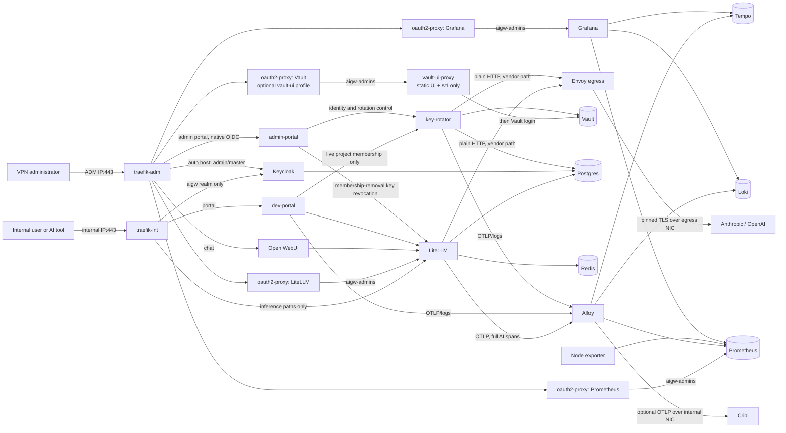

# AI Gateway — Current Architecture and Trust Boundaries

This document describes the implementation currently present in `compose/`,
`ansible/`, and `services/`. The companion diagram set is in
[architecture-diagrams.md](architecture-diagrams.md); the dedicated security
references are [network-security.md](network-security.md),
[os-security.md](os-security.md), and [docker-security.md](docker-security.md). It is the architecture anchor the other operator
guides reference: [deploy-guide.md](deploy-guide.md),
[operations.md](operations.md),
[identity-operations.md](identity-operations.md),
[observability-operations.md](observability-operations.md),
[litellm-scaling.md](litellm-scaling.md),
[high-availability.md](high-availability.md),
[anthropic-wif-bootstrap.md](anthropic-wif-bootstrap.md), and
[test-runbook.md](test-runbook.md). Live release and gate status lives in
[project-status.md](project-status.md). This is a customer prototype, not a
turnkey production appliance; historical design notes are superseded by the
configuration described here.

## Scope and deployment model

AI Gateway runs as one Docker Compose project on one existing Rocky Linux 9
VM. The customer or lab owner creates the VM, its three NetworkManager
connections, static addressing, gateways, DNS, and upstream routing. Ansible
validates those facts and then configures policy routing, firewalld, Docker,
segmented bridges, the application stack, and post-deploy assertions. It does
not create the VM, readdress interfaces, or change customer routes, gateways,
DNS, or static IPs.

The physical trust zones are:

| Leg | Inbound policy | Outbound purpose |
|---|---|---|
| Egress | no gateway listener; zone target `DROP` | fixed Envoy identity only: approved DNS and vendor TCP/443 |
| ADM (`ETH1_IP`) | VPN source CIDR only: host TCP/22 and published TCP/443; lab-only TCP/UDP 53 | source-based reply routing through the ADM gateway |
| Internal (`ETH2_IP`) | internal source CIDR only: published TCP/443; lab-only TCP/UDP 53 | source-based replies and optional exact Alloy-to-Cribl tuple |

The main routing table must already contain exactly one default route through
the egress NIC. Ansible adds tables 101 (`adm`, priority 10101) and 102
(`internal`, priority 10102) for replies sourced from the two corresponding
host addresses. It does not create or reactivate NetworkManager profiles and
never changes their addresses, routes, gateways, DNS, or interface bindings.
It does own exactly one bounded property on each supplied active physical
profile, the saved `connection.zone` keyed by live UUID, because
NetworkManager otherwise re-imports a blank value into firewalld's default zone
after reload. A vanilla Rocky 9 host may correctly have only the vendor
table-name registry at `/usr/share/iproute2/rt_tables`. Read-only preflight
uses an existing safe `/etc/iproute2/rt_tables` override when present and
otherwise reads the vendor file. The routing role then seeds a missing `/etc`
override from that vendor registry before adding the bounded project block,
preserving standard table names instead of shadowing them.

Ansible orchestrates the host through the ordered roles in `ansible/site.yml`:
`host_preflight`, `firewall_preflight`, `time_sync`, `selinux_baseline`,
`network_routing`, `firewalld_zones`, `os_baseline`, `docker_networks`,
`docker_stack`, `verify`, and `host_finalize`. `ansible/deploy-stack-only.yml` performs an
app-only rollout and refuses to run against a stale firewall or network ABI.
The inventory ships a generic `inventory/hosts.yml` and an explicit lab
`inventory/lab.yml`. See [deploy-guide.md](deploy-guide.md).

## Implemented component inventory

The base stack defines 25 services: the one-shot `volume-init` plus 24
long-running services, of which two — `vault-ui-proxy` and its
`oauth2-proxy-vault` gate — are enabled only by the optional `vault-ui`
Compose profile (`aigw_vault_ui_enabled`, default off), so a default
deployment runs 23. All third-party runtime bases are pinned by tag and immutable OCI
digest. Locally built services use reviewed Dockerfiles and pinned bases;
several layer a static health/startup probe onto an otherwise shellless final
stage.

| Compose service | Responsibility | Exposed path or persistence |
|---|---|---|
| `volume-init` | versioned one-shot ownership/mode initialization for non-root state volumes | no network; runs only when absent, failed, definition-changed, or owner/mode-drifted, then exits before stateful services start |
| `traefik-int` | TLS edge for internal users | exact internal host IP:443 |
| `traefik-adm` | TLS edge for administrators | exact ADM host IP:443 |
| `oauth2-proxy` | Keycloak `aigw-admins` gate for the LiteLLM Admin UI | internal to `net-admin-app` |
| `oauth2-proxy-grafana` | Keycloak `aigw-admins` gate for Grafana | internal to `net-grafana`/`net-admin-app` |
| `oauth2-proxy-prometheus` | Keycloak `aigw-admins` gate for Prometheus | internal to `net-admin-app`/`net-observability` |
| `oauth2-proxy-vault` | Keycloak `aigw-admins` gate before Vault's own login | internal to `net-admin-app`/`net-vault` |
| `litellm` | OpenAI/Anthropic-compatible gateway, virtual keys, provider routing | inference allow-list through `api.<domain>`; DB in `pg_data` |
| `open-webui` | OIDC browser chat | `chat.<domain>` on the ADM edge; `openwebui_data` |
| `keycloak` | `aigw` user realm and isolated `anthropic-wif` realm | `auth.<domain>` scoped to the `aigw` realm on the internal leg; full console and master realm through the same `auth.<domain>` host on the ADM leg; DB in `pg_data` |
| `dev-portal` | OIDC self-service gateway keys and tool snippets; no admin route | `portal.<domain>` on the internal edge |
| `admin-portal` | separate OIDC application for managed Keycloak projects/users and provider rotation | `admin.<domain>` on the ADM edge |
| `vault-ui-proxy` (optional `vault-ui` profile) | static Go proxy serving the extracted, analytics-disabled Vault 2.0.3 browser UI and forwarding only `/v1` to the fixed `http://vault:8200` backend | `net-vault` only; behind `oauth2-proxy-vault` |
| `envoy-egress` | sole vendor egress; originating TLS, exact routes/SANs, narrowed CA stores | no host port; loopback admin; read-only Prometheus facade |
| `key-rotator` | static seed, Anthropic WIF, OpenAI rotation, scheduler, identity controller | internal API with `X-Internal-Auth`; DB in `pg_data` |
| `vault` | KV v2, PKI, rotator and identity key material, audit | isolated plaintext API on `net-vault`; ADM UI only through OAuth2 Proxy; `vault_data`, `vault_audit` |
| `postgres` | separate LiteLLM, Keycloak, and rotator databases | `pg_data`; three isolated database planes |
| `redis` | LiteLLM cache/router state | ACL-authenticated from root-rendered files (no server argv/environment credential), tmpfs only, intentionally non-persistent |
| `alloy` | OTLP receive/fan-out, Docker log tail, Vault audit tail, spanmetrics | `alloy_data`; fixed receiver/export identities |
| `prometheus` | metrics and Alloy remote-write receiver | 15-day `prom_data`; ADM UI only through OAuth2 Proxy |
| `node-exporter` | host filesystem/capacity metrics for local alert rules | read-only host-root view; metrics-only network; no persistence |
| `loki` | operational and Vault audit logs | 30-day `loki_data` |
| `tempo` | prompt-bearing distributed traces | 30-day `tempo_data` |
| `grafana` | query UI for Prometheus, Loki, and Tempo | `grafana_data`; ADM-only behind `oauth2-proxy-grafana`, auth-proxy header trust, org Admin auto-assign, own login form disabled |
| `cribl-mock` | lab-only OTLP receipt proof | basic debug counts; no durable storage |
| `lab-dns` (platform-DNS overlay only) | authoritative, non-recursive `aigw.internal` DNS for host-side clients | exact ADM/internal host IPs:53 TCP+UDP; dedicated no-peer bridge; enabled by `platform_authoritative_dns_enabled` |
| `samba-ad` (lab overlay only) | disposable AD-compatible directory and hostname-verified LDAPS | isolated `net-identity`; no published host port; three persistent lab volumes |

The four OAuth2 Proxy instances share one image
(`ai-gateway/dhi-oauth2-proxy:7.15.3-probe`) and are reverse-proxy OIDC gates
on the ADM leg behind `traefik-adm`, one per admin UI. The two portals share
one image (`ai-gateway/portal:1`, the Flask/ASGI app in `services/dev-portal`)
but run as different ASGI applications in different containers, Docker planes,
OIDC clients, session secrets, and hostnames. `key-rotator` is the rotation
engine and Keycloak identity controller built from `services/key-rotator`.

The explicit lab overlay adds `samba-ad` (and the platform-DNS overlay adds `lab-dns`) under the
`lab-ad` profile, bringing the running set to 25 long-running services plus
`volume-init`. The overlay defines `samba-ad` on `net-identity` and joins
`keycloak` to `net-identity` so Keycloak can perform LDAPS user federation
against the lab DC; it also hands `key-rotator` the lab LDAP configuration and
bind-password secret it uses to provision that federation through Keycloak.
Generic deployment deliberately starts neither lab service and never silently
creates a customer LDAP provider. Samba is lab-only and must never be presented
as a customer directory; see [identity-operations.md](identity-operations.md).

Every long-running service has an explicit exec-form health contract. Shellless
images use either an image-native client (Traefik's `traefik healthcheck`,
Tempo's `/opt/tempo/tempo --health`) or the static `aigw-health-probe` binary
built from `services/dhi-health-probe` and copied onto the pinned runtime.
Samba's probe checks domain state, policy, and LDAPS; lab DNS carries a
purpose-built `dns-healthcheck`. `volume-init` intentionally has no healthcheck
because successful completion and its definition/metadata hash — not continued
execution — is its contract.

Native health has two documented blind spots: Traefik `/ping` does not prove a
non-root process loaded its dynamic TLS/router files, and Grafana
`/api/health` does not prove datasource provisioning loaded. The Ansible
`verify` role therefore performs trusted TLS/SNI/status checks across both edge
legs and queries Grafana's authenticated API from an isolated network probe for
the exact healthy Prometheus/Loki/Tempo graph. Deterministic `0755`/`0644`
non-secret configuration modes and narrower verified Keycloak/Traefik private
bind ownership prevent controller checkout or restored root ownership from
silently defeating those services. During recovery maintenance, host-origin
traffic to the published physical addresses is intentionally denied, so
verification connects directly to the reviewed Traefik service-plane
attachments and requires exact `portal=200`, `api=403`, and `admin=403` results
with CA and SNI validation.

### Versioned state-volume initialization

Ansible hashes the effective Compose definition for `volume-init`. Before
starting the application graph it requires an existing successful one-shot
container with that hash and compares the root owner/group/mode of all eight
managed state volumes (`pg_data`, `vault_data`, `vault_audit`, `alloy_data`,
`prom_data`, `loki_data`, `tempo_data`, `grafana_data`). It reruns the
initializer only when the container is absent, its last exit was nonzero, its
definition hash changed, or one of those metadata contracts drifted, then
verifies the exact metadata again. `openwebui_data` is deliberately outside
this set because Open WebUI owns its own volume.

The initializer has no network, a read-only root filesystem, all capabilities
dropped, and only `CHOWN`, `FOWNER`, and `FSETID` added back. `FSETID` is
required to retain `2750` on `vault_audit` after assigning group `473`.
Initialization changes only each mounted volume root's ownership and mode; it
does not recursively rewrite contents.

Lifecycle automation starts the long-running graph through
`scripts/aigw-runtime-up.sh`, which derives the service list from the effective
profile, excludes the one initializer, and invokes Compose with dependency
traversal and implicit builds disabled. A broad raw `docker compose up` is
forbidden because it can re-enter the initializer as a dependency during normal
lifecycle operations.

### Deployed-code boundary and stateful build gate

Ansible does not recursively copy the controller's `scripts/` tree. `docker_stack`
declares a flat, root-owned operational-script manifest — 24 entries, including
`compute-bind-source-digests.py` — inventories the complete target tree on every
converge, removes non-manifest entries, and proves the exact count, type, owner,
group, mode, and top-level path. `scripts/safe-inventory-marker.py` is
deliberately controller-only and is excluded from the deployed allow-list. The
retired `services/egress-proxy/docker-entrypoint.sh` is removed explicitly from
older or restored trees; current Envoy uses the compiled
`aigw-envoy-entrypoint` in its shellless DHI image.

A content-addressed build planner (`plan-compose-builds.py`) is shared by the
pre-upgrade gate and the Ansible build step. It hashes the effective build
definition, the allow-listed context including modes and symlinks, and the
current local image ID with a length-framed, domain-separated stream so a file
payload cannot absorb a following inventory record and suppress a required
rebuild. A source-only or Dockerfile change beneath a stable image tag is
therefore a stateful image change: if an affected stateful container already
exists, the gate requires a recent encrypted backup whose receipt and SHA-256
match before any build. A container-free first deployment has no old state to
protect. Immediately before building, `preserve-compose-rollbacks.py` records
an immutable schema-2 binary rollback reference for every service that already
has state, failing closed on ambiguous, unhealthy, tag-drifted, or racing
sources. This complements the encrypted backup; it does not reverse a
state-schema migration. Live-deployment status for these controls is tracked in
[operations.md](operations.md) and [project-status.md](project-status.md).

The portal image has an additional dependency boundary. Its direct requirements
stay exact-pinned for review while a generated `requirements.lock` carries the
full transitive Python graph with SHA-256 hashes; the DHI builder installs only
that lock with pip `--require-hashes`, and validation forbids a production
fallback to the direct-only file.

### Hardened-image policy and reviewed exceptions

DHI is the preferred runtime source, not an unconditional downgrade rule. Three
bases are pinned directly from the DHI catalog and ship their own shell-free
health path: BusyBox `1.38.0-alpine` (`volume-init`), Postgres `16.14`, and
Tempo `3.0.2`. Ten more are locally built DHI derivatives that embed the static
`aigw-health-probe` because DHI runtimes are shellless — OAuth2 Proxy `7.15.3`,
Keycloak `26.6.4`, Vault `2.0.3`, Redis `7.4.9`, Alloy `1.17.1`, Prometheus
`3.5.5`, node-exporter `1.11.1`, Loki `3.7.3`, Grafana `12.4.5`, and the
OpenTelemetry Collector `0.156.0-contrib` behind `cribl-mock`. Envoy, the portal
image, and the lab CoreDNS (`dhi.io/coredns:1.14.4`) also use DHI final stages.
Every source image remains tag-and-digest pinned. The following derivative and
three exceptions were reviewed on 2026-07-13 and must be re-evaluated at every
image upgrade:

| Status | Workload/current pin | Rationale |
|---|---|---|
| DHI derivative | Traefik: `dhi.io/traefik:3.7.6` runtime plus upstream `v3.7.7` binary → `ai-gateway/dhi-traefik:3.7.7-patched` | the catalog DHI trails the fix for `GHSA-cxjq-mrr5-89rv`; the build keeps the non-root, shellless DHI runtime and replaces only `/usr/bin/traefik` from the immutable patched upstream image |
| Non-DHI | LiteLLM upstream `v1.91.3` (`ghcr.io/berriai/litellm`) | the evaluated DHI artifact contained a fixable High CVE in `sigstore`; the signed upstream release passed the project scan and compatibility review |
| Non-DHI | Open WebUI upstream `0.10.2` (`ai-gateway/open-webui:0.10.2-probe`) | no application-specific DHI catalog image was available; the shared probe is still layered on |
| Non-DHI | Samba AD lab: pinned Debian plus pinned Samba packages | no application-specific DHI image was available, and this directory exists only in the disposable lab profile |

An exception is not permission to float a tag or skip scanning. Replace it with
DHI only after the candidate is at least as secure, supports the required
architecture, and passes its state, health, and integration tests.

## Request and authentication flows

There are two Traefik instances, both running
`ai-gateway/dhi-traefik:3.7.7-patched` with file-provider configuration and no
Docker-socket discovery. `traefik-int` binds `${ETH2_IP}:443` and routes
`api.<domain>` to LiteLLM (only the inference,
model, and liveness/readiness paths; any other path on the api host hits an
explicit deny-all `403`), the `aigw`-realm-scoped `auth.<domain>` to Keycloak,
and `portal.<domain>` to the dev portal. `traefik-adm` binds `${ETH1_IP}:443`
and routes `chat.<domain>` to Open WebUI, `litellm-admin.<domain>` through
`oauth2-proxy` to the LiteLLM Admin UI, `admin.<domain>` to the admin portal, `grafana.<domain>` through
`oauth2-proxy-grafana`, `prometheus.<domain>` through `oauth2-proxy-prometheus`,
`vault.<domain>` through `oauth2-proxy-vault` to `vault-ui-proxy` (this
router and backend are rendered only when the optional Vault UI profile is
enabled), the legacy `admin-portal.<domain>` host as a redirect to
`admin.<domain>`, and the full-console `auth.<domain>` to Keycloak. Only
Traefik publishes container ports in the base stack, bound to the exact
ADM/internal host IPs; nothing binds the egress IP or `0.0.0.0`. The `verify`
role DNS-checks `portal`, `auth`, `admin`, `admin-portal`, `litellm-admin`,
`grafana`, `prometheus`, and `vault`.

### User and administrator authorization

The `aigw` realm emits realm roles in a multivalued `roles` claim:

- `aigw-users`: Open WebUI access;
- `aigw-developers`: dev-portal key issuance and tool snippets;
- `aigw-admins`: developer functions plus the ADM admin portal, LiteLLM Admin
  UI, Grafana, Prometheus, and Vault edge gates.

Open WebUI's own API keys are disabled. Developer tools use LiteLLM virtual
keys minted by the dev portal, preserving per-key ownership and gateway-level
budgets and rate limits. The internal `api.<domain>` router permits only
inference, model, and liveness/readiness paths; LiteLLM management endpoints
fall through to the explicit `403` middleware.

A portal-issued virtual key is plaintext only in the successful creation
response. It is never written to the portal session or cookie, redisplayed by a
later GET, or inserted into a later tool snippet, which contains only
`YOUR_KEY`. A project is exactly one lowercase direct child group of
`/aigw-managed` with the `aigw-developers` capability. The portal asks the
identity controller for the subject's live direct group memberships on every
key page and mutation; nested, malformed, duplicate, stale, or non-developer
groups fail closed. LiteLLM Community does not provide the native project
hierarchy this design uses, so the canonical group name is stored as namespaced
`aigw_project_id` key metadata rather than an invented native project row.

Each OIDC subject may have at most one active key per live project group and
must explicitly deactivate the current key before creating a replacement.
Creation is serialized by a process-local owner/project lock and rechecks
membership after minting before the one-time plaintext is disclosed. Admin
membership removal deactivates that subject/project's active portal keys both
before and after the Keycloak mutation, closing the normal mint/removal race.
The reviewed deployment therefore remains exactly one dev-portal container with
one Uvicorn worker until the lock moves to a database transaction or
distributed lock.

Open WebUI uses a separate, shared workload key from the encrypted overlay.
After LiteLLM is ready, Ansible reconciles the exact candidate by both alias and
token hash as owner `svc-open-webui`, service/project `open-webui`, scoped to
only `claude-sonnet`, `claude-haiku`, and `gpt` plus `/v1/models` and
`/v1/chat/completions`, proves it cannot reach a management endpoint, and never
prints its plaintext. This is service identity, not human identity: all
browser-chat traffic is attributed to `svc-open-webui`, and client-supplied
`llm.user` is explicitly not an authorization or audit authority. Per-human
chat attribution requires a separate server-side integration and acceptance
test.

The internal `dev-portal` application registers no admin route. Identity, group,
and rotation workflows exist only at `admin.<domain>/admin` on the ADM
edge; every page rechecks the caller's live admin role, and mutations also
require CSRF plus a fresh `prompt=login,max_age=0` Keycloak step-up.

The four admin UIs on the ADM leg — LiteLLM Admin, Grafana, Prometheus, and
Vault — are each fronted by their own OAuth2 Proxy instance with a distinct
callback/cookie namespace enforcing the `aigw-admins` role. Vault then requires
its own login. Grafana does not perform native Keycloak OIDC: it runs in
auth-proxy mode, trusts only the fixed `oauth2-proxy-grafana` source address and
its forwarded `X-Forwarded-Preferred-Username` header, auto-provisions the
already-gated user as org Admin, and disables both its own login form and basic
auth. Keycloak administration is reached through the same `auth.<domain>`
hostname on the ADM leg, which is source-restricted to the VPN CIDR and carries
the full admin console and master-realm login; the internal leg's
`auth.<domain>` router allow-lists only the `aigw` realm and static
`/resources` and denies everything else. The lab retains one vaulted,
ADM-only local recovery operator; generic profiles delete temporary bootstrap
principals.

Open-source Traefik supplies TLS, exact-host routing, and network placement; it
has no native OIDC middleware. Keeping OIDC in the applications or the dedicated
DHI OAuth2 Proxy sidecars avoids running a third-party authentication plugin
inside the edge process.

## Docker network segmentation

There is no flat `net-backend`. The `docker_networks` role pre-creates all 20
bridges (`172.28.0.0/24` through `172.28.19.0/24`) as `external: true` with
stable, sub-16-character Linux bridge names and IPv6 disabled; each container
receives the `.128/25` half of its subnet. The base Compose project attaches to
18 of them, and the lab overlay adds `net-identity` and `net-lab-dns`.
Five bridges are ordinary `internal: false` — the three physical planes
(`net-egress`, `net-adm`, `net-internal`) plus the two no-peer port-publication
bridges (`net-int-edge`, `net-lab-dns`) — while every application/data plane is
`internal: true`. Docker 29 omits published-port DNAT when every attached bridge
is internal, so the no-peer bridges preserve exact-host-IP publication while both
host firewall layers still deny their container-originated egress.

| Network / bridge | Subnet | Attached services |
|---|---|---|
| `net-egress` / `br-egress` | `172.28.0.0/24` | Envoy (`172.28.0.2`) |
| `net-adm` / `br-adm` | `172.28.1.0/24` | `traefik-adm` |
| `net-internal` / `br-internal` | `172.28.2.0/24` | Alloy (`172.28.2.2`), `cribl-mock` |
| `net-chat` / `br-chat` | `172.28.3.0/24` | `traefik-int` (`.2`), LiteLLM, Open WebUI, Keycloak |
| `net-portal` / `br-portal` | `172.28.4.0/24` | `traefik-int` (`.2`), LiteLLM, Keycloak, dev portal, key-rotator |
| `net-admin-app` / `br-admin` | `172.28.5.0/24` | `traefik-adm` (`.2`), all four OAuth2 proxies, admin portal, LiteLLM, Keycloak, key-rotator |
| `net-grafana` / `br-graf` | `172.28.6.0/24` | `traefik-adm` (`.2`), `oauth2-proxy-grafana` (`.3`), Grafana |
| `net-vendor` / `br-vendor` | `172.28.7.0/24` | LiteLLM, key-rotator, Envoy |
| `net-vault` / `br-vault` | `172.28.8.0/24` | key-rotator, Vault, Vault OAuth2 proxy |
| `net-db-litellm` / `br-db-llm` | `172.28.9.0/24` | LiteLLM, Postgres |
| `net-db-keycloak` / `br-db-kc` | `172.28.10.0/24` | Keycloak, Postgres |
| `net-db-rotator` / `br-db-rot` | `172.28.11.0/24` | key-rotator, Postgres |
| `net-cache` / `br-cache` | `172.28.12.0/24` | LiteLLM, Redis |
| `net-telemetry` / `br-otel` | `172.28.13.0/24` | LiteLLM, dev/admin portals, key-rotator, Alloy (`.2`) |
| `net-metrics` / `br-metrics` | `172.28.14.0/24` | both Traefik instances, Keycloak, Envoy, Prometheus, node-exporter |
| `net-observability` / `br-obs` | `172.28.15.0/24` | Alloy (`.2`), Prometheus (`.3`), Prometheus OAuth2 proxy, Loki, Tempo, Grafana |
| `net-traces` / `br-traces` | `172.28.16.0/24` | Alloy, Tempo (`.2`) |
| `net-identity` / `br-ident` | `172.28.17.0/24` | lab overlay only: Keycloak and Samba AD |
| `net-lab-dns` / `br-lab-dns` | `172.28.18.0/24` | lab overlay only: DNS (`172.28.18.2`); no application peers |
| `net-int-edge` / `br-int-edge` | `172.28.19.0/24` | `traefik-int` only; no application peers |

The fixed addresses are a security ABI: trusted-proxy lists, receiver binds, and
host firewall exceptions depend on them. Change a subnet or address only as a
single reviewed update across group variables, Compose, proxy trust, and
firewall assertions.

LiteLLM currently has one container and the default one Uvicorn worker. This is
a capacity and availability limit, not an implicit Docker-DNS load-balancing
design. Vertical tuning and the required static, socket-free multi-replica
architecture are in [litellm-scaling.md](litellm-scaling.md). The dev portal's
separate one-worker lock remains mandatory regardless of any future LiteLLM
replica count.

### SELinux/MCS and bind-source freshness

The full playbook requires Rocky's `targeted` SELinux policy to be enabled and
enforcing before it mutates the host; it does not turn a permissive or disabled
host into enforcing mode. The baseline installs the container policy and tools,
enables Docker's SELinux integration, and verifies the daemon reports the active
security option.

Ordinary long-running services run as `container_t` with unique MCS process and
mount levels. Every application bind is read-only with exactly one shared `z` or
private `Z` contract, and postflight compares each host object with the effective
container mount level. Alloy and node-exporter are the only bounded
`label=disable` exceptions because they read policy-owned system trees that must
never be relabeled; their DAC, capability, network, publication, and read-only
boundaries remain independently asserted. Docker's data root and containers tree
must retain `container_var_lib_t`, and any AVC/USER_AVC in the converge window
fails the deployment.

Atomic configuration replacement is paired with a per-service bind-source digest.
A stable, root-only key is consumed only on stdin to HMAC a bounded,
length-framed inventory of source paths, metadata, and bytes; unsafe links,
special files, overlaps, limits, and read races fail closed. The digest enters
only that consumer's Compose labels, so an affected service is recreated and
cannot retain a deleted inode while unrelated services stay stable. Restore
deletes the local key as a new epoch, forcing every restored bind consumer to be
recreated by the designated current source. `volume-init` is deliberately
outside this mechanism and keeps its separate one-shot definition/state contract.

## Host and container packet policy

firewalld controls host-terminated input with source-scoped rich rules. It is
not trusted to protect Docker-published ports by itself. Two additional layers
cover container traffic:

1. An atomic iptables `DOCKER-USER` policy, installed before Docker starts and
   reasserted by a firewalld D-Bus reload watcher.
2. An independent native nftables `inet aigw_guard` table. Its input hook drops
   new container-to-host connections; its forward hook mirrors same-plane,
   cross-plane, physical-ingress, exact-egress, and default-drop behavior even
   while firewalld rebuilds its own tables.

Both layers permit reply-direction established traffic, same-bridge traffic, and
inbound TCP/443 or lab DNS only when conntrack proves Docker DNAT from the exact
published host address to a managed bridge. A physical source CIDR and
destination port alone are never sufficient, so enabling IP forwarding cannot
turn this host into a transit router. Envoy DNS is restricted to one resolver,
Envoy TCP/443 to the egress leg, and — only when explicitly enabled — Alloy to
one literal Cribl `/32` and port. Cross-bridge flows and every other
bridge-originated physical flow are dropped. Docker remains on its iptables
firewall backend; its experimental nftables backend would remove the supported
`DOCKER-USER` integration.

All containers receive an explicit non-loopback DNS resolver so upstream DNS
originates in the container namespace, and only Envoy's fixed source address is
allowed to reach that resolver. An external Cribl endpoint must be a literal IP
because Alloy receives no DNS exception; TLS server-name validation is
configured separately.

For host-input zone ownership, the firewalld role requires one valid, distinct
active NetworkManager UUID per physical interface. It changes only a drifted
saved `connection.zone`, binds the same interface immediately and permanently in
firewalld, and never cycles the link. Inventory spells the reject target as
`%%REJECT%%` for Ansible/YAML compatibility while firewalld reports canonical
`REJECT`; target drift compares canonical forms so an unchanged converge does
not trigger another ruleset reload.

## Vendor egress and provider credentials

LiteLLM and key-rotator call `http://envoy-egress:8080/anthropic/...` or
`/openai/...` over `net-vendor`. Envoy at the fixed `172.28.0.2` is the only
workload the host firewall allows external DNS and TCP/443. It has no catch-all
route, originates TLS with exact SNI/SAN validation and a per-vendor
`trusted_ca` bundle narrower than the system trust store, and its startup gate
rejects absent, placeholder, or system-wide trust bundles and command-line
config overrides. The unauthenticated admin API stays on `127.0.0.1:9901`; the
`0.0.0.0:9902` listener exposes only the exact read-only `/stats/prometheus`
path.

The committed bundles are operational pin material and must be independently
revalidated before production and during issuing-CA changes. The project does
not implement an automatic CA-drift monitor or pin-update workflow; Envoy TLS
counters and access logs provide detection at or after failure.

Provider runtime credentials live in Vault and are pushed into LiteLLM's
credential API. The two `static-*` drivers are enabled as run-once lab seed
paths; Anthropic WIF and OpenAI service-account rotation rows start disabled;
Anthropic's broker client is imported disabled with `private_key_jwt` and no
shared-secret fallback; and OpenAI rotation requires a Vault document containing
the admin API key and project ID. The browser rotation form changes only enabled
state, interval, and grace window — the external Anthropic federation IDs and
OpenAI admin configuration remain an operator-controlled Vault step. See
[anthropic-wif-bootstrap.md](anthropic-wif-bootstrap.md).

Startup jobs use one-use scheduler triggers. The deployed scheduler patch
classifies a sealed or temporarily unavailable Vault as a deferral, writes no
rotation-history row, and recreates the bounded retry when the Vault gate or a
driver requests one; generic failures remain terminal. This avoids losing a
run-once job during ordinary sealed boot without turning permanent configuration
failures into an infinite loop.

The Anthropic JWKS watcher is intentionally detection-only. It canonicalizes the
internal realm key set, persists a pending public candidate/hash, and alerts
until an operator replaces the full inline JWKS in Anthropic using a fresh
interactive `org:admin` session and records that exact approved hash in Vault.
The workspace-scoped inference broker makes zero issuer-administration calls and
is never elevated to organization administrator.

## Data, secrets, and telemetry

Postgres uses three isolated network attachments, SCRAM host authentication,
separate database users, and this exact `CONNECT` matrix. `PUBLIC` is revoked
from all four databases; the `postgres` superuser retains maintenance access.

| Login role | `litellm` DB | `keycloak` DB | `rotator` DB | `postgres` DB |
|---|---:|---:|---:|---:|
| `litellm` | allow | deny | deny | deny |
| `keycloak` | deny | allow | deny | deny |
| `rotator` | deny | deny | allow | deny |

On every converge, Ansible runs one idempotent reconciler over the trusted local
Unix socket. It tests each desired password through actual SCRAM TCP
authentication and changes only a mismatch, avoiding a new salted verifier on an
unchanged run. It enforces each service role as `LOGIN`, non-superuser,
`NOCREATEDB`, `NOCREATEROLE`, `NOINHERIT`, `NOREPLICATION`, `NOBYPASSRLS`,
connection limit `-1`, no role-local settings, and no finite expiry; enforces
exact database ownership; removes every role membership involving a service role;
and mutates the `CONNECT` ACL only on drift. A separate read-only assertion
verifies the 12 service-role/database decisions, all three owners, all three role
contracts, zero memberships, and `postgres|postgres|true`.

Redis is a password-protected non-persistent cache. After a test credential was
found in Docker `Config.Cmd`, it was treated as exposed and rotated without
recording its value; the server now reads only a SHA-256 ACL verifier file,
command/environment metadata is secretless, and a separate client password file
is narrowly bound for authenticated probes. Vault uses barrier encryption, but
its single-node file backend and unseal material still require protected
backups.

The repository does not create or unlock LUKS. Generic/customer playbooks fail
before mutation unless both the configured Docker data root and `/opt/ai-gateway`
resolve through a block device with a `crypto_LUKS` ancestor; only the explicit
disposable lab profile opts out. Prompt and completion content is
explicitly captured as OpenTelemetry span attributes and retained in Tempo for
30 days, and is also sent to Cribl when configured. Before export, Alloy
promotes only validated, server-authenticated LiteLLM metadata into canonical
`aigw.user.id`, hashed `aigw.api_key.id`, bounded `aigw.api_key.alias`,
`aigw.project.id`, and `aigw.request.id` trace attributes. The spend index joins
the hashed key to that metadata while prompt bodies stay disabled in spend logs.
This gives direct API traffic the required timestamp, user, prompt, key
identifier, and project correlation without storing bearer plaintext. Open WebUI
remains a documented service/project-only attribution exception. Operational and
Vault audit logs go to Loki. See
[observability-operations.md](observability-operations.md).

Alloy has no Docker socket. It tails bounded `json-file` logs through named-user
ACLs: traversal only on the Docker data root, reviewed `r-x` plus a default
traversal entry on its `containers` root, directory traversal below that, read
only on `*-json.log*`, and explicit denial on ordinary sibling metadata. The
reconciler repairs the containers-root ACL before its bounded child walk,
verifies Docker enumeration succeeded, and confines systemd writes to the
containers subtree; it never grants uid 473 broad Docker-root read or write.

## Security controls and current residuals

Implemented controls include tag-and-digest image pinning, non-root custom
services, `no-new-privileges`, capability dropping, read-only filesystems where
verified, process/memory/CPU limits, bounded Docker logs, no Docker socket in
Alloy, exact proxy trust lists, OIDC issuer validation, CSRF, short portal
sessions, fresh admin step-up, constant-time internal-token comparison, Vault
least-privilege rotation policy, and database/network isolation.

Important residuals before production:

- generic customer LDAP federation is not automated; Samba is a lab-only
  directory and must never be presented as a customer integration;
- the durable identity controller necessarily holds broad Keycloak
  `manage-users` plus read-only `view-realm` authority; controller-side
  allow-lists and tree checks reduce exposure but do not make compromise of that
  client low impact;
- one process-local identity-topology lock serializes managed-group creation,
  deletion, and membership changes with the last-admin check; it closes
  in-process races but does not protect multiple key-rotator workers or replicas,
  which remain unsupported until a database-backed or distributed fenced lock
  exists;
- the two ADM OAuth2 Proxy cookies revalidate every five minutes and expire
  after eight hours, leaving a bounded post-revocation edge window that
  acceptance must verify;
- Vault bootstrap is 1-of-1, file-backed, internally plaintext, and uses a test
  root; customer-root PKI and production unseal custody are not automated, and
  `scripts/vault-bootstrap.sh` is TEST MODE, run on the VM, and forbidden on the
  restore path;
- LUKS provisioning/unlock, backup scheduling/off-host custody, HA, and site
  disaster recovery are external; Ansible enforces encrypted backing and a
  recent-artifact pre-upgrade gate, but the single-VM lab does not prove
  Mac-host/site loss, production custody, customer RTO/RPO, or HA;
- `dev-portal /admin` is role/step-up protected but remains on the internal leg;
- full prompt capture is intentionally high sensitivity and can exhaust a small
  disk; Cribl supports verified TLS but no bearer token or mTLS in the current
  Alloy exporter, and the lab Vault bootstrap rewrites the mounted CA bundle in
  which the Cribl CA must coexist with the internal CA;
- filesystem capacity rules and node-exporter are present, but there is no
  Alertmanager/notification route, dashboard bundle, cAdvisor/database-exporter
  set, or automatic vendor-CA drift monitor;
- node-exporter's read-only host-root mount is unprivileged, capability-dropped,
  metrics-network-only, and unpublished, but its compromise can still expose host
  metadata/files readable by its UID;
- realm imports populate an empty Keycloak database only; later client secret,
  callback, or domain changes require an explicit Keycloak update;
- Open WebUI's bounded workload key provides service/project attribution only;
  trusted per-human browser-chat attribution is not implemented;
- this is a single VM with no application or telemetry replication. Capacity
  is added by vertically scaling the VM; HA and horizontal scaling require a
  separate Kubernetes design (see
  [high-availability.md](high-availability.md)). Duplicate containers on this
  host are not host redundancy.

Live converge, recovery-gate, and destructive-rehearsal status — including the
Anthropic WIF exchange that remains dependent on absent customer external
configuration — is recorded in [project-status.md](project-status.md) and
[lab-dr-rehearsal.md](archive/lab-dr-rehearsal.md), not here.

## Decision history

| Decision | Current outcome |
|---|---|
| Ansible rather than Terraform | The VM and NICs already exist; Ansible orders host firewall, routing, Docker, and Compose without provisioning state or `remote-exec`. Terraform may own VM lifecycle later and hand off to the same playbook. |
| NAT bridges plus source PBR | Preserves ordinary Docker behavior; tables 101/102 solve asymmetric replies without macvlan host-reachability complexity. |
| Traefik rather than Caddy | Two explicit file-provider instances bind the internal and ADM addresses; no Docker-socket discovery. |
| Envoy reverse proxy rather than CONNECT proxy | Envoy must originate TLS to enforce vendor CA/SAN policy; an opaque CONNECT tunnel cannot do so without interception. |
| Narrowed CA stores rather than leaf-only SPKI | Issuing CAs are operationally more stable. Optional leaf pins remain possible but require rotation coordination. |
| dev portal plus one bounded Open WebUI workload key | Human API keys stay portal-owned and one-time-visible. Open WebUI's own key issuance stays disabled; Ansible reconciles one shared LiteLLM workload key with inference-only routes and service/project attribution. |
| Four OAuth2 Proxy gates rather than in-app admin SSO | LiteLLM Admin, Grafana, Prometheus, and Vault lack a common OIDC gate at their license tier; a dedicated DHI proxy per UI enforces the `aigw-admins` role with an isolated cookie namespace. |
| Vault CE rather than OpenBao | Customer accepted Vault's license for internal use; the implementation uses KV v2, PKI, audit, and metrics-capable CE features only. |
| Tempo for AI content, Loki for logs | Full prompts are trace attributes. Keeping them out of ordinary log streams avoids duplicate sensitive stores and unbounded log labels. |
| Full prompt capture | Customer requirement; access control, encrypted storage, capacity planning, and retention are load-bearing controls. |

Earlier Caddy, flat `net-backend`, CONNECT-proxy, native-OIDC-Grafana,
`keycloak.<domain>`-hostname, three-OAuth2-proxy, Loki-prompt, OpenBao, and
"implementation pending" statements in historical drafts are superseded by the
implementation described above.
