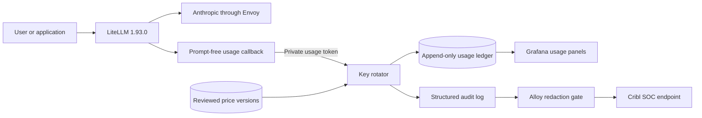

# Usage and cost accounting

This page explains how the gateway records model use and cost. It covers the
local PostgreSQL record, the Grafana report, and the small audit event sent to
Cribl through Alloy.

## What this feature does

LiteLLM makes the provider call. After the call ends, a custom callback sends
one small JSON event to `key-rotator`. The event does not contain a prompt,
reply, API key, or request header.



The callback and `key-rotator` share a private file named
`litellm_usage_token`. This token works only on `POST /usage/events`. It is not
the rotator admin token. It cannot change models, prices, identity settings,
or provider credentials.

Production creates this token once on the target host. Local preprod derives a
different stable token from its ignored local credential seed. The token does
not appear in an inventory file, Compose environment value, command argument,
or log.

## What one event records

Each event records:

- the requested gateway model;
- the actual provider model;
- the stable user and project when LiteLLM supplies them from trusted key or
  signed Open WebUI identity data;
- the LiteLLM call ID used to join the usage row to the request audit;
- success or failure, streaming, and the reported retry count;
- normal input tokens;
- 5-minute cache-write tokens;
- 1-hour cache-write tokens;
- cache-read tokens;
- output tokens;
- LiteLLM's reported cost;
- a provider-reported cost when the provider supplied one; and
- the exact reviewed price version and configured cost for each token class.

The request ID stays in PostgreSQL and the structured audit line. It never
becomes a Prometheus label. This avoids creating a new metric series for every
request.

## Unknown data stays unknown

The callback uses the exact field shapes in LiteLLM `v1.93.0`. For Anthropic,
it accepts either the provider usage-report names or LiteLLM's standard prompt
token details.

LiteLLM `v1.93.0` has a logging bug when an Anthropic success response leaves
out or malforms token usage. Its logging worker can stop or turn bad values
into zeroes before custom callbacks run. The gateway's immutable LiteLLM image
applies one small, offline patch to the exact reviewed source. The patch checks
raw normal and streaming token counts, adds an internal unusable-usage receipt,
and lets logging continue. The callback turns that receipt into null token
counts, unknown completeness, and no LiteLLM cost. Provider response fields or
headers cannot set this receipt. The image build stops if the pinned LiteLLM
source changes or the patched Python does not compile.

| Cost part | Accepted exact field |
| --- | --- |
| Normal input | `uncached_input_tokens` or standard `text_tokens` |
| 5-minute cache write | `cache_creation.ephemeral_5m_input_tokens` or the matching standard detail |
| 1-hour cache write | `cache_creation.ephemeral_1h_input_tokens` or the matching standard detail |
| Cache read | `cache_read_input_tokens` or standard `cached_tokens` |
| Output | `output_tokens` or standard `completion_tokens` |

An older response may give only one combined cache-write number. The gateway
does not guess that it is a 5-minute write. Both cache-write fields stay null,
and the row is marked `partial`.

The completeness values are:

- `complete`: all five token counts are present;
- `partial`: some counts are present;
- `unknown`: no count is present; and
- `not_applicable`: the provider call failed and supplied no usable counts.

Configured cost is calculated only from complete usage. A missing price makes
that component and the total cost null. Zero tokens cost zero and do not claim
a price version. Zero is never used to hide a missing price.

## Three cost values

The report keeps three different ideas separate:

- **LiteLLM cost** is what the pinned LiteLLM release calculated.
- **Provider cost** is used only when LiteLLM preserves a cost reported by the
  provider. Anthropic normally does not send one, so this value is usually
  unknown. LiteLLM's calculated `usage.cost` is not copied into this field.
- **Configured cost** uses the gateway's reviewed, effective-dated Decimal
  price versions.

Configured cost uses exact decimal math. It does not use binary floating-point
math and it does not round before storage. Each non-zero component stores the
price-version ID that produced it. A later price change does not rewrite an
old request.

Price backdating is implemented in the current source. It stays out of
production until the exact offline-seed PreProd test passes. The workflow uses
an append-only adjustment ledger. It never edits an old price, usage row, or
cost.

The backdate release must follow this order:

1. The admin enters one reviewed price and a past effective time.
2. The portal shows the full half-open time window, the exact affected-row
   count, old and new totals, and the exact cost change. It shows up to 100
   row details. PostgreSQL stores and hashes all affected rows. A preview over
   10,000 rows is refused so the admin can split the correction into smaller
   windows. Unknown old cost stays unknown.
3. The preview saves a digest of the price policy and affected rows. A row or
   policy change makes that preview stale and blocks confirmation.
4. Preview and confirmation each require a Keycloak admin login from the last
   five minutes. Confirmation also requires the exact phrase
   `CONFIRM BACKDATED PRICE`.
5. Confirmation appends the price, one immutable adjustment per affected
   usage component, and one audit record in a single database transaction.
6. An exact retry returns the same receipt. Reusing an operation ID with
   different data is a conflict.

The backend creates the price audit record from the row it committed. It does
not trust a model name or usage class copied from a portal form. The record
contains the saved amount, token unit, effective time, source reference, and
policy digests. The free-form review note stays in PostgreSQL. Only its
SHA-256 digest enters logs.

The original usage row and its booked cost never change. Grafana reads the
booked value plus the latest confirmed adjustment view. Rollback keeps the
price, preview, confirmation, and adjustment evidence.

## Duplicate callbacks and retries

LiteLLM may call a callback again after a stream completes or while a caller
retries. The callback builds a stable event ID from the LiteLLM call ID,
provider response ID, status, and pinned source version.

An exact replay returns the existing receipt. Reusing the same event ID with
different data is a conflict. The old row is never changed or deleted.

A failed call is recorded with `status=failure`. Token and cost fields stay
null when LiteLLM did not return safe usage data. The callback never turns the
zero-filled failure placeholder in the standard payload into billable use.

## Accounting delivery gaps

The provider call has already ended when the usage callback runs. If the
ledger is down, the callback does not fail the completed user response. Doing
that could make the caller retry and pay the provider twice.

The callback writes a small `delivery_failure` security event instead. It has
the safe request join fields when they were available. It never has the
prompt, reply, key, header, endpoint response, or error text. Alloy is the only
path for this event to Loki and Cribl.

The Grafana usage dashboard shows these events as **Accounting delivery
gaps**. A gap means the usage ledger may be missing a provider result. It must
not be counted as a zero-token or zero-cost request. Use the request ID, when
present, to compare the gap with the request audit and provider records. Fix
the ledger or callback first. Do not replay the provider request just to fill
the accounting row.

## Grafana checks

Open **AI Gateway Model Usage and Cost** from the Grafana dashboard list. Use
the same time range for every panel. The dashboard shows:

- model totals split across all five token classes;
- LiteLLM, provider, and configured costs;
- complete, partial, unknown, and failed event counts;
- model and project totals; and
- model and stable-user totals.

Missing identities and prices stay visible as `unattributed` or `unknown`.
They are not dropped from totals.

The release test connects to PostgreSQL as the same `grafana_ro` login used by
the Grafana data source. It compares both reporting views with the ledger and
then proves that this login cannot read the private usage table. This catches
a broken dashboard grant before release.

Use the request ID from a table row to find the matching request audit in
Loki:

```logql
{service_name="aigw-requests"} | logfmt | aigw_request_id="<request-id>"
```

## Cribl and local retention

`key-rotator` writes a bounded `aigw.usage.audit` line after an event is stored
or replayed. Docker logs carry it to Alloy. Alloy is the only export path to
Cribl. The event has IDs, outcome, model, project, user, and completeness. It
has no prompt, reply, credential, or header.

Price changes use a separate `aigw.price.audit` record. It contains the
committed model, provider, usage class, amount, token unit, effective time,
source reference, operation ID, review-note hash, and policy digests. The raw
review note is never logged or exported.

Loki keeps local logs for 7 days. The Cribl team keeps exported security logs
for 24 hours at the destination. Alloy uses the existing disk queue and
back-pressure rules when Cribl is slow or down. Prometheus keeps metrics locally
for up to 30 days or until `PROMETHEUS_RETENTION_SIZE` is reached, whichever
comes first. The default size cap is 5 GB and can be set with
`prometheus_retention_size` in Ansible inventory. Alloy mirrors admitted
metrics to Cribl. Grafana dashboards show warning conditions and failures;
security usage records do not create a separate alert stream.

## Deploy and rollback

Fresh installs use PostgreSQL 18. After PostgreSQL is healthy and before
database consumers start, Ansible runs the idempotent application-schema
reconciler. This also runs on an existing PostgreSQL 18 volume. It runs
`02-governance.sql` and then `03-usage-accounting.sql`. Each file must return
its exact, content-free schema receipt. A missing receipt stops the converge.

The schema updates create append-only tables, mutation guards, and read-only
report views. Re-running them keeps existing rows. The application role may
read price policy and append usage evidence. It cannot update, delete,
truncate, disable a guard, or own the schema.

The usage callback, `key-rotator` image, application-schema update, and
dashboard are one release unit. Test that exact unit through offline-seed
loading and local preprod before production promotion.

Rollback must keep the usage tables. Do not drop them and do not delete rows.
An older application image may ignore the newer tables, but the evidence
remains for a forward repair. A database rollback that removes evidence is not
supported.

## Test the contract

From the repository root, run:

```bash
python3 -I -m unittest discover -v -s scripts/tests -p 'test_litellm_usage_callback_contract.py'
cd services/key-rotator
PYTHONPATH=. pytest -q tests/test_usage.py tests/test_pricing.py
```

Release acceptance also starts from a fresh offline seed. Follow
[Local preprod](preprod.md) and the
[test runbook](test-runbook.md#step-2--clean-load-and-test-the-exact-preprod-pair). The
acceptance test must cover a normal response, a streamed response, a failure,
an exact replay, a missing price, all five Anthropic token classes, Grafana
totals, and the Cribl mock receipt.

Local PreProd does not mount the Mac or Linux Docker log directory into Alloy.
The acceptance script reads the new producer lines through the Docker CLI,
checks the exact schema and values, and keeps the original timestamp and
stream. It then writes only those bounded lines into PreProd's owned empty-log
volume using a short-lived helper with no network, a read-only root, and no
capabilities. Alloy runs the production log filters on that file. The script
removes the file after the Cribl receipt. An unknown producer, malformed line,
extra field, stale timestamp, or oversized record stops the test.

The live result must state the expected and stored totals for normal calls,
streams, retries, failures, and missing usage. It must also show the count of
`delivery_failure` gaps. A green test cannot hide a missing row by treating it
as zero.

## Reviewed upstream sources

These sources were reviewed on 2026-07-22:

- [LiteLLM custom callbacks](https://docs.litellm.ai/docs/observability/custom_callback)
- [LiteLLM standard logging payload](https://docs.litellm.ai/docs/proxy/logging_spec)
- [LiteLLM cost tracking](https://docs.litellm.ai/docs/proxy/cost_tracking)
- [Anthropic prompt caching](https://platform.claude.com/docs/en/build-with-claude/prompt-caching)
- [Anthropic pricing](https://platform.claude.com/docs/en/about-claude/pricing)

The fixture pins LiteLLM tag `v1.93.0` at commit
`052b5a2169d8d3082e1d66e69f200a72b0c1e274`. A LiteLLM update must refresh
the fixture and pass the same extraction tests before release.
